[Return to main lab page](../../MQ-Labs/Overview/)

## Connect an external client to MQ running on OCP

Connecting an MQ client running outside of the kubernetes cluster to a queue manager runnin on Openshift requires additional configuration.

In this lab you will connect an MQ client running on your laptop to the Native MQ queue managers you configured on Lab 1.

* #NOTE: PRE-REQUISITE
  Make sure that you have an MQ Client installed in your local machine.
  They can be downloaded from:

  - Windows:
    https://www.ibm.com/support/fixcentral/swg/doSelectFixes?options.selectedFixes=9.3.0.0-IBM-MQC-Win64&continue=1
  - Linux:
    https://www.ibm.com/support/fixcentral/swg/doSelectFixes?options.selectedFixes=9.3.0.0-IBM-MQC-LinuxX64&continue=1
  - MacOS
    https://developer.ibm.com/tutorials/mq-macos-dev/

    Follow any configuration instructions of the mq client after installation.

  ## Set up the OCP Routes

We need to create an openshift route to allow external application to connect in the cluster using TLS.

1. Click on the (+) icon at the top right of the Openshift console and paste the contents of the configmap-unicluster-ini.yaml file included in this lab.

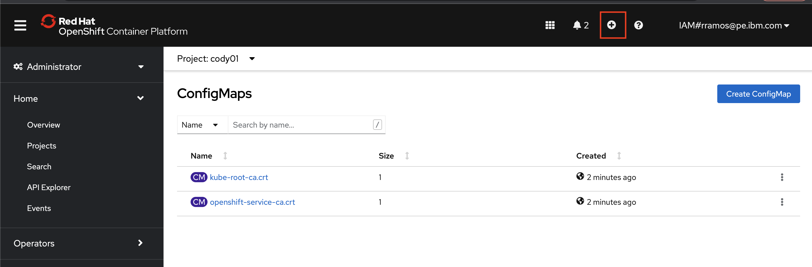

Replace the namespace with your namespace (e.g. "cody01") and also replace it in the Conname parameter values and then click Create.

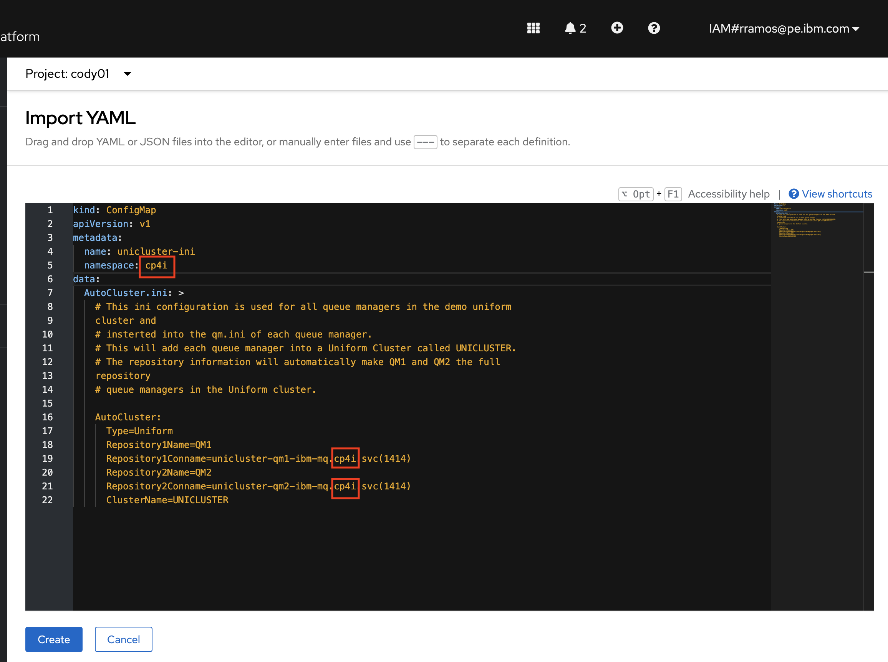


6. Click the plus sign once more to import the configmap-unicluster-qm1-mqsc.yaml file as shown in the following screenshot.

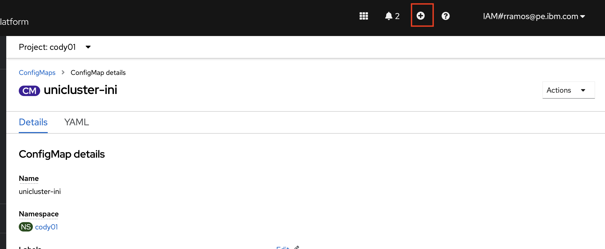

9. Replace the namespace with your own namespace and also place it in the CONNAME parameter within the MQSC file.


11. Repeat the same process to import the configmap-unicluster-qm2-mqsc.yaml and configmap-unicluster-qm3-mqsc.yaml files.

13. After clicking on Configmaps under the Workloads section in the left menu bar you should see the configmaps that where created by importing the files

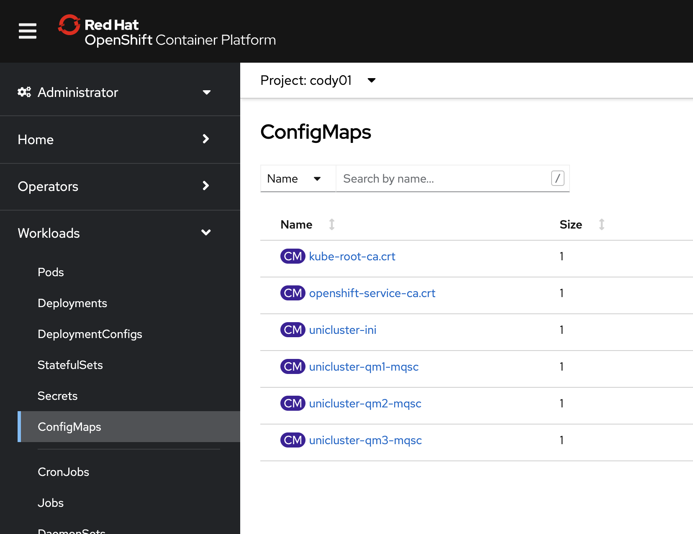

15. Switch to the Platform Navigator console, log in and then click on Integration Instances.

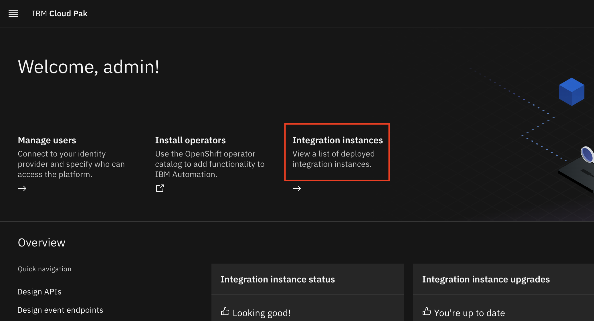

17. Click on Create an Instance.


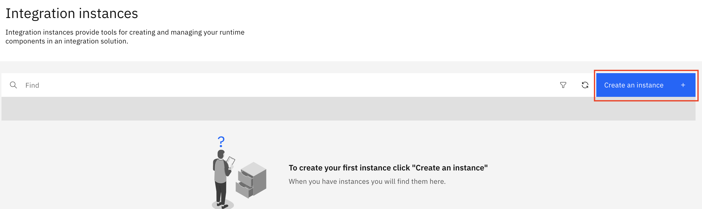

19. Click on Messaging.


21. Click on QuickStart

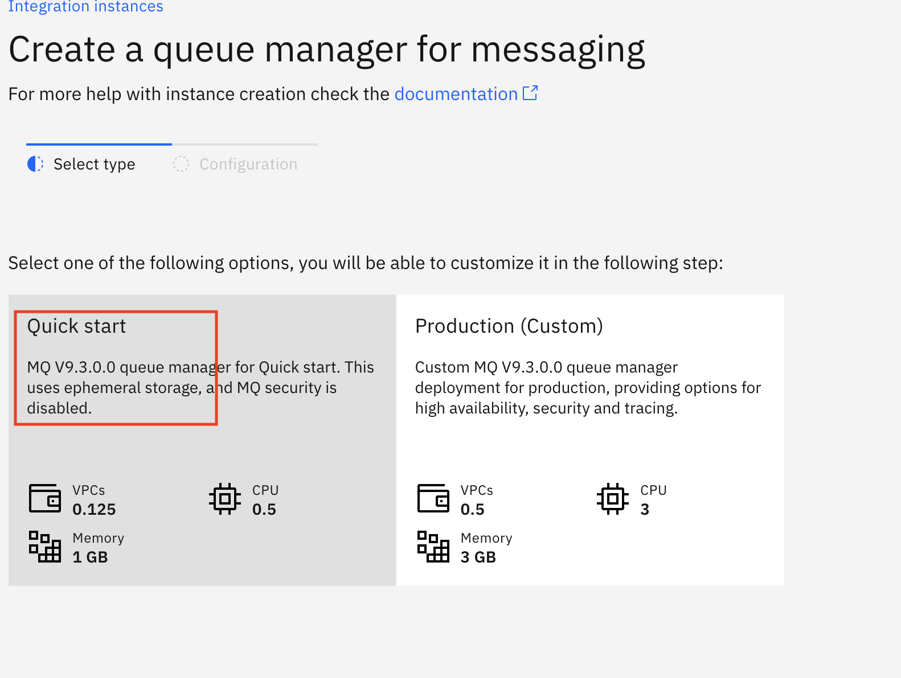

23. Type unicluster-qm1 as name, accept the license and toggle the Advanced Settings switch.

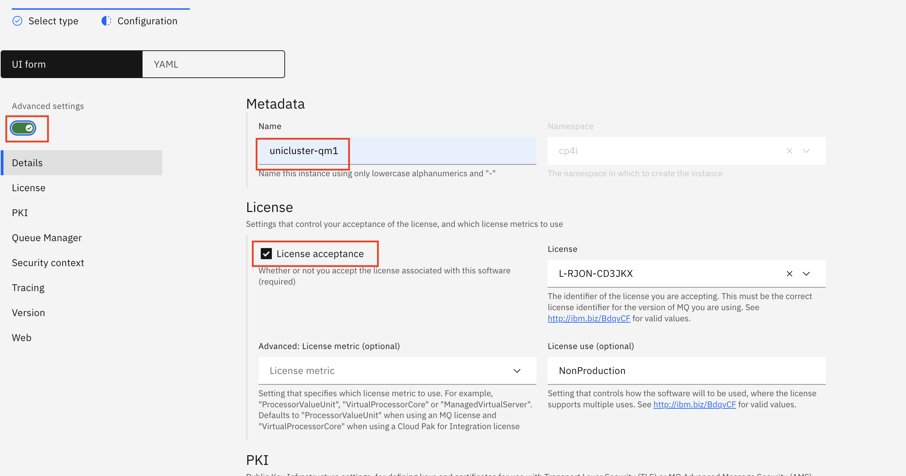


25. Scroll down to the INI section. Click on Add+ to add items to the section. Type AutoCluster.ini in the Advanced:Items text box and press Enter. (A gray bouble shoud appear arund the text). Then select unicluster-ini in the Advanced:Name selection box.

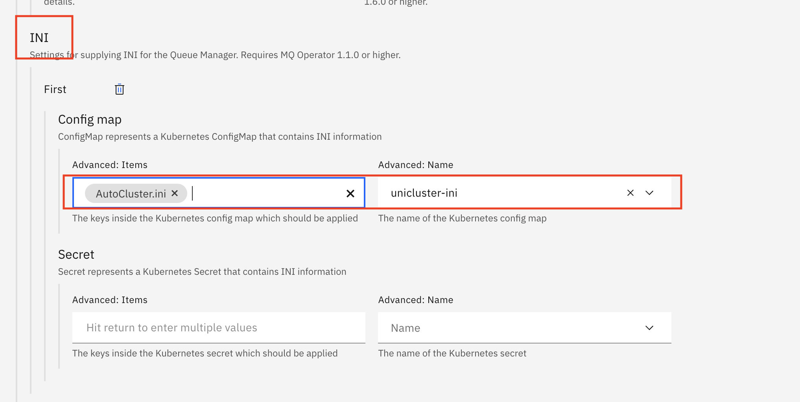

27. Scroll further down into the MQSC section and click on Add+. Type UniCluster.mqsc in the Advanced:Items section and press Enter and then select unicluster-qm1-mqsc in the Advanced:Name selection box. Finally, type QM1 as the queue manager name and click create on the top right

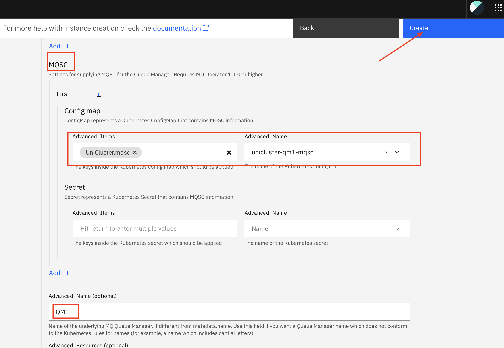

   
29. Repeat the process for another queue manager called QM2. Make sure you select the corresponding mqsc configmap.
30. You should end up with two running queue managers.

 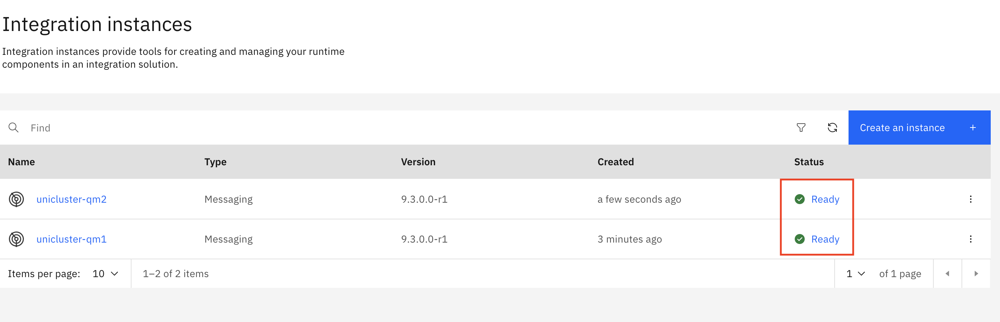

 The INI and MQSC cofigmaps you provided included the configuration so that a Uniform cluster is created between both queue managers. Unlike traditional MQ queue managers where you have to select a couple a full repositories and then manually create channels and add additional queue managers by starting the channeles, a Uniform Cluster has automatic dynamic configuration. New queue mananagers just need to boot up and they will be automatically added to the cluster.

34. Go back to the OCP console. Under workloads select pods and type Uni in the filter text box.
You should see the two queue managers running. Click on the first queue manager.

 

38. Click on Terminal
 

39. Type runmqsc and then type DISPLAY QMGR REPOS

 

It will show that that queue manager is a full repository for a cluster called UNICLUSTER (which was defined in the INI file)

39. Type DISPLAY CHANNEL(UNI*)

 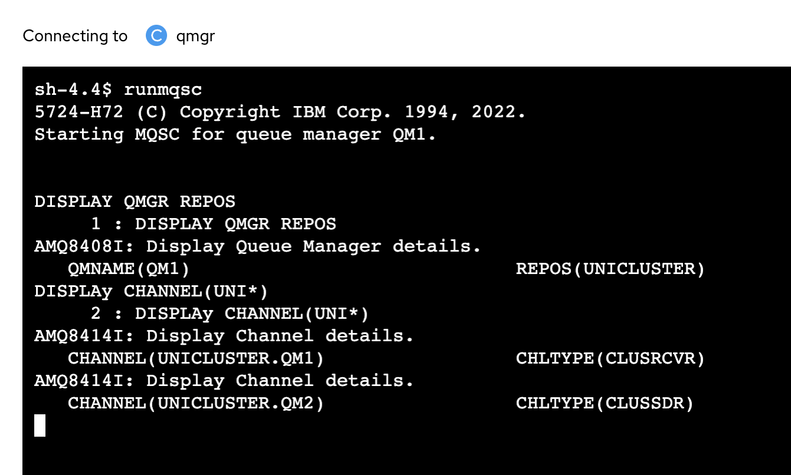


 It will show a Cluster receiever and a cluster sender channel. Those are the channels connecting the two queue managers.

43. Repeat the queue manager creation process once again in the Platform Navigator console but for a queue manager called QM3. Make sure you select the corresponding mqsc configmap when required.

45. Go back to the OCP console and select Pods. You should now see 3 pods.

47. Click on the qm3 pod and go into the terminal

 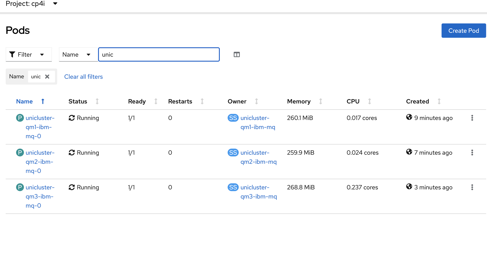

49. Type runmqsc and then type DISPLAY QMGR REPOS and then DISPLAY CHANNEL(UNI*)

 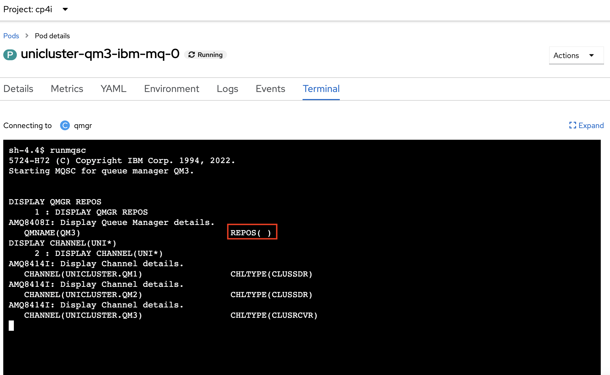

 You will see that now the REPOS parameter is empty. This is because the new queue manager is not a ful repository for the cluster. You will also see that now there are 3 channels. One cluster receiver with its name and two cluster senders connecting it to the other two queue managers.

Now we will allow external connectivity into the cluster so that you can connect an mq client running in your laptop to the queue manager uniform cluster.
On Lab #2 we created an OCP route and TLS on MQ to connect to the queue manager. Now we are going to take another approach. We will be creating a LoadBalancer object and will not be using TLS.

With this approach each queue manager will have its own external IP address. Even though we will be creating a LoadBalancer there will be no loadbalacing performed by an external load balancer into the pods as each queue manager pod is unique. It is the quemanagers themselves who balance the client connections in to them once a client connects to any of them. The client is aware of the ip addresses of each queue manager by using a CCDT file.

56. Import the  unicluster-qm1-lb.yaml, unicluster-qm2-lb.yaml and unicluster-qm1-lb.yaml files

 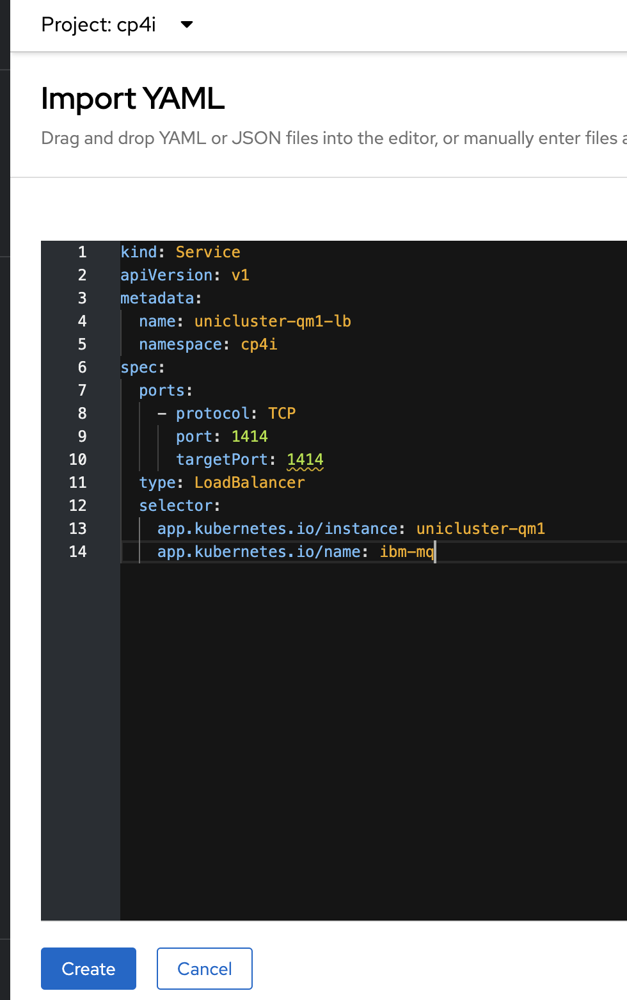

59. In the OCP console click on services within the Networking section in the left menu and type -lb in the filter text box. Click on the unicluster-qm1-lb service. 

 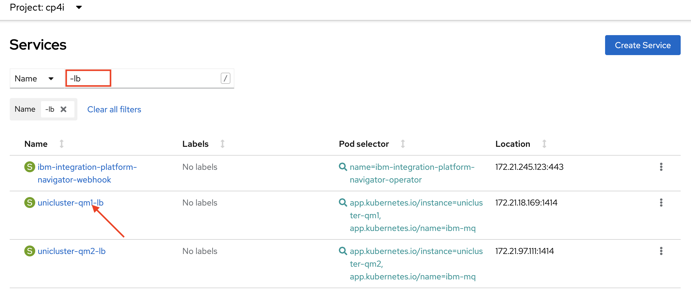

60. You will see that it has an external IP address assigned. Take note of it. 

 

Do the same to get the ip address of the unicluster-qm2-lb service.


60. Edit the ibm-mq-ccdt.json file and replace the two exiting IP addresses with the two ip address you got from your service instances. Note that they are repeated once more. This is because the client shoudl be able to  connect by either providing a specific queue manager name (with no load balancing nor failover) or providing a wildcard name.


 


56. Open a new terminal window and run the following commands replacing "*path-to-ccdt*" and *"path-to-keyfile"* with the folders where you downloaded the keyfile and connection file:

    ```
    export MQCCDTURL='/path-to-ccdt/ibm-mqha-ccdt.json'
    ```

    ```
    export MQSSLKEYR='/path-to-keyfile/clientkey'
    ```
57. Run the follwing command in the terminal window:

    ```
    amqsputc APPQ1 QUICKSTART
    ```

    The sample program amsputc will put the messages to queue **APPQ1** which has a default persistence defined as persistent. These messages should still be available after a failover.
58. Type any message and press Enter. Type another message and press Enter twice to disconnect from the queue manager. Remember the text of the messages you typed.
59. In the terminal window enter the following commands replacing "*path-to-ccdt*" and *"path-to-keyfile"* with the folders where you downloaded the keyfile and connection file:

    ```
    export MQCCDTURL='/path-to-ccdt/ibm-mqha-ccdt.json'
    ```

    ```
    export MQSSLKEYR='/path-to-keyfile/clientkey'
    ```

    ```
    amqsghac APPQ QUICKSTART
    ```

    

    The sample program amqsghac starts running and will wait for messages to arrive on queue **APPQ**.
60. Open another terminal window and type the following command:

    ```
    amqsphac APPQ QUICKSTART
    ```
61. The sample program amqsphac will connect to MQ and start sending messages incessantly.
62. Return to the window where *amqsghac* is running. You should get a list of all the messages that have been previously sent before running the command and the ones that are being sent after.

    
63. Go back to the OCP console and check the status of the pods:
    
64. Delete the running pod

    

Once the active pod is deleted, the running programs will then reconnect to the other pod for it to take over.


16. Return to the browser tab where OCP is open. In your project, click the drop-down for *Workloads* and select *Pods*. Enter your queue manager name in the *Name* field to filter out the rest. You will see the now a different pod is in 1/1 Ready state.

    
17. Return the Platform Navigator home page and click on on your queue manager name in the Messaging box

    
18. Click on Manage.

    
19. Verify that queue **APPQ1** still has the number of messages you put to the queue earlier.

    
20. Click the hyperlink for the queue to verify that those are the messages you created.

    

## Congratulations

You have completed this lab for MQ on CP4I
