[Return to main lab page](../../MQ-Labs/Overview/)

These instructions will document the process to deploy a NativeHA highly available (HA) persistent IBM MQ on the Cloud Pak for Integration (CP4I) 2021.1.1. 

## MQ Native HA Overview

A Native HA configuration provides a highly available queue manager where the recoverable MQ data (for example, the messages)  are replicated across multiple sets of storage, preventing loss from storage failures. The queue manager consists of multiple running instances, one is the leader, the others are ready to quickly take over in the event of a failure, maximizing access to the queue manager and its messages.

A Native HA configuration consists of three Kubernetes pods, each with an instance of the queue manager. One instance is the active queue manager, processing messages and writing to its recovery log. Whenever the recovery log is written, the active queue manager sends the data to the other two instances, known as replicas. Each replica writes to its own recovery log, acknowledges the data, and then updates its own queue data from the replicated recovery log. If the pod running the active queue manager fails, one of the replica instances of the queue manager takes over the active role and has current data to operate with.

A Kubernetes Service is used to route TCP/IP client connections to the current active instance, which is identified as being the only pod which is ready for network traffic. This happens without the need for the client application to be aware of the different instances.

Three pods are used to greatly reduce the possibility of a split-brain situation arising. In a two-pod high availability system split-brain could occur when the connectivity between the two pods breaks. With no connectivity, both pods could run the queue manager at the same time, accumulating different data. When connection is restored, there would be two different versions of the data (a 'split-brain'), and manual intervention is required to decide which data set to keep, and which to discard.

Native HA uses a three pod system with quorum to avoid the split-brain situation. Pods that can communicate with at least one of the other pods form a quorum. A queue manager can only become the active instance on a pod that has quorum. The queue manager cannot become active on a pod that is not connected to at least one other pod, so there can never be two active instances at the same time:

  -  If a single pod fails, the queue manager on one of the other two pods can take over. If two pods fail, the queue manager cannot become the active instance on the remaining pod because the pod does not have quorum (the remaining pod cannot tell whether the other two pods have failed, or they are still running and it has lost connectivity).
    
  -  If a single pod loses connectivity, the queue manager cannot become active on this pod because the pod does not have quorum. The queue manager on one of the remaining two pods can take over, which do have quorum. If all pods lose connectivity, the queue manager is unable to become active on any of the pods, because none of the pods have quorum.

  -  If an active pod fails, and subsequently recovers, it can rejoin the group in a replica role.

The following figure shows a typical deployment with three instances of a queue manager deployed in three containers.

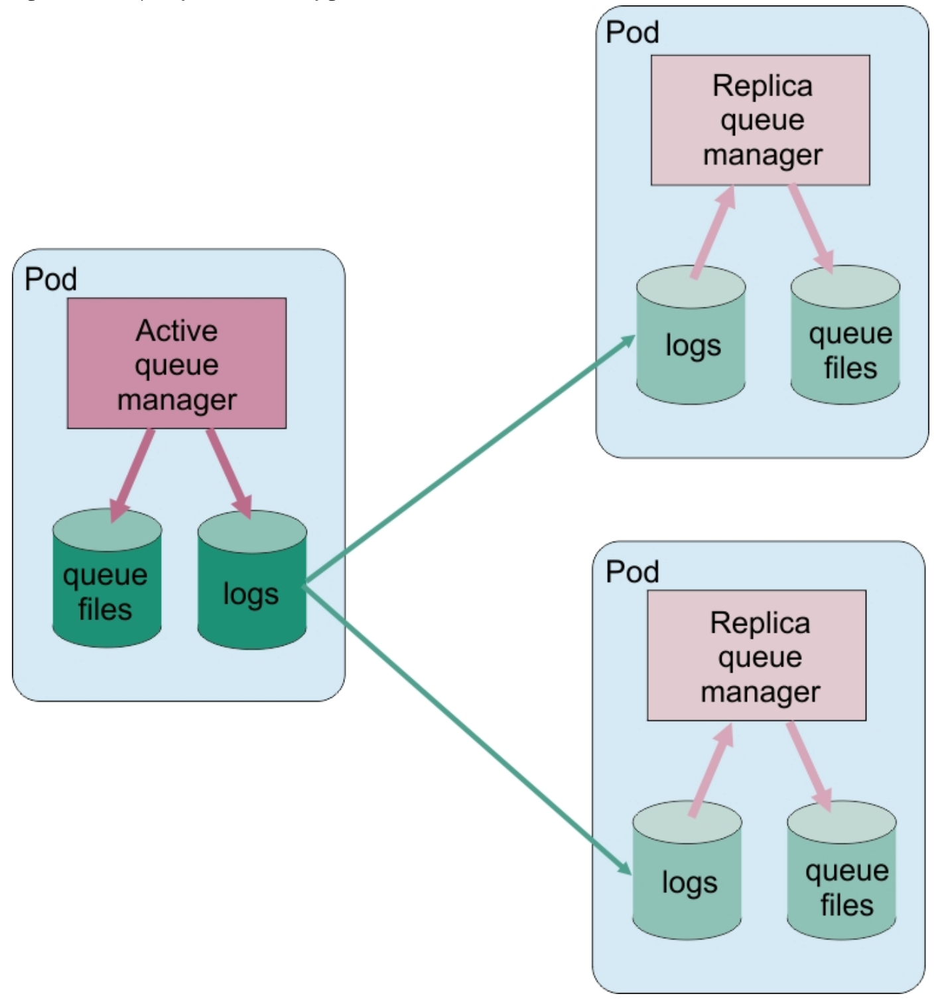

For more information see: [Evaluating the Native HA feature in IBM Cloud Pak for Integration 2021.1.1](https://www.ibm.com/docs/en/ibm-mq/9.2?topic=nher-evaluating-native-ha-feature-in-cloud-pak-integration-202111)

## Pre-reqs

You should have already downloaded the artifacts for this lab in the lab Environment Setup from [GitHub MQonCP4I](https://github.com/ibm-cloudintegration/mqoncp4i). 

If you are doing this lab out of order return to [Environment Setup](../envsetup/mq_cp4i_pot_envsetup.md) to perform the download. Then continue from here.

### Important points to note

The lab guide assumes you are using the RHEL desktop VM from the IBM Asset Repo. If you are using another platform, you can download the necessary artifacts from the github repo. The instructor will provide directions.

**Note**: The screen shots were taken on a test cluster and many will not match what you see when running the lab. Particularly URL values will be different depending on the cluster where CP4I is running. Projects (Namespaces) may also vary. It is important to follow the directions, not the pictures.

### Further information

* [IBM MQ Knowledge Center](https://www.ibm.com/docs/en/ibm-mq/9.2?topic=mq)


## Deploy the MQ Queue Manager with associated resources

1. Navigate to the *nativeHA* directory with the following command:

	```sh
	cd /home/student/MQonCP4I/nativeha/deploy
	```
	
	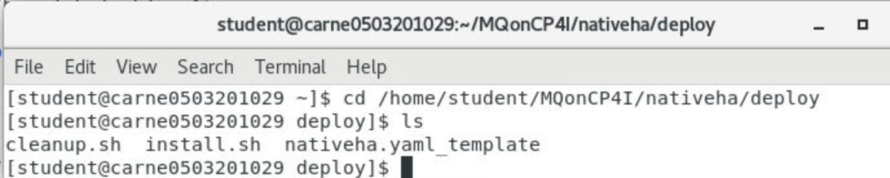
	
1. Edit *install.sh* with following command:

	```sh
	gedit install.sh
	```
	
	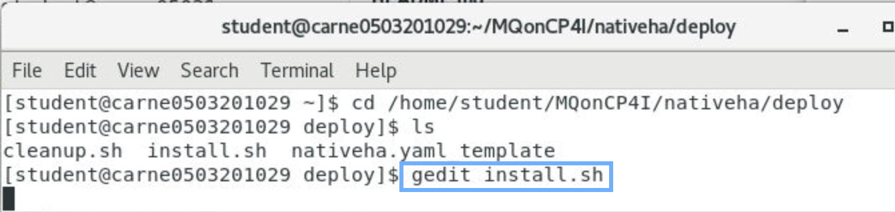
	 
	The terminal window cannot be used while gedit is open. If you close the window, gedit will end.
	
1. Change	*TARGET_NAMESPACE* to your assigned project/namespace. NativeHA was introduced as a tech preview in CP4I verion 9.2.2.0, so the value *VERSION* must be 9.2.2.0-r1. Change **00** in *QMname* export to your student number. The *SC* export for *managed-nfs-storage* should be uncommented and *ibmc-file-gold-gid* should be commented out.

	

	**Note**: chopper5 is the namespace used to document this lab. When working in a PoT, you will have been assigned a userid and namespace such as chopper5.
	
	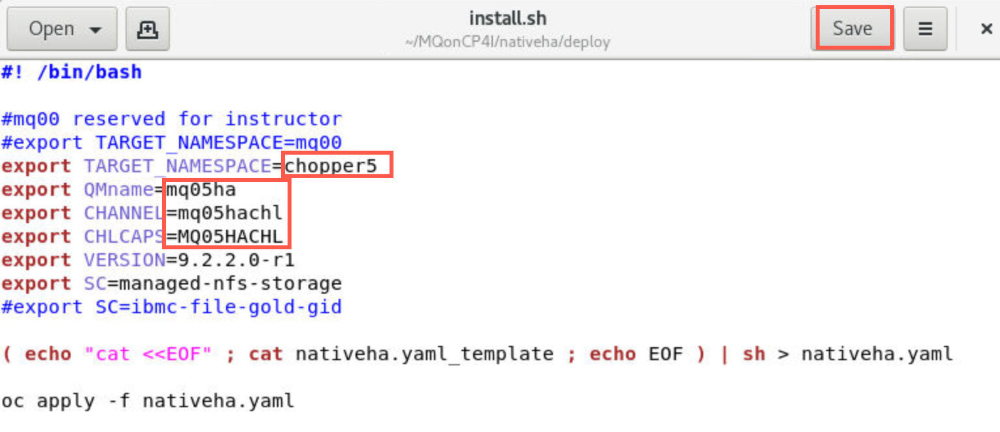	
	**Note**: If you are an IBMer running this lab on a ROKS cluster, use storage class *ibmc-file-gold-gid*.
	
	Click *Save*.
	
1. Click the drop-down next to *Open*, then click *Other documents*. 

	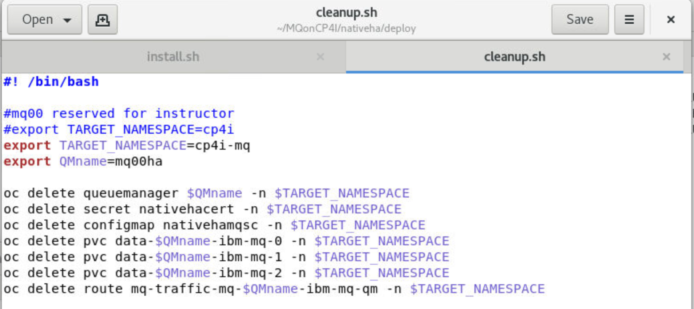

1. The current directory opens showing all the files in the directory. You also need to update *cleanup.sh*, so select it and click *Open*.

	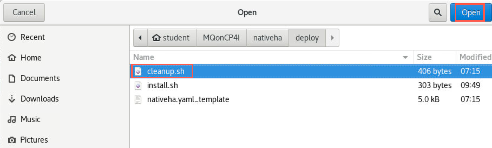
	
	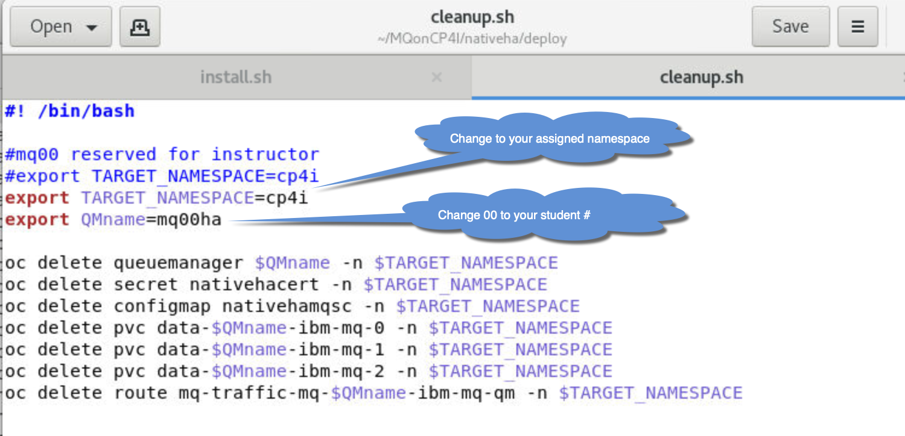	
	
1. Change *TARGET_NAMESPACE* to your assigned project. Change **00** in *QMname* to your student number. Click *Save* to save cleanup.sh.

	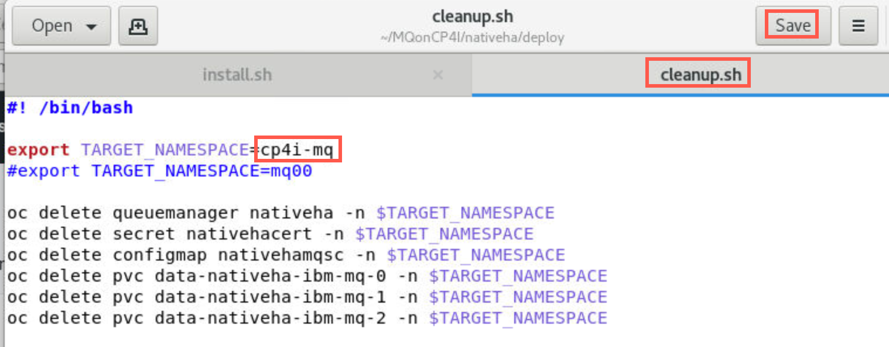

	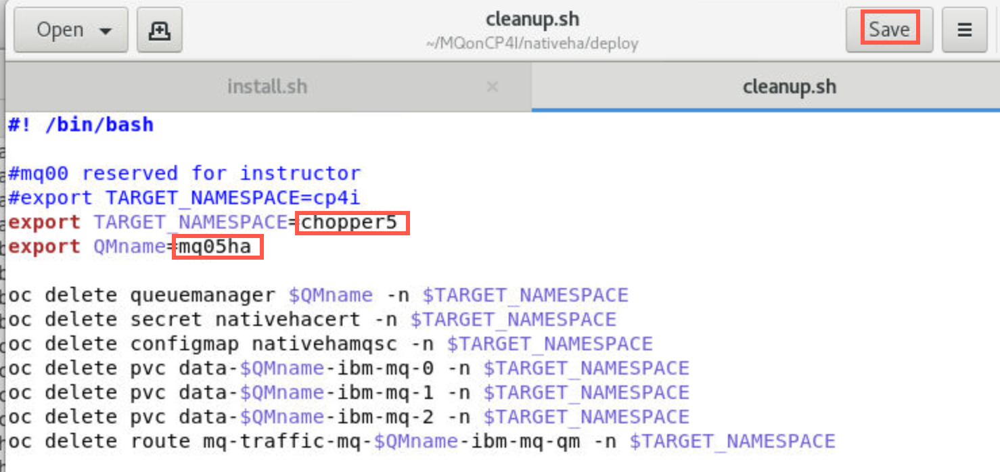
	
1. Repeat the above steps to open *nativeha.yaml_template*.  

	There is nothing to change here, but it is necessary to review the how the queue manager is created by the yaml code. The first Kubernetes API is a *ConfigMap* named **nativehamqsc**. This creates a file of mqsc commands to define MQ objects in the queue manager. The second Kubernetes API is a *Secret* called **nativehacert**. This includes two files to build the secret. *tls.crt* is the signer certificate for the queue manager and *tls.key* is the queue manager's private key. nativehamqsc and nativehacert will be used to define the third Kubernetes kind, the queue manager itself.   

	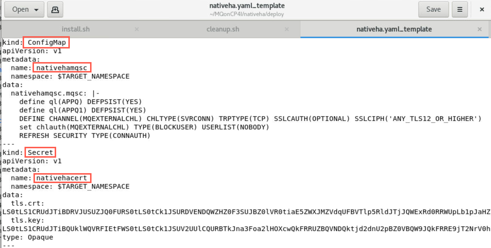
	
1. Native HA is configured using the *.spec.queueManager.availability* of the QueueManager API. Scroll down to the *kind: QueueManager*. *QMname* takes the value from the install.sh script so **mq00ha** (substituted with your student number) will be the name of the deployment and the name of the queue manager. Under *spec*, version is being substituted by the variable defined in install.sh and includes the license value. *pki* pulls in the secret defined earlier. *queuemanager* pulls in the mqsc definitions defined earlier and availability shows type **NativeHA**. This tells the MQ Operator to implement the native HA pattern and will create three pods running the same queue manager with replicated data. 

	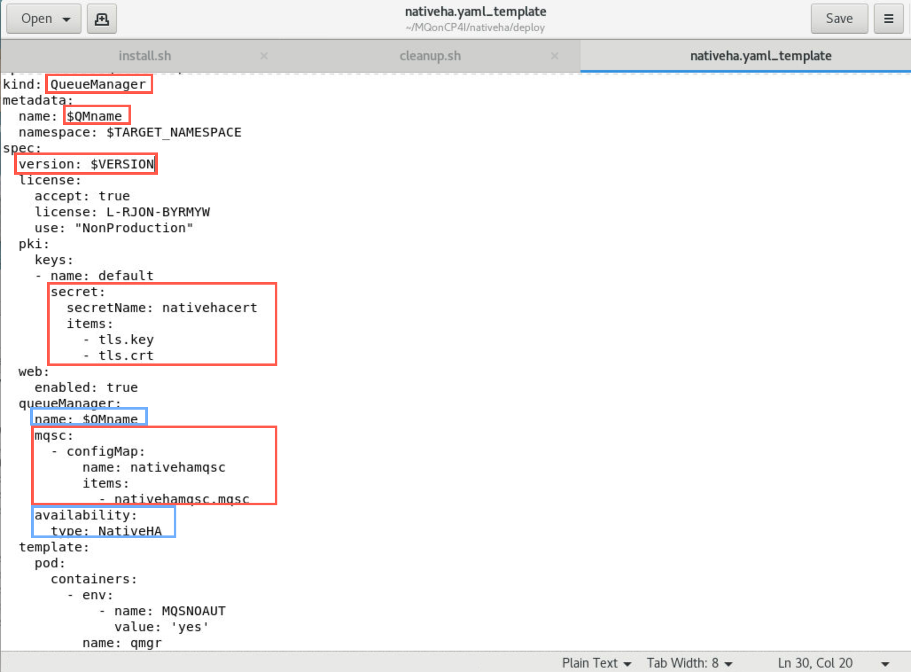
	
	There is nothing to change so just close the yaml file. 
	
1. Looking again at *install.sh*, the last statement copies the yaml template to nativeha.yaml and applies that it to create the queue manager.

	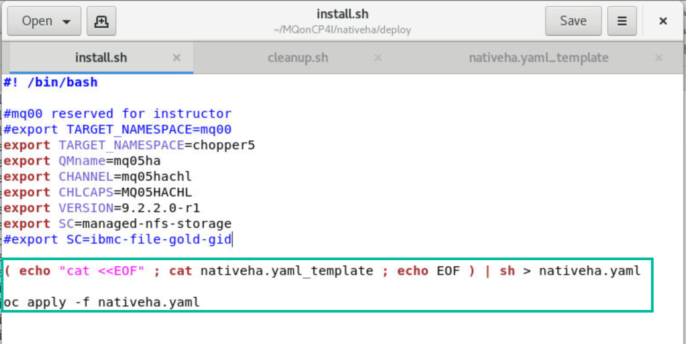
	
	You can now close the gedit utility.
	
1. You now need to make install.sh and cleanup.sh executable using the following commands:

	```sh
	chmod +x install.sh
	chmod +x cleanup.sh
	```
	
	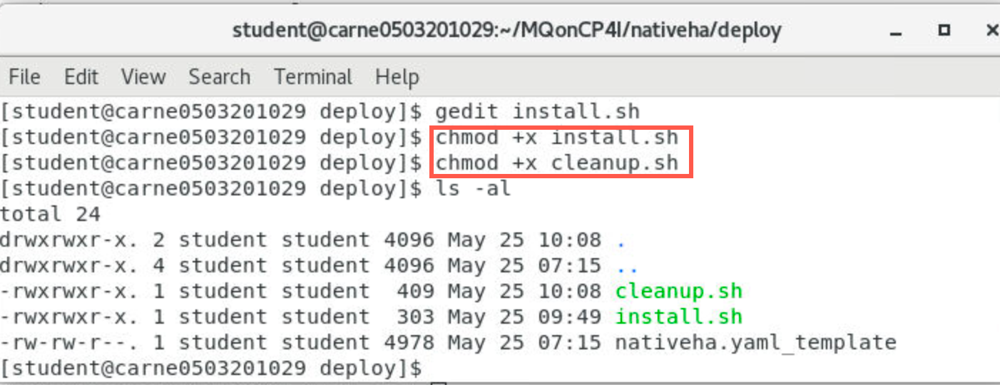
	
1. Run the install.sh script with the following command:

	```sh
	./install.sh
	```
	
	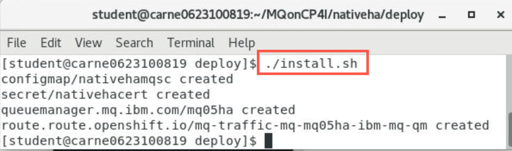 
	
	The response is that the configmap, secret, and queue manager were successfully created.  
	
1. If you receive an unauthorized message, your session may have timed out. You will need to sign-on again as you did in the *Environment Setup*.  
	
	Make sure you are in your assigned project:
	
	```sh
	oc project chopper5
	```
	
## Explore the queue manager 

### MQ Console

The hyperlink to the OpenShift Console for the cluster should be included in your email. Navigate to the OCP console now. 
 
1. The OCP Console opens at the *Overview* page. You can explore the various information about the cluster details here. When ready, click *Projects* and select your project **chopper5** (Use you assigned namespace).

	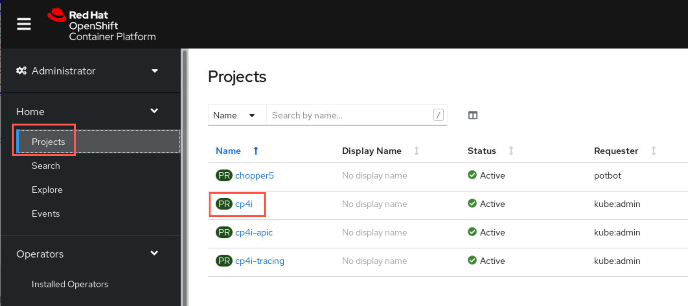		
1. To access the queue manager and the MQ Console, you need to open the CP4I Platform Navigator. Click the drop-down for *Networking* and select *Routes*. Type *Integration* in the filter, then click the location hyplerlink for route **integration-quickstart-pn**. 

	 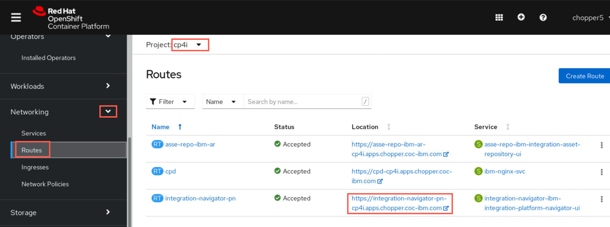
	 
	 Accept any security warnings and continue.
	 
1. When presented with the "Log in to IBM Automation", click *Enterprise LDAP*. Enter the userid and password that you received in your email and click *Login*. Remember to use your credentials, not the ones in the screen shot.

		
1. Under *Messaging* you will see the namespace **chopper5** and the **mq05ha** queue manager. Click **mq05ha**.

	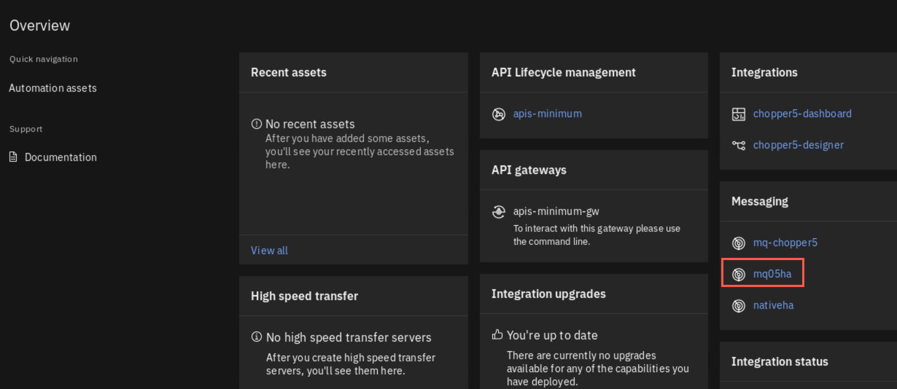
	
1. The MQ Console is now opened for queue manager **mq05ha**. Click the *Manage* icon.

	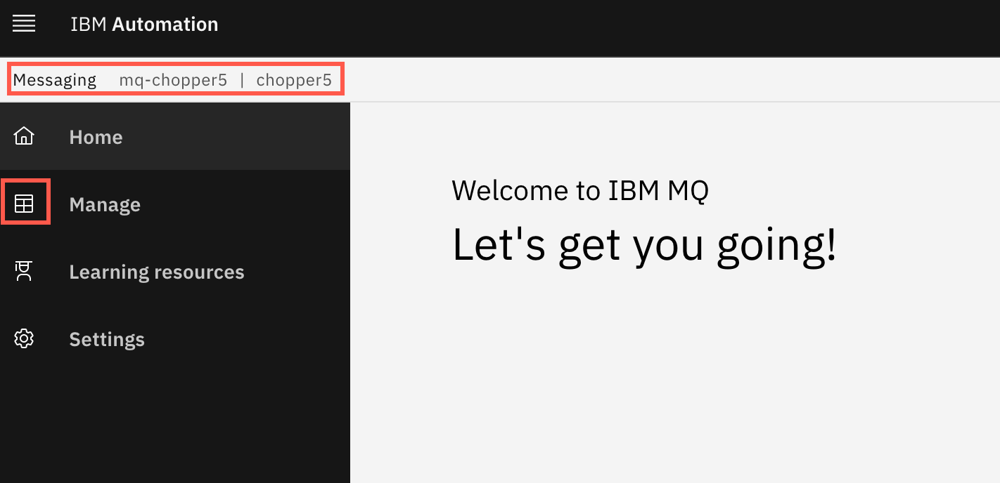

1. The Manage page has tabs for *Queues*, *Topics*, *Subscriptions*, and *Communication (Channels)*. You see queue **APPQ** which was defined in the *ConfigMap (mqsc)* stanza of the install.sh yaml file.

	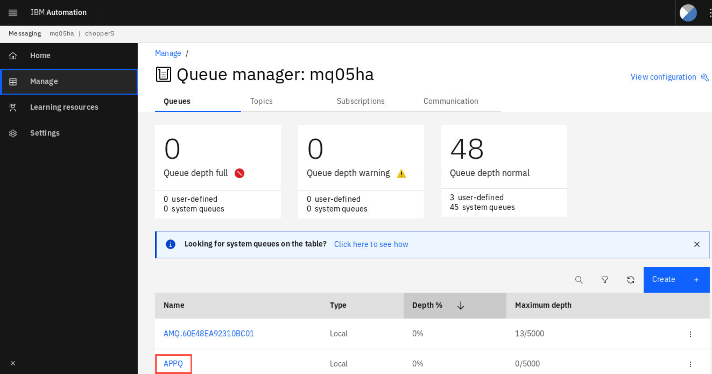		
1. Click *Communication \> App channels*. App channels are better known as SVRCONN channels. Here you see **MQ05HACHL** which was defined in the *Queue Manager* stanza of the yaml.

	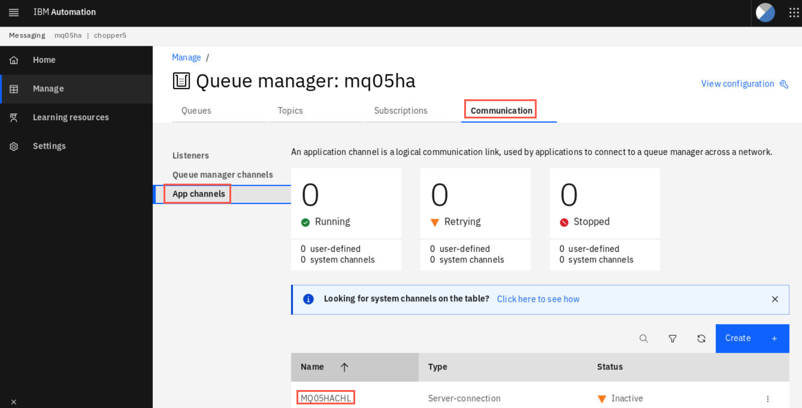

1. In the OCP Console, change the project to your namespace, for example *chopper5*. Click the drop-down for *Operators* then select *Installed Operators*. Scroll to the bottom and click the hyperlink for **IBM MQ**.

	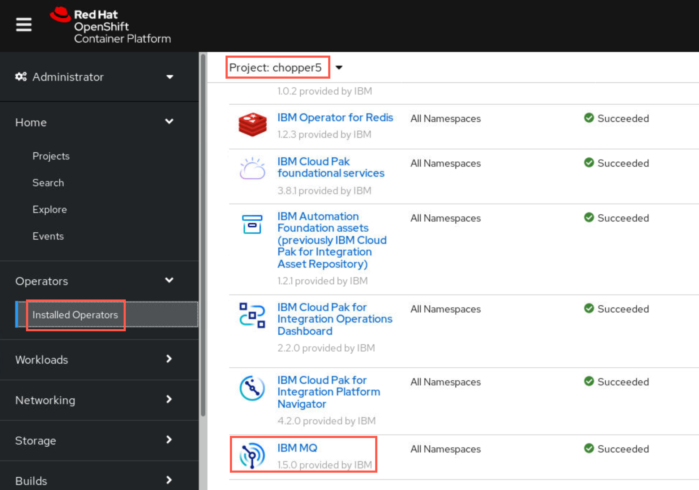

1. You can browse the details about the MQ Operator, then click *Queue Manager*. You see your queue manager **mq05ha** and it is *Running*. Any other queue managers running in the namespace will also be displayed.  

	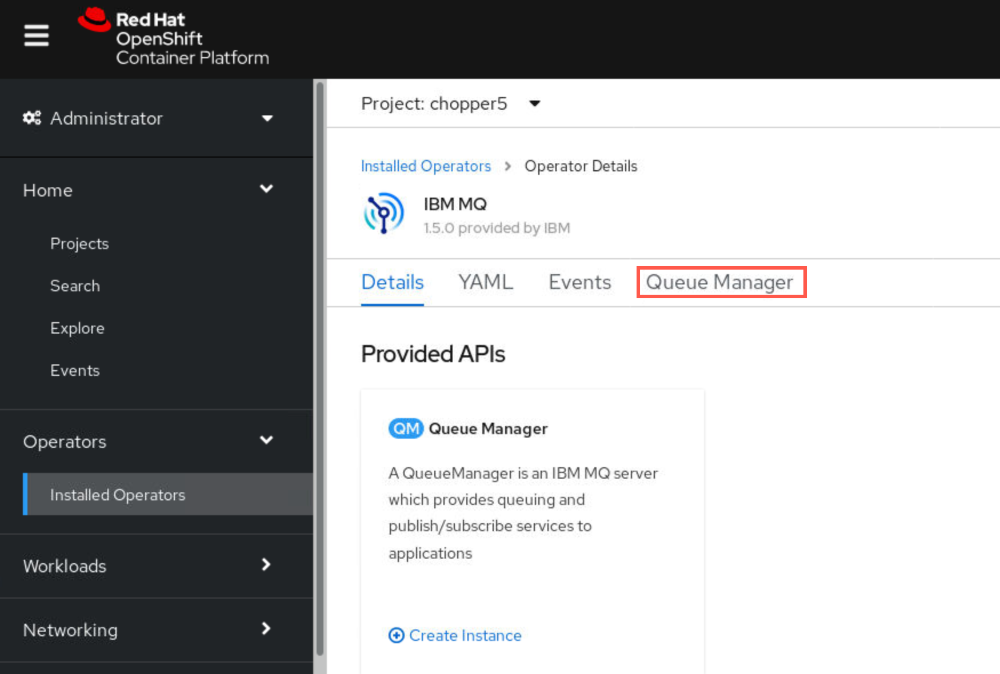

	Click the hyperlink for **mq05ha**.
	
	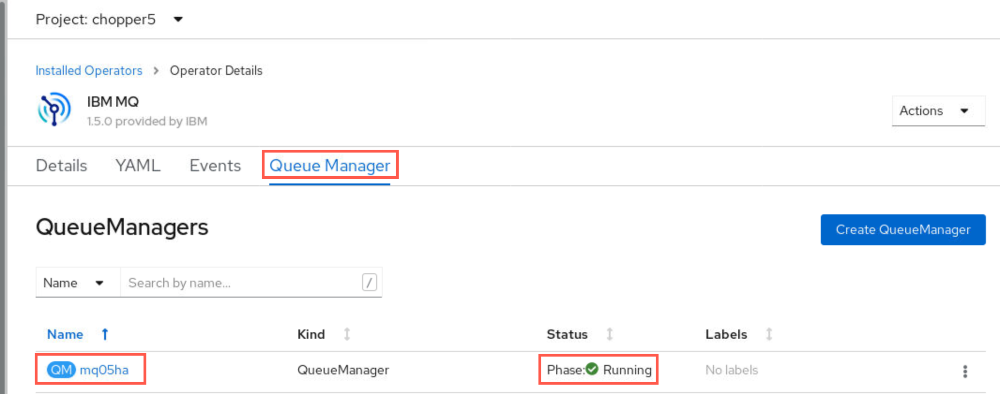		
1. The details and properties for the queue manager are displayed. Review by scrolling through the details. You can also see the yaml that for the queue manager object. 

	After reviewing, click the drop-down for *Workloads* and select *Pods*. Type **mq05** (your student number in place of 05) in the filter so you will only see the pods for queue manger mq05ha. 
	
	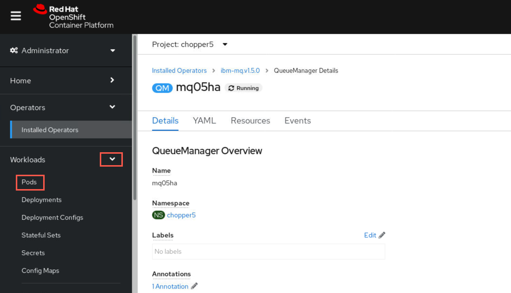		
1. As expected you will see three pods for the nativeha queue manager. One of the pods has 1 of 1 containers running. Two of the pods have 0 of 1 containers running. This is the nature of nativeHA, one pod running the queue manager and data being replicated to the other two pods which are in standby mode.

	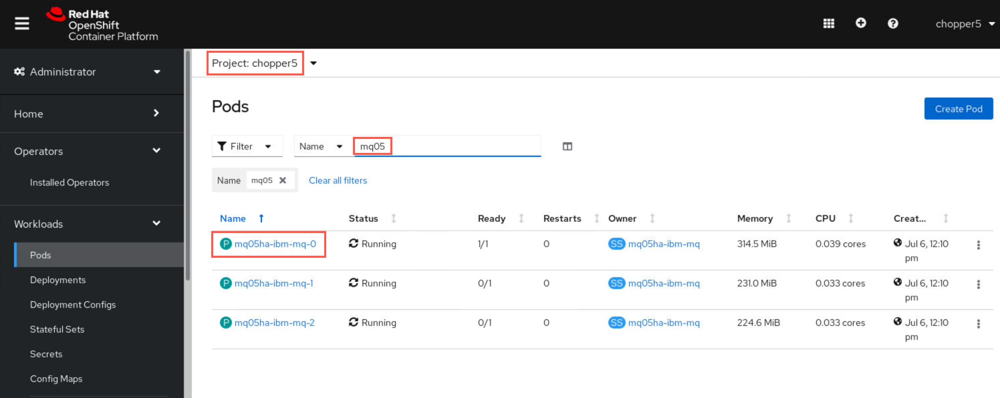
	
1. If you click the hyperlink for the running pod, you will see its details and the logs. 	Click *Logs* to review the messages. Below is a sample from pod *mq05ha-ibm-mq-0* where you can see the messages involved with HA.

	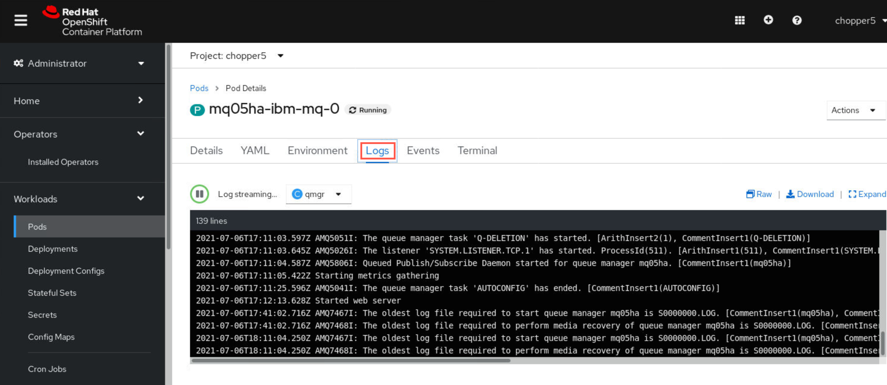

1. Under *Workloads* click *ConfigMaps* then select **nativehamqsc**.

	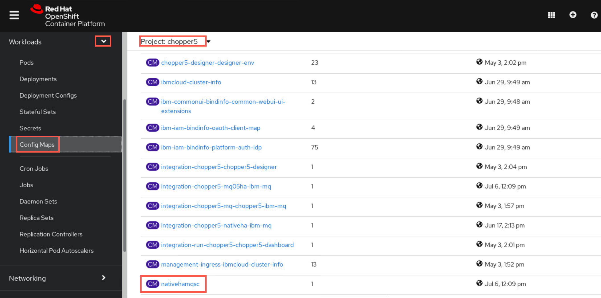
	
1. Scroll down to *Data* and you will see the mqsc statements to define the queue manager objects.

	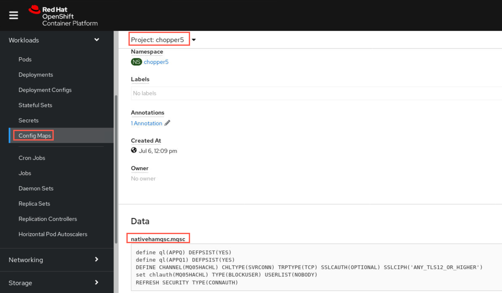
	
1. Under *Workloads* click *Secrets* then scroll down to select **nativehacert**.

	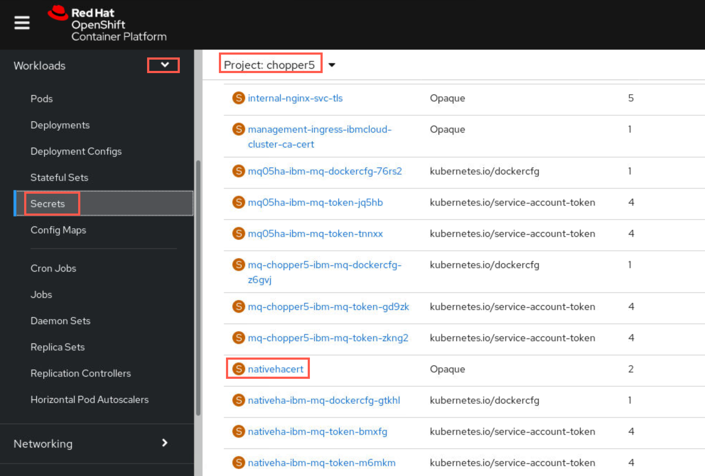
	
1. Scroll down to *Data* and you will find the files for the certificate and key. 

	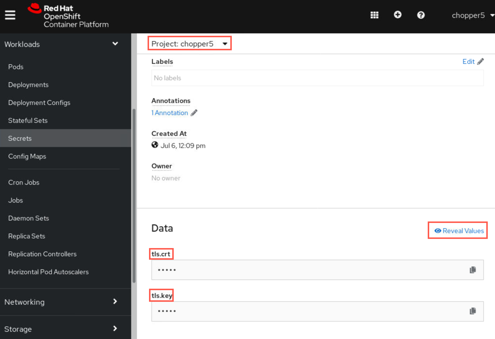
	
	Click *Reveal values* to see the cert and key. 
	
### Viewing the status of Native HA queue managers 

You can view the status of the Native HA instances by running the dspmq command inside one of the running Pods.

You can use the dspmq command in one of the running Pods to view the operational status of a queue manager instance. The information returned depends on whether the instance is active or a replica. The information supplied by the active instance is definitive, information from replica nodes might be out of date.
You can perform the following actions:

* View whether the queue manager instance on the current node is active or a replica.
* View the Native HA operational status of the instance on the current node.
* View the operational status of all three instances in a Native HA configuration.

The following status fields are used to report Native HA configuration status:

* ROLE
    Specifies the current role of the instance and is one of Active, Replica, or Unknown.
* INSTANCE
    The name provided for this instance of the queue manager when it was created using the -lr option of the crtmqm command.
* INSYNC
    Indicates whether the instance is able to take over as the active instance if required.
* QUORUM
    Reports the quorum status in the form number_of_instances_in-sync/number_of_instances_configured.
* REPLADDR
    The replication address of the queue manager instance.
* CONNACTV
    Indicates whether the node is connected to the active instance.
* BACKLOG
    Indicates the number of KB that the instance is behind.
* CONNINST
    Indicates whether the named instance is connected to this instance.
* ALTDATE
    Indicates the date on which this information was last updated (blank if it has never been updated).
* ALTTIME
    Indicates the time at which this information was last updated (blank if it has never been updated).

1. Find the pods which are part of your queue manager with the following command:

	```sh
	oc get pods --selector app.kubernetes.io/instance=mq05ha
	```
	
	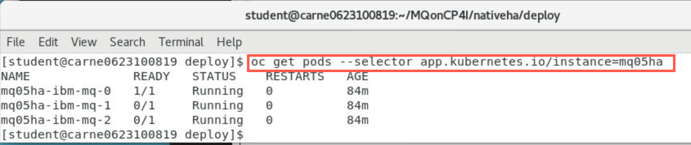
	
1. Use the following command to run the *dspmq* command in the active pod: 

	```sh
	oc exec -t mq05ha-ibm-mq-0 dspmq
	```
	
	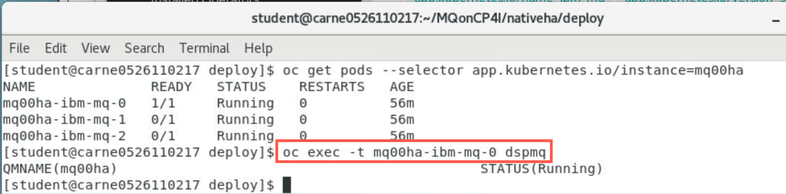 
	
	In the active pod the queue manager shows *Running*.
	
1. Run the command again but this time in a replica pod.

	```sh
	oc exec -t mq05ha-ibm-mq-1 dspmq
	```
	
	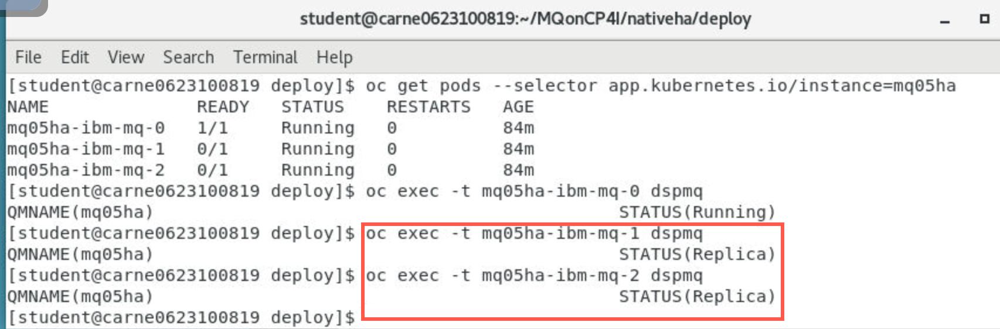
	
	In a replica pod the queue manager shows *Replica*.
	
	We will not test every possibility, but the following are possible displays to expect. Review the possibilities.

	* An active instance of the queue manager named **mq00ha** would report the following status:

			QMNAME(mq05ha)                 STATUS(Running)

	* A replica instance of the queue manager would report the following status:

			QMNAME(mq05ha)                 STATUS(Replica)

	* An inactive instance would report the following status:

			QMNAME(mq05ha)                 STATUS(Ended Immediately)

1. To determine Native HA operational status of the instance in the specified pod:

	```sh
	oc rsh mq05ha-ibm-mq-0 dspmq -o nativeha -m mq05ha
	```
	
	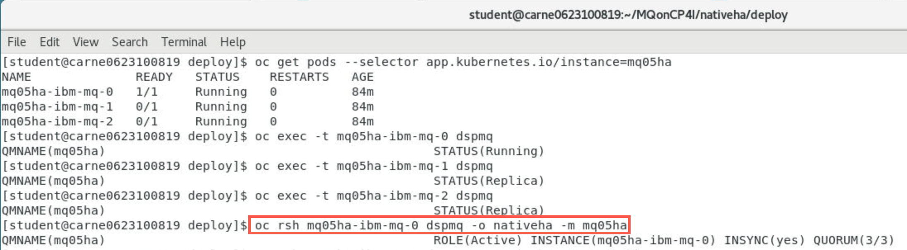
	
	We will not test every possibility, but the following are possible displays to expect. Review the possibilities.
	
	* The active instance of the queue manager named **mq05ha** might report the following status:

			QMNAME(mq05ha)               ROLE(Active) INSTANCE(inst1) INSYNC(Yes) QUORUM(3/3)

	* A replica instance of the queue manager might report the following status:

			QMNAME(mq05ha)               ROLE(Replica) INSTANCE(inst2) INSYNC(Yes) QUORUM(2/3)

	* An inactive instance of the queue manager might report the following status:

			QMNAME(mq05ha)               ROLE(Unknown) INSTANCE(inst3) INSYNC(no) QUORUM(0/3)

1. To determine the Native HA operational status of all the instances in the Native HA configuration:

	```sh
	oc rsh mq05ha-ibm-mq-0 dspmq -o nativeha -x -m mq05ha
	```
	
	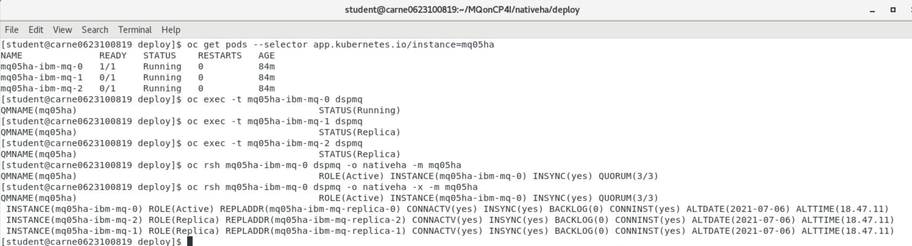
	
	We will not test every possibility, but the following are possible displays to expect. Review the possibilities.
	
	* If you issue this command on the node running the active instance of queue manager **mq05ha**, you might receive the following status:

			QMNAME(mq05ha)			ROLE(Active) INSTANCE(inst1) INSYNC(Yes) QUORUM(3/3) 
				INSTANCE(mq05ha-ibm-mq-0) ROLE(Active)  REPLADDR(mq05ha-ibm-mq-0) 					CONNACTV(Yes) INSYNC(Yes) 					BACKLOG(0) CONNINST(Yes) ALTDATE(2021-01-12) ALTTIME(12.03.44) 
				INSTANCE(mq05ha-ibm-mq-1) ROLE(Replica) REPLADDR(mq05ha-ibm-mq-1) 					CONNACTV(Yes) INSYNC(Yes) 					BACKLOG(0) CONNINST(Yes) ALTDATE(2021-01-12) ALTTIME(12.03.44) 
				INSTANCE(mq05ha-ibm-mq-2) ROLE(Replica) REPLADDR(mq05ha-ibm-mq-2) 					CONNACTV(Yes) INSYNC(Yes) 					BACKLOG(0) CONNINST(Yes) ALTDATE(2021-01-12) ALTTIME(12.03.44)

	* If you issue this command on a node running a replica instance of queue manager **mq05ha**, you might receive the following status, which indicates that one of the replicas is lagging behind:

			QMNAME(mq05ha)			ROLE(Replica) INSTANCE(inst2) INSYNC(Yes) QUORUM(2/3)
				INSTANCE(mq05ha-ibm-mq-2) ROLE(Replica) REPLADDR(mq05ha-ibm-mq-2) 					CONNACTV(Yes) INSYNC(Yes) 					BACKLOG(0) CONNINST(Yes) ALTDATE(2021-01-12) ALTTIME(12.03.44) 
				INSTANCE(mq05ha-ibm-mq-0) ROLE(Active)  REPLADDR(mq05ha-ibm-mq-0) 					CONNACTV(Yes) INSYNC(Yes) 					BACKLOG(0) CONNINST(Yes) ALTDATE(2021-01-12) ALTTIME(12.03.44) 
				INSTANCE(mq05ha-ibm-mq-1) ROLE(Replica) REPLADDR(mq05ha-ibm-mq-1) 					CONNACTV(Yes) INSYNC(No)  					BACKLOG(435) CONNINST(Yes) ALTDATE(2021-01-12) ALTTIME(12.03.44)

	* If you issue this command on a node running an inactive instance of queue manager **mq05ha**, you might receive the following status:

			QMNAME(mq05ha)			ROLE(Unknown) INSTANCE(inst3) INSYNC(no) QUORUM(0/3)
			 	INSTANCE(mq05ha-ibm-mq-0) ROLE(Unknown) REPLADDR(mq05ha-ibm-mq-0) 					CONNACTV(Unknown) 							INSYNC(Unknown) BACKLOG(Unknown) CONNINST(No) ALTDATE() ALTTIME() 
				INSTANCE(mq05ha-ibm-mq-1) ROLE(Unknown) REPLADDR(mq05ha-ibm-mq-1) 					CONNACTV(Unknown) 							INSYNC(Unknown) BACKLOG(Unknown) CONNINST(No) ALTDATE() ALTTIME() 
			 	INSTANCE(mq05ha-ibm-mq-2) ROLE(Unknown) REPLADDR(mq05ha-ibm-mq-2) 					CONNACTV(No) 								INSYNC(Unknown) BACKLOG(Unknown) CONNINST(No) ALTDATE() ALTTIME()

	* If you issue the command when the instances are still negotiating which is active and which are replicas, you would receive the following status:

			QMNAME(mq05ha)              STATUS(Negotiating)

1. If necessary, use these commands while testing the deployment.

## Test the deployment

1. Open a new terminal window and navigate to */home/student/MQonCP4I/nativeha/test* directory using the following command:

	```sh
	cd ~/MQonCP4I/nativeha/test
	```
	
	Open *getMessage.sh* in gedit:
	
	```sh
	gedit getMessage.sh
	```
	
	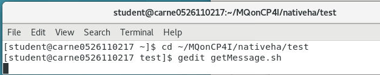
	
	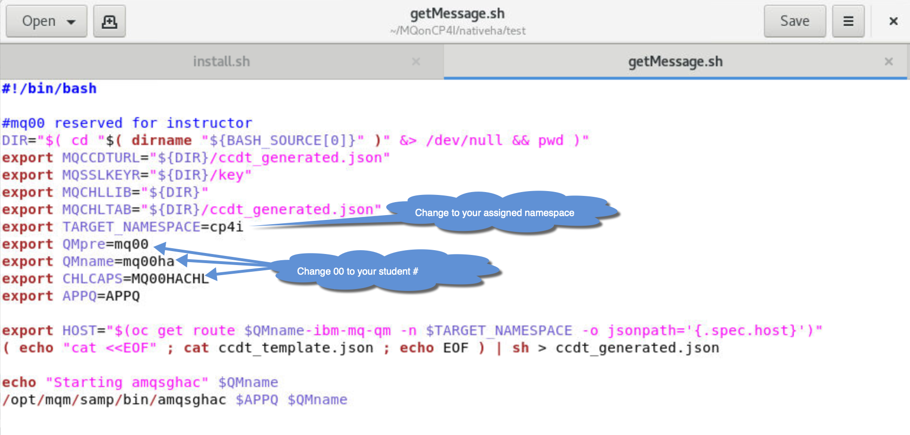
	
1. Change *TARGET_SPACE* to your assigned namespace. Change *QMname* to your queue manager. Then click *Save*.

	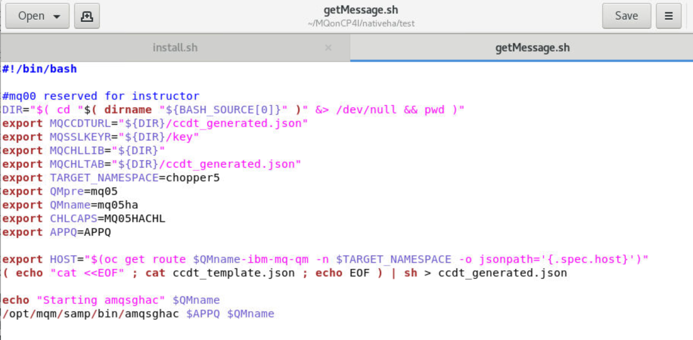	
1. Still in gedit, open *sendMessage.sh*, make the same changes for *TARGET_NAMESPACE*, *QMname*, and click *Save*.

	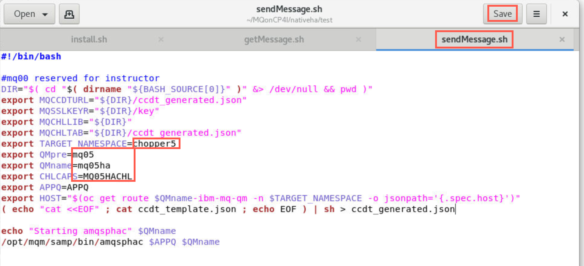
	
	Repeat the edit again for *sendPersistentMessage.sh*.
	
	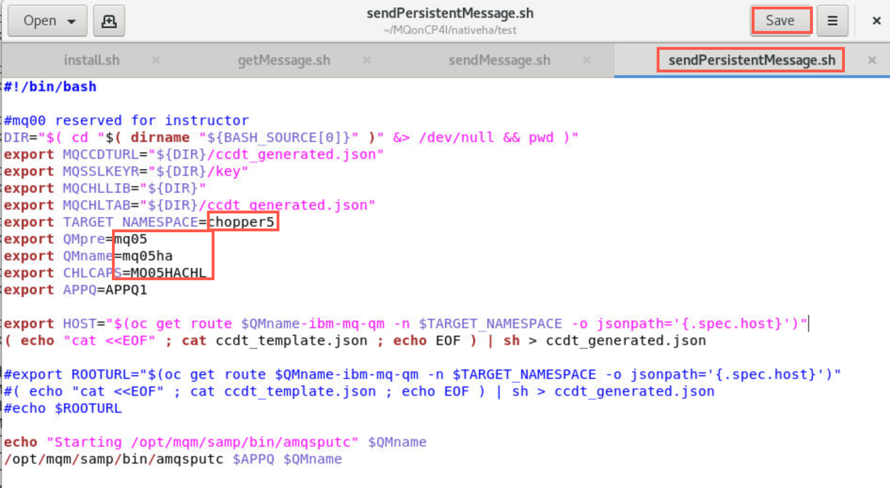
	
	Close gedit.
	
1. Run the sendPersistentMessage.sh command:

	```sh
	./sendPersistentMessage.sh
	```
	
	Enter a few random messages and hit enter after each message.
	Hit enter when finished to end the program.
	
	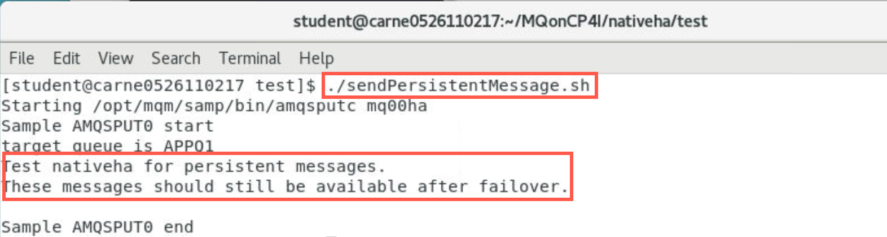
	
	The sample program amsputc will put the messages to queue **APPQ1** which has a default persistence defined as persistent. These messages should still be available after a failover.
	
1. Now start the getMessage shell with the following command:

	```sh
	./getMessage.sh
	```
	
	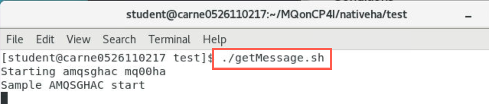
	
	The sample program amqsghac starts running and will wait for messages to arrive on queue **APPQ1**.
	
1. Open another terminal window and 	navigate to */home/student/MQonCP4I/nativeha/test* as you did previously. Start the sendMessage shell with the following command:

	```sh
	./sendMessage.sh
	```
	
	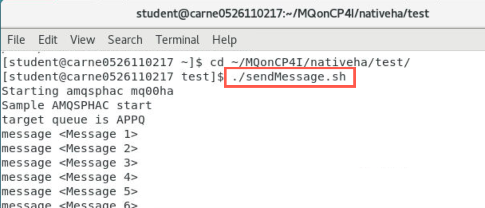	
1. The sample program amqsphac will connect to MQ and start sending messages incessantly.	

1. Return to the window where *getMessage.sh* is running. You should get a list of all the messages that have been previously sent before running the command and the ones that are being sent after.
   
   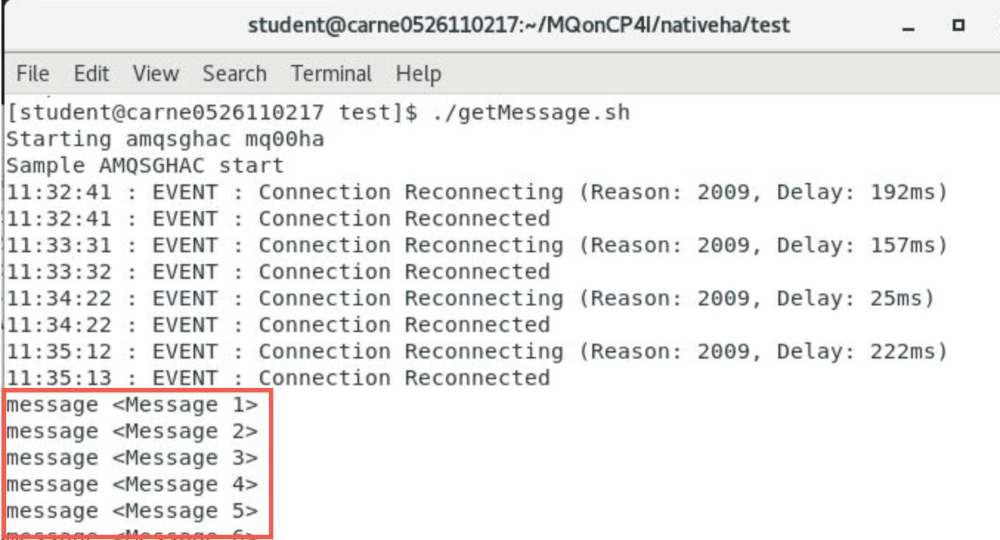

1. Open a new terminal window. To see how the pods work together in action, run the following command to view the current pods:

	```sh
	oc get pod | grep mq05ha
	``` 

	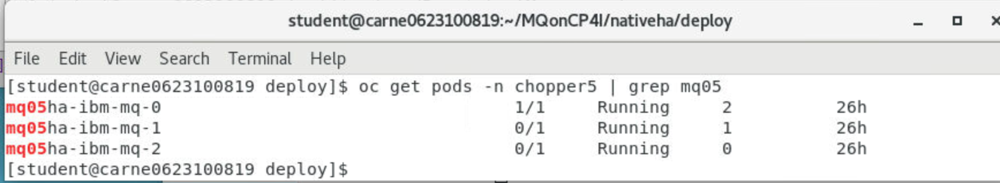 
	
1. Delete the running pod by issuing the command: 

	```sh
	oc delete pod mq05ha-ibm-mq-0
	```
	
	Once the active pod is deleted, the running programs will then reconnect to the other pod for it to take over.
   
   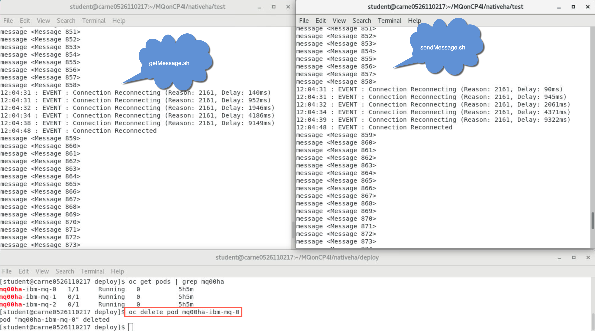

1. To verify that the other pod is now running, return to the terminal where you ran the "oc" command and issue the "get pods" again.

	```sh
	oc get pods | grep mq05ha
	```
	
	You will see that pod **mq05ha-ibm-mq-1** is now the active pod and the other two are in standby. This is indicated by the *Ready* column which shows 1 of 1 containers is running. The other pods have 0 of 1 containers running.
	
	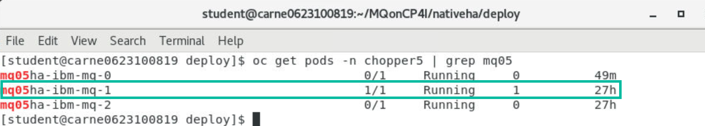

1. Return to the browser tab where OCP is open. In your project, click the drop-down for *Workloads* and select *Pods*. Enter your queue manager name in the *Name* field to filter out the rest. You will see the same information - **mq05ha-ibm-mq-1** is currently running. 

	

1. Still in OCP, kill the running pod and watch one of the standbys take over. Click the elipsis on the far right and select *Delete Pod*.

	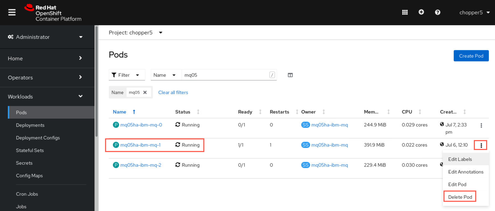
	
1. In the pop-up, click *Delete* to confirm the deletion.

1. You will see pod *mq05ha-ibm-mq-1* status change to *Terminating* immediately and within seconds, **mq05ha-ibm-mq-0** becomes *Running*.

	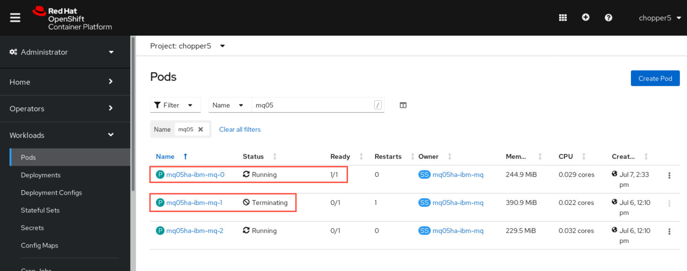

1. Return to the browser tab where MQ Console is running. Refresh the page and click *Manage*. Verify that queue **APPQ1** still has the number of messages you put to the queue earlier. 

	
	
	Click the hyperlink for the queue to verify that those are the messages you created.
	
	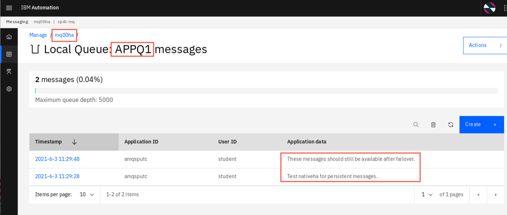	

## Congratulations

You have completed this lab nativeHA for MQ on CP4I.


## Cleanup
	
1. Close all the applications and terminal windows.

1. In a terminal navigate to /home/student/MQonCP4I/deploy:

	```sh
	cd ~/MQonCP4I/nativeha/deploy
	```
	
	You should have updated the cleanup.sh script earlier in the lab. Run it now to delete the nativeHA queue manager.
	
	```sh
	./cleanup.sh
	```

	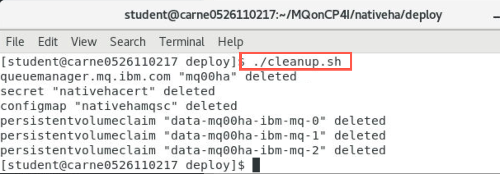