[Return to main lab page](../../acelabs/Overview/)

---

# 1. Introduction

The purpose of this LAB is to show how to migrate an IBM Integration Bus (IIB) v10 integration node (also known as Broker) into App Connect Enterprise v12

Prerequsisites:
You need to have downloaded and installed App Connect Enterprise Toolkit v12.0.6 or later in your local workstation.

You can download it from:
[https://www.ibm.com/docs/en/app-connect/12.0?topic=enterprise-download-ace-developer-edition-get-started]()

## 2. Deploy the IIB V10 backup into AppConnect V12

In this section we use a backup that was extracted from an IIB v10 instance running on Windows. The mqsibackupbroker command was used to create the backup which is packeged in a zip file. We can grab the zip file and use it to generate the content for an AppConnect v12 deployment. For the purpose of this lab the backup file is already provided for you. You will not be extracting it from an existing instance of IIB.

For your reference, the following command was used:
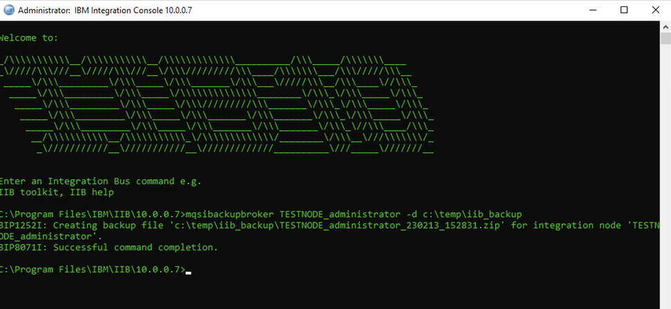

Download the backup file from [TESTNODE_Administrator_210825_083432.zip](./labfiles/TESTNODE_Administrator_210825_083432.zip) and save it to local folder in your workstation.

1. Launch the App Connect Enterprise Toolkit.
2. Open the App Connect Enteperprise console which is a pre-configured command shell environment that allows you to run App Connect configuration commands.

   - On MacOS you can open it by clicking on IBM App Connect Enterprise in the menu bar while the Toolkit window is selected and clicking on Open IntegrationConsole.

   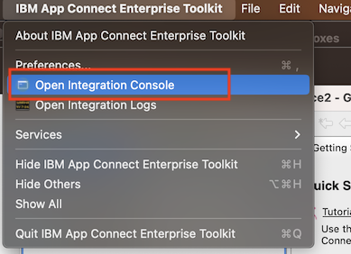

   - On Windows you can open it by clicking on the IBM App Connect Enterprise Console in the start menu.

   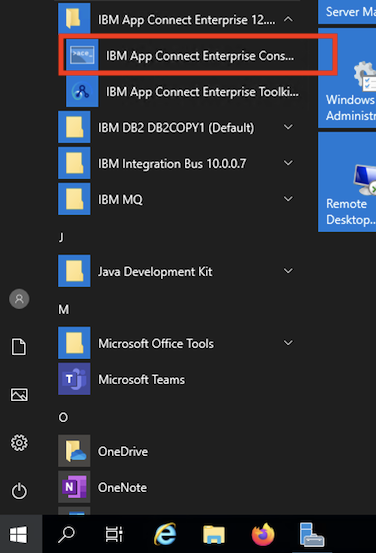
3. Run the mqsiextractcomponents command passing the location of the backup file you downloaded. For example:

`mqsiextractcomponents --backup-file /Users/rramos/Downloads/TESTNODE_Administrator_210825_083432.zip  --source-integration-node TESTNODE_Administrator --target-integration-node ACENODE1`

4. Start the newly created integration node by typing:

`mqsistart ACENODE1`

5. Switch to the ACE Toolkit window and expand the integration node which is on the bottom left panel. You should see that the ACENODE1 integration node was created and it already has applications and policies deployed to it.

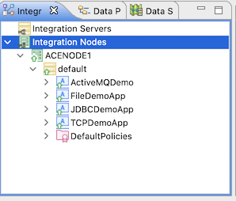

6. Expand the DefaultPolicies folder. You will see that 3 policies where created and deployed.

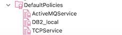

Policies did not exist in IIB v10. Configuration options for some nodes and services where provided trough node-managed ConfigurableServices which no longer exist in ACE v12. The mqsiextractcomponents command automatically created policies for such configurations and stored them in the DefaultPolicies project. Because they are stored in the DefaultPolicies project node properties in the integration flows just need to reference them by name without needing to provide a policy project. This is taken care for you automatically by the migraton tool.

If you choose to do a parallel (new code deployment) migration then you will need to start from your v10 source code and import a copy/fork into ACE Toolkit v12. That source code will not be policiy-aware so will be missing the policies. You can created then from scratch by hand but it is also usefull to run the extract command and grab the auto generated policies from there.

File location varies depending it the target is an integation node or stand-alone integration server and if the former then varies per operating system type.
For example these are locations on macOS and Windows for an integration Node:

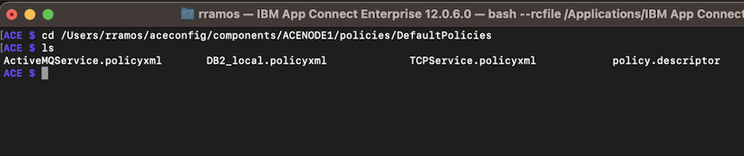
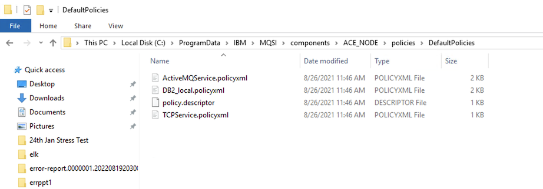

On stand-alone integration server it will be located within the work directory of the integration server.

So far we have migrated the v10 Integration Node into a new V12 Integration node. Now we will pick a particular integation server from the v10 to a v12 stand-alone integation server.

Integration Nodes are typically used on traditional VM or Baremetal IIB/ACE deployments. Stand alone integration servers can be deployed in VMs as well but are more commonly used on containers.

7. Stop the Integration node by running the following command in the ACE Intgration console:

`mqsistop ACENODE1`

8. Create a folder in your hard drive. This folder is called the work directory and will hold all configuration and runtime files for your integration server. In this example we called it defaultIS
9. Run the mqsiextract components command again but now we will select the "default" integration server and deploy it to target working directory. Replace the target-work-directory parameter with the folder you previously created in your hard drive.

`mqsiextractcomponents --backup-file /Users/rramos/Downloads/TESTNODE_Administrator_210825_083432.zip --source-integration-node TESTNODE_Administrator  --source-integration-server default --target-work-directory /Users/rramos/Documents/defaultIS`

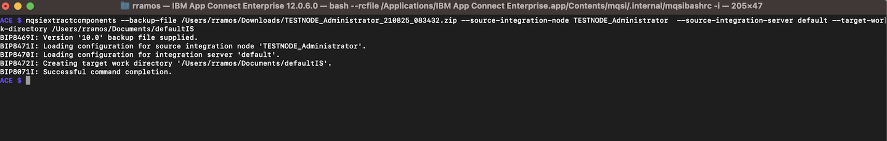

11. Start the integration server by running the IntegrationServer command and passing the location of the work directory as a parameter;

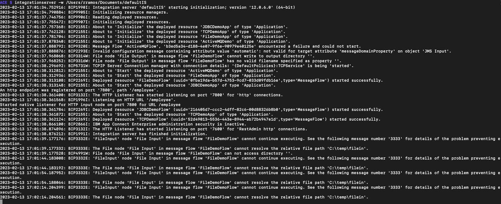

Note: You might get firewall warnings from your local OS. Click on allow connections to the integration server.

You might notice that is shows some errors because a windows folder used by a FileInputNode does not exist on your laptop. Later on we'll see can we can prevent these types of issues from happening.

11. Switch back to the ACE Toolkit and right click on Integration Servers on bottom left panel to add your new Integration Server.

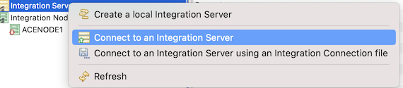

12. Type localhost as Host name and 7600 as port.

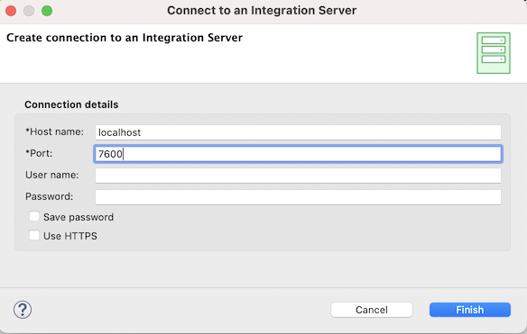

13. Expand the integration server. You should see the deployed content similarly as we saw while migrating the entire integration node.

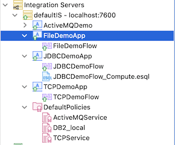

During a migration project ideally we should check first for compatibility of the existing code with the new ACE version and new target deployment architecture as containers or CP4I. For this IBM provides IBM Transformation Advisor with a plugin to analyze IIB backups or BAR files and generate migration reports.
We will run transformation advisor against our IIB v10 backup to see what we might to change before deploying it into containers.

14. Create another folder somewhere in your hard drive. This folder will hold the transformation advisor reports.
15. Go back to the Integration Console and issue the following command to set up the environment variable that points it to the report folder location (replace the folder with yours):

`export TADataCollectorDirectory=/Users/rramos/Documents/TADir`

16. Run the following command to run Transfomation advisor passing the location of the backup file you downloaded as parameter:

`TADataCollector ace run /Users/rramos/Downloads/TESTNODE_Administrator_210825_083432.zip`

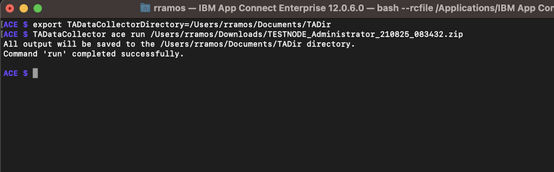

17. Navigate to the folder you created to store the reports and expand the contents.

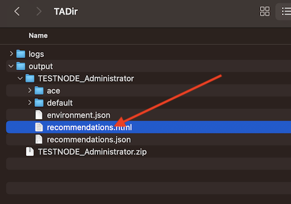

18. Double-click on the recommendations.html file:

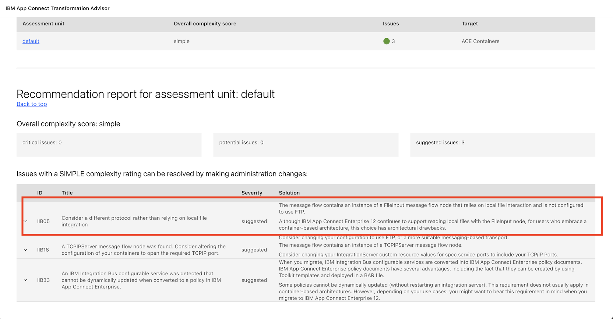

You will see some recommendations. One of them, for example, is to not use local folders for your file input node (the error we where getting) but rather a network shared file system. This would make it be more container-friendly and portable.

## Congratulations

You have completed the IIB to ACE migration lab.

[Return to main lab page](/acelabs/Overview)
