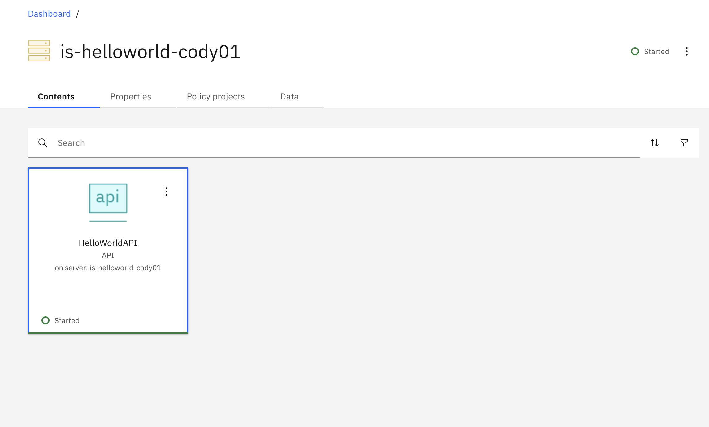

[Return to main lab page](../../acelabs/Overview/)

---

# Introduction

The purpose of this LAB is to show how to configure autoscaling of Integration Server instances based on cpu utilization.

## Deploy the an Integration Server on CP4i

1. Log in to Platform Navigator with your assigned user id.

   
2. Click on the Ace Dashboard intance under Integrations. Note: It migh have a different name  than the one in the screenshot in the cluster you are using.

   
3. Click on the Dashboard icon

   
4. Click on Create Server

   
5. Click on Quick Start Integration and then click Next

   
6. Select the HellowWorld bar file from the dropdown selection box and then click Next

   
7. Click on Next in the Configurations step

   
8. Rename the integration server to is-helloworld-`<your userid>`. For example is-helloworld-cody01

   
9. Click on the Advanced Settings toggle switch on the left so it turns green.


10. Scroll down and reduce  cpu limit and cpu request to 200m. We are doing doing this so it'll be easier to reach target resource usage limit for autoscaling. Once you are down changing the values click Create on the top right.


11. Wait until the Integration Server is ready. It might take a minute or two. You may need to refresh your browser window to confirm that it is ready.


12. Open the OpenShift console in an new browser window or tab and go to Workloads->pods on the left menu bar. Once in the pod list type is-hello as filter and look for your Integration Server name. You should see just one pod for your Integration Server.


13. Click on the (+) sign on the top right of the Openshift Console to import a yaml file. Insert the following yaml, append your userid to the name and to the name of the target referece:


For CP4I 2022.2 or earlier:
```
kind: HorizontalPodAutoscaler
apiVersion: autoscaling/v1
metadata:
  name: helloworldhpa
  namespace: cp4i
spec:
  scaleTargetRef:
    kind: IntegrationServer
    name: helloworld
    apiVersion: appconnect.ibm.com/v1beta1
  minReplicas: 1
  maxReplicas: 4
  targetCPUUtilizationPercentage: 20
```
For CP4I 2022.4 or later
```
kind: HorizontalPodAutoscaler
apiVersion: autoscaling/v1
metadata:
  name: helloworldhpa
  namespace: cp4i
spec:
  scaleTargetRef:
    kind: IntegrationRuntime
    name: helloworld
    apiVersion: appconnect.ibm.com/v1beta1
  minReplicas: 1
  maxReplicas: 4
  targetCPUUtilizationPercentage: 20
```

This creates a Horizontal Pod Autoscaler that will increase the number of replicas of the pod when average CPU utilization goes beyond 20%. Note that the target of the pod autoscaler is not a base k8s object such as deployment or statefuleset but rather an ACE Integration Server Custom Definition.

14. Go back to the ACE Dashboard window and click on your Integration server and then click on the HellowWorldAPI API



15. Click on the GET /Customer method


16. Click on Tryit and then Send.


You should get a successul response (HTTP code 200). Select and copy the URL.

17. Open a new browser tab or window and paste the URL. You should see the same reponse.


Now we will generate additional load with a rather rudementary method but should work for this lab without needing additional tools. Ideally we would used specialized tools such as LoadRunner.

18. Press and keep pressing the refresh button/shortcut of your brower for about 10 seconds. Note: In windows it would be the F5 key. On a mac it would be command+R.

20. Go back to the Openshift console and check the pods. Type is-hellow as filter and find your pods. If  utilization CPU goes beyond 0.02 cores (10% of 200 milicores) you should see that at least new pod was automatically created.


20. In the OpenShift Console go to Workloads and then HorizontalPodAutoscalers. Click on your horizontal pod autoscaler.


21. Switch to the YAML view. You will see that the desired replica count is now greater than 1.


## Congratulations

You have completed the ACE Autoscaling lab.

[Return to main lab page](/acelabs/Overview)
