[Return to main lab page](../../acelabs/Overview/)

---

# 1. Introduction

The purpose of this LAB is to show how to optimize an Integration server so its startup up time is greatly reduced and memory usage is lowered.

Prerequsisites:
You need to have downloaded and installed App Connect Enterprise Toolkit v12.0.6 or later in your local workstation.

You can download it from:
[https://www.ibm.com/docs/en/app-connect/12.0?topic=enterprise-download-ace-developer-edition-get-started]()

## Import the Project Interchange file containing the assets used in this lab.

1. Download the Project Interchange file used in this lab to a folder in local workstation;[ExampleApplication.zip](./labfiles/ExampleApplication.zip)
2. Open App Connect Enterprise Toolkit. If it is the first time you open it you will be prompted for a workspace location. Click Launch.

If you had already used the toolkit it will open your previously used workspace. If that is the case click File and then Switch Workspace then Other and change the name of the last folder to lab3 and then click Launch.

3. Click on File and then Import

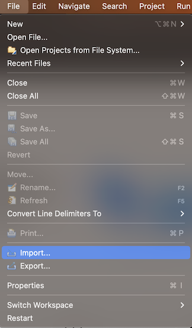

4. Select Project Interchange from the list.

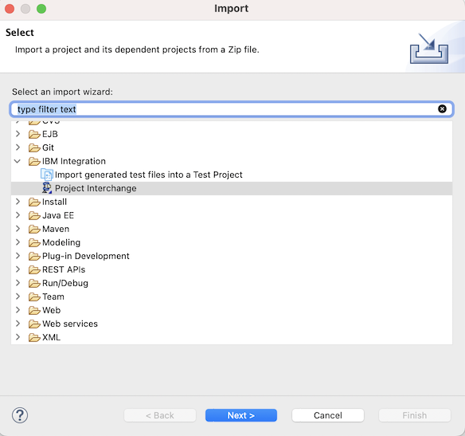

5. Browse for the zip file you downloaded, select it, make sure the application is selected and then click Finish

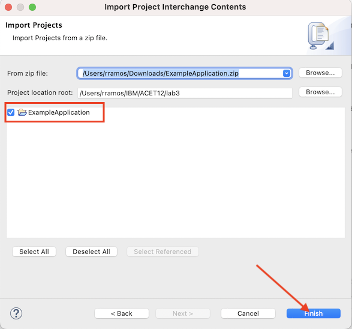

6. Expand the contents of the new application. You will see that there a single message flow in it.


# Create an Integration Server

1. From the Integration Explorer view in the bottom left corner of the Toolkit, right-click the Integration Servers folder and select the option to Create a local integration server. Leave all the options with their default values.

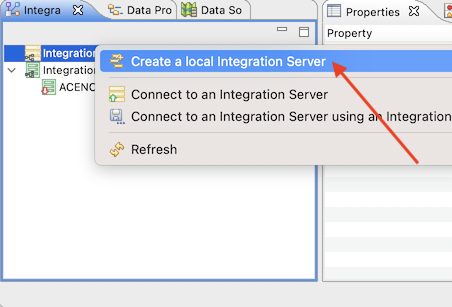

It is important to select the default options for this wizard, because we will be comparing the start-up times with these default options to the optimized server configuration later in the tutorial.

3. Click Finish on the dialog and the local Integration Server will be started, using a project in your Toolkit's workspace as the work directory. .

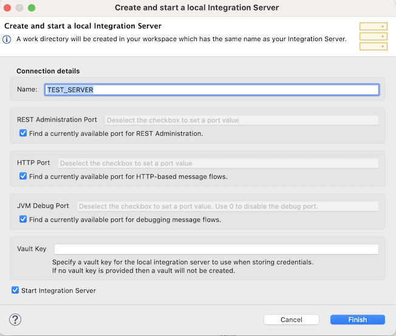

4. Click OK to dismiss the Success dialog

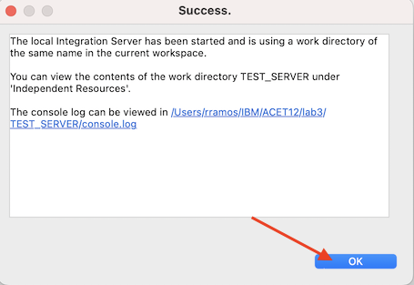

5. Right-click the integration server you just created (named TEST_SERVER) and choose the option to Open Console Log.

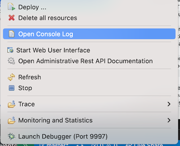

The console will show several messages for the starting of the server, similar to the following output:

```
2022-03-28 14:55:56.064716: BIP1990I: Integration server 'TEST_SERVER' starting initialization; version '12.0.4.0' (64-bit)2022-03-28 14:55:56.091108: BIP9905I: Initializing resource managers. Listening for transport dt_socket at address: 9997
2022-03-28 14:56:02.801710: BIP9906I: Reading deployed resources.
2022-03-28 14:56:03.641175: BIP2866I: IBM App Connect Enterprise administration security is inactive.
2022-03-28 14:56:03.655721: BIP3132I: The HTTP Listener has started listening on port '7600' for 'RestAdmin http' connections.
2022-03-28 14:56:03.661341: BIP1991I: Integration server has finished initialization.
```

In this example, on the particular machine this was captured from, note that the integration server started up relatively slowly, in approximately 7.5 seconds. Of course, precise timings may vary dependent on the speed of your hardware. This startup time will reduce significantly when we optimize the server later in the tutorial.
Next you will use the Flow exerciser to send HTTP requests to the message flow.

# Run

Use the Flow Exerciser to test the message flow

1. Double click on ExampleFlow.msgflow and click the Flow Exerciser icon to start testing the flow.

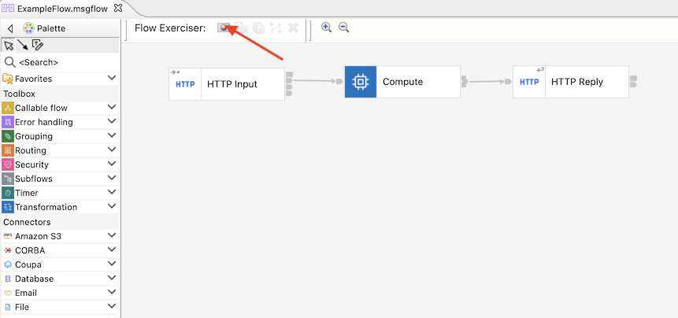

2. Click OK in the confirm popup window.

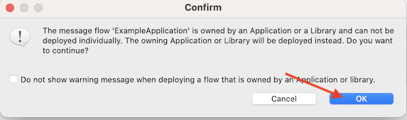

3. If a Ready to record message window appears click Close.

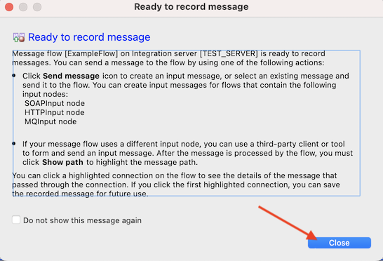

4. Click the Send Message icon.

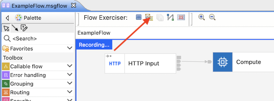

One saved message is provided, named InputJSON, which can be used to invoke the HTTP Input node...
The input message Input1 contains this data:{"message": "hello world"}

5. Select this input message and click Send and your message is sent to the HTTPInput node. You will receive an XML reply message structured like this:`<?xml version="1.0" encoding="UTF-8"?><Message>`HELLO WORLD`<Message>`
   After you close the dialog, the path taken through the message flow will be highlighted.

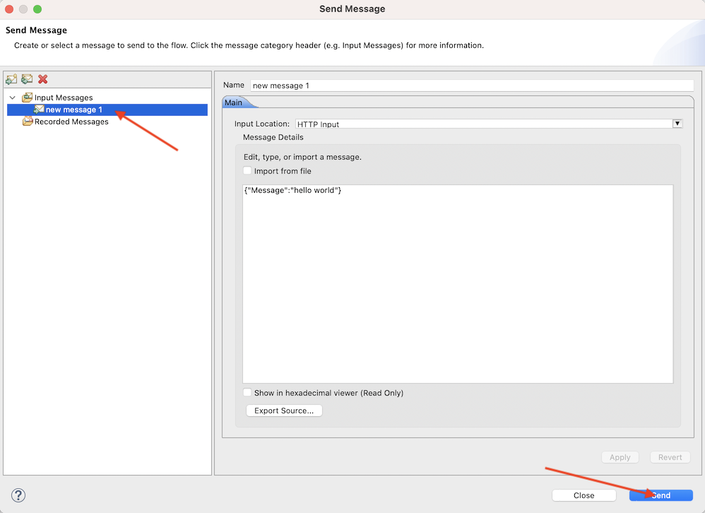

6. Close the Progress Information window.

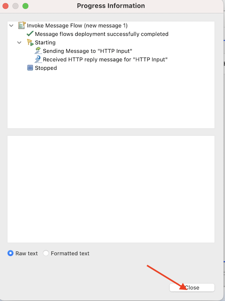

Now we have tested the message flow, we will optimize the server startup to match the content of the configured integration server. Before progressing to the next set of instructions, please STOP your integration server from the Toolkit.

7. Click the Return Flow to Edit mode button, and then righ-click TEST_SERVER and select Stop. The next stages involve interacting with the integration server's work directory and ensuring the server is stopped will avoid any of the files being locked by another process.

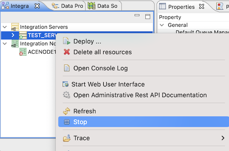

# Open a Command Console

1. Open an IBM App Connect Enterprise command console and execute the following command, using the file system location of your Toolkit workspace in place of`<Your Toolkit Workspace Location>`

`ibmint optimize server --work-directory <Your Toolkit Workspace Location>/TEST_SERVER --verbose`

The response should look like this:

`BIP15243I: Analyzing server configuration.
BIP15257I: The component 'NodeJS' is required for YAML configuration setting 'RestAdminListener/port' with value '7600'.BIP15244I: Analyzing application 'ExampleApplication'.
BIP15250I: Analyzing message flow 'ExampleFlow'.
BIP15251I: Analyzing message flow node 'HTTP Input'.
BIP15251I: Analyzing message flow node 'HTTP Reply'.
BIP15251I: Analyzing message flow node 'Compute'.
BIP15254I: The component 'Nodes/ESQL' is required for message flow node 'Compute' of type 'ComIbmCompute'.
BIP15255I: The component 'Nodes/ESQL' is required for deployed resource 'ExampleFlow_Compute.esql'.
BIP15237I: The components file '/Your/workspace/TEST_SERVER/server.components.yaml' was created. It may be further edited if required.BIP8071I: Successful command completion.`

The optimization process generates a configuration file named server.components.yaml (not to be confused with server.conf.yaml!) which is written to the root of the server's working directory.

2. Locate this file and explore its contents. For reference, it should look like this:

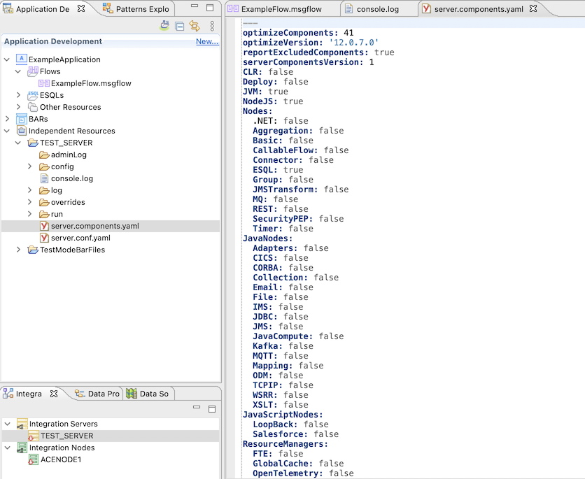

As you can see, in this particular example there are many parts of the integration server which do not need to be started, hence many entries with the value false in the list! In real-life scenarios, the greater the diversity of artifacts which you have deployed to an integration server, the larger the number of its capabilities which will need to be left switched on. In particular, note that the list above has top level settings which apply to the CLR, Deploy, JVM and NodeJS. Each of these capabilities has been switched off apart from NodeJS. NodeJS is required in order to support the integration server's administrative web UI. We will discuss this further in the second optimization stage.

We will now observe the impact of optimization.

3. Staying in the Command console session, start up the integration server using the following command:

`IntegrationServer --work-directory <Your Toolkit Workspace Location>\TEST_SERVER`

The output of the command will look like this:

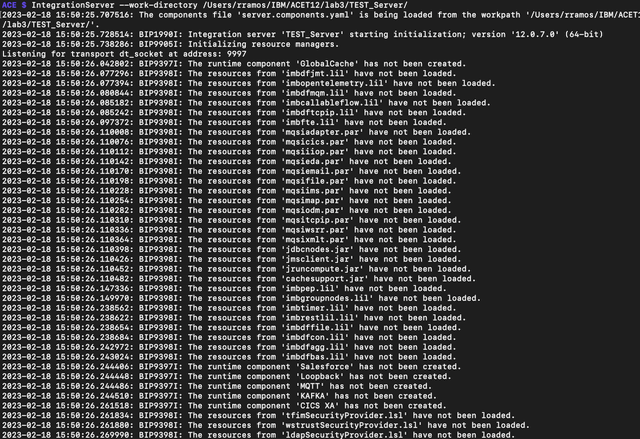

In this example, note that the integration server started up significantly quicker than normal, in less than 2.5 seconds! Of course, precise timings may vary dependent on the speed of your hardware and the degree to which your deployments can be optimized.

4. Now, stop the server. For example on Windows, Linux or MacOS platforms, you can do this using the Ctrl-C key combination in your Command Console session.
5. Open the server.components.yaml file in the root of your integration server's work directory (`<Your Toolkit Workspace Location>`\TEST_SERVER) with a text editor and change the setting to now also turn off NodeJS. You can do this by changing the property NodeJS: true to become NodeJS: false. Also change the property JVM: true to become JVM: false. Resave the server.components.yaml file.

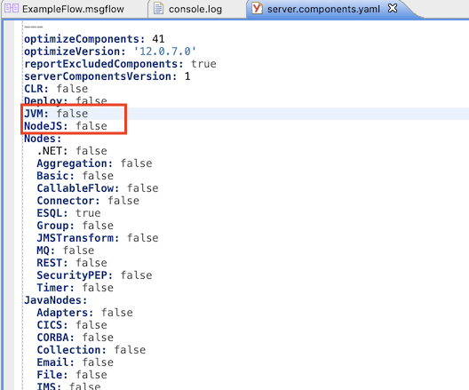

We will now observe the impact of this second stage of optimization.

6. Staying in the Command console session, start up the integration server using the following command:

`IntegrationServer --work-directory <Your Toolkit Workspace Location>\TEST_SERVER`

The output of the command will look like this:

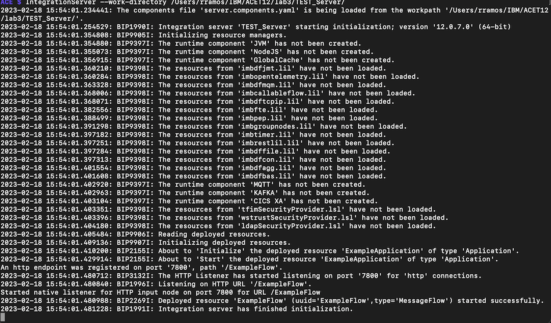

In this example, note that the integration server started up in less than a second! Again, of course precise timings may vary dependent on the speed of your hardware and the degree to which your deployments can be optimized, but you should at least observe that the integration server start time has reduced even further than in the last test.

## Congratulations

You have completed the IIB to ACE migration lab.

[Return to main lab page](/acelabs/Overview)
