[Return to main lab page](../../acelabs/Overview/)

## Building and Executing a Simple Integration Application

In this lab, you will build and execute an Integration *Application*, consisting of a single *message flow*. The Application will then be deployed to an *Integration Server* in an *Integration Node* where it will execute.

To explain these terms, in order:

- **An *Application* is a container that holds all the artifacts that make up an Integration Solution.**
- **A *message flow* is like a program but is developed using a visual paradigm.**
- **An *Integration Server* is an operating system process where user flows execute.**
- **An *Integration Node* is a collection of operating system processes, including one or more Integration Servers, that together act as an Integration Control Point. This is sometimes referred to as a Broker.**

The Integration Application you build will be deployed to an Integration Server where it will execute. The unit of deployment is a *Broker Archive* (BAR) file. Broker archive files have a file extension of “bar”, and are essentially a zip file with a deployment descriptor. The deployment descriptor allows certain properties of the message flow to be overridden. Once deployed, the flow will then be available to process requests, messages, events, etc.

**There is no need to restart the Integration Node or the Integration Server for the deployment of a new or changed message flow.**

Broker Archive (BAR) files and their use are explained in more detail at the end of Lab 2.

As a convention for these labs, a  **red box**  will be used to identify a particular area, and when information is to be entered and/or an action is to be taken, it will be in **bold** characters.  **Red arrows or lines**  may be used to indicate where nodes are to be placed when building your message flow.

Tools that you will use as part of these labs include:

- Integration Toolkit
- Flow Exerciser
- XPath Expression Builder

A number of sections will be labeled “Key Idea” or “Key Concept”. Be sure to review these sections when you come across them, as they will explain concepts of IBM App Connect Enterprise that you will explore in some detail in the early labs, but in more detail as you continue to work through the more advanced labs

### Key Idea: The Toolkit

|---|---|
|  |The Integration Toolkit.  Read the section below for additional information on the IBM Integration Toolkit.|

The Integration Toolkit is based on Eclipse and includes components from IBM Rational® Application Developer. It provides several Perspectives specifically for IBM App Connect Enterprise as well as additional Perspectives from Rational Application Developer and Eclipse. This system is using the default installation. During the labs and lectures, you will be learning more about the components in a typical development and runtime environment.

The screenshot above is of the **Integration Development** perspective. It is divided into multiple views (or panes). Each view is identified by a tab at the top of the view. On the lower left are several additional views, such as the **Integration Nodes** view.

On the upper left is the Navigator view, which has tabs for projects (**Application Development**) and patterns (**Patterns Explorer**). The Navigator view contains the projects that are available within the Eclipse workspace. In this screenshot there are no projects at present; so what you see are a set of **New Project Wizards**, for kick-starting the development of *Applications*, *Integration Services*, *REST APIs* and *Libraries*. You can also access these by right-clicking in the whitespace of the Application Development view.

The area below the Navigator view is the summary area. Several views are present in this region - the **Integration Nodes** view will show all defined local nodes as well as connections to remote nodes that have been created. **Integration Servers** (shown here is the **default** integration server) and the resources deployed, as well as their status, will be shown here as well.

The large area on the right is used by the resource editors. When an editor has opened a resource, it will also be represented by a tab. Below the editor view is a pair of views for Properties and Problems.

At upper right are tabs for the Perspective(s) that have been opened. To switch between Perspectives, you can simply click on the desired tab.

The Integration Toolkit also provides links to a number of pre-defined patterns. In later labs you will explore how these are used.

Eclipse is project oriented – artifacts are organized into projects. A project is typed. Project types that are specific to IBM App Connect Enterprise include Applications, Integration Services, REST APIs and Libraries. Also, legacy projects of type Message Flow Project and Message Set Project can be created or imported into the toolkit. Since they pre-date the concept of Applications and Libraries, they will be visible in the hierarchy under a Folder called “Independent Resources”.

Building a simple application
-----------------------------

1. In the Application Development pane, click the ***New* Application…** link.

   Alternatively, you can click **File** on the Menu Bar, and select **New->Application**, or use the drop-down list under File. Use these when you want to create project types other than those represented by the four  New  wizards.

   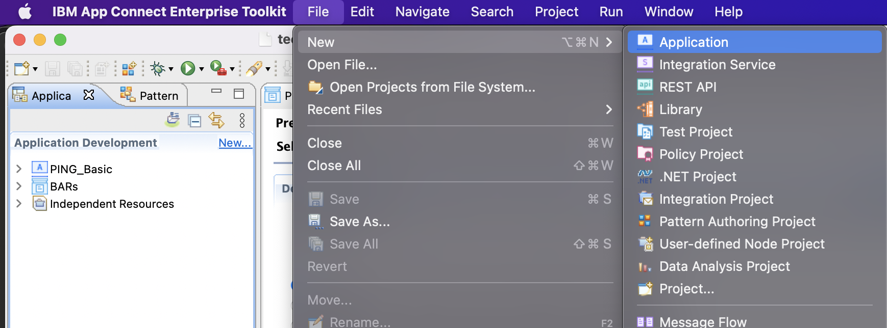

   You are prompted to enter a name for your Application.
2. Enter **IntroLab** for the Application name. Click **Finish**.

   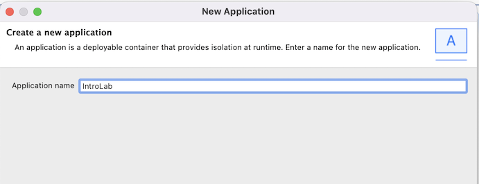

   Now you will create a new message flow.
3. Under **IntroLab**, click on **(New…)**.
4. Select **Message Flow**.

   The options for the New action will be different depending on how the request is made. For example, when using the **File New** from the Menu bar, all of the options will be listed. However, in this case, by starting from an Application, the only options shown are those that are related to the selected project type.

   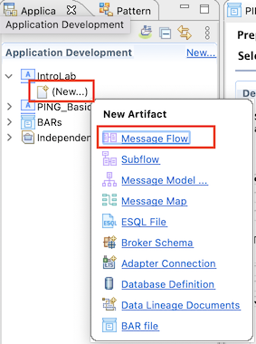
5. Here you are asked to name the message flow.

   **Note!** An **Application** may contain multiple message flows.
6. Enter **IntroMessageFlow** in the Message flow name box.

   Click **Finish**.

   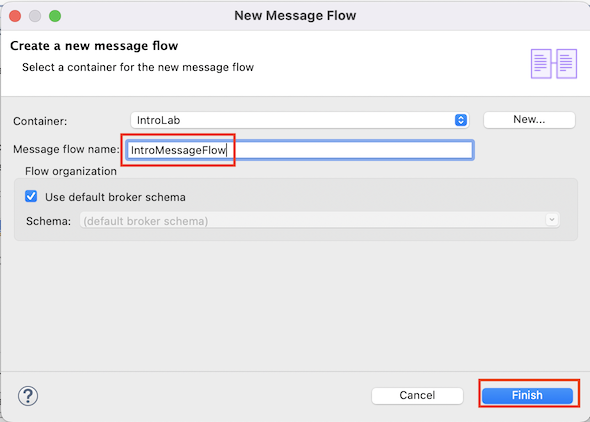

   Now things are starting to get interesting.

   You should see the first of several editors you will be working with – this one is the *Message Flow Editor*, which is used for message flow composition.
7. Click on the  white space  in the Message Flow Editor - information about the message flow will appear in the *Properties* pane.
8. Select the **Properties** tab.
9. Select the **Description** tab.
10. Enter the following:

    Enter **1.0** for the **Version** field;

    Enter **Introduction to IBM App Connect Enterprise V10** for the **Short description** field;

    Your choice of information in the **Long description** field.

    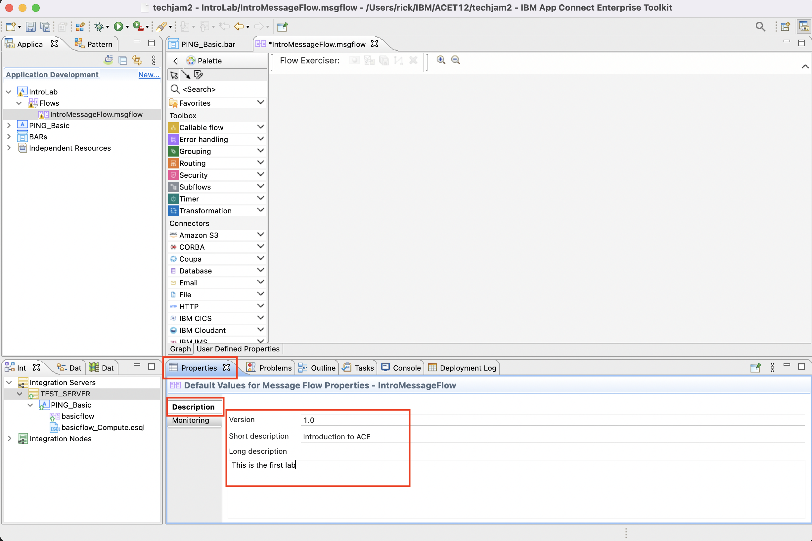

    A message flow must begin with an Input node. An input node establishes the runtime context for the flow. There is an Input node for each of the many protocols that IBM App Connect Enterprise supports. We will process an HTTP request with this flow so we need an **HTTPInput** node.

    The **HTTPInput** node is in the **HTTP** drawer.
11. Open the  drawer by clicking on it.
12. Hover over the  node. You will see a brief description of the node’s function.

    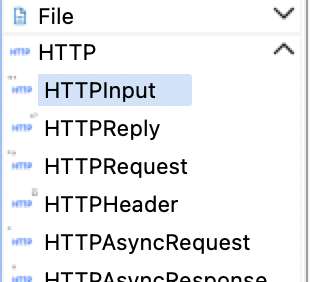
13. Click on the  node, and either drag it to the canvas or move the mouse to the canvas and click again.

    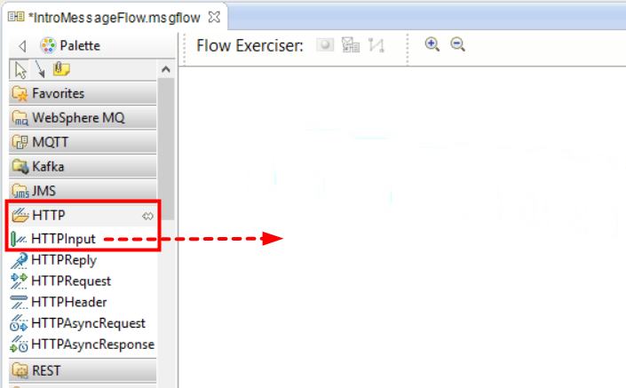

    When a node is initially added, its name can be changed immediately by over-keying the default name – or – by entering a new value in the Node name field in the Description tab of the Properties.

    A “best practice” is to provide a new name for each node that is descriptive of the function that it provides. For most of the labs, you will be renaming the nodes.

    |----|----|
    |  |If you use the names as suggested it will make it easier to follow the lab guide.|
14. Change the name of the node to **IntroLab\_Listener**.

    Press the **Enter** key to complete the rename.

    Select the **Basic** tab in the **Properties** pane.

    The **Path suffix for URL** in the node properties must be set. Mandatory fields that are not set are indicated by a message in  **red** .

    
15. Note the 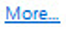 hotspot on the right.

    Click on this for a brief description of the node’s function. In addition, there will be a hyperlink provided to the Help section that describes the node in detail.

    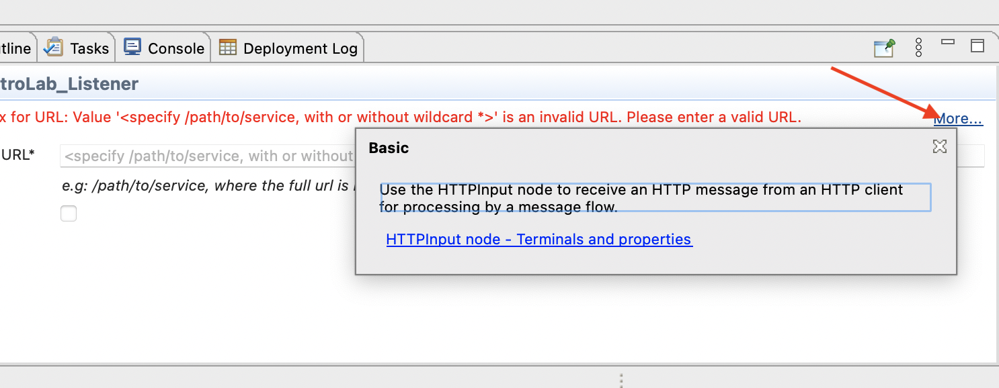
16. Click in the **Path suffix for URL** field.
17. Hover over the 
    icon that appears. Field-level help is available by clicking on these when they appear.

    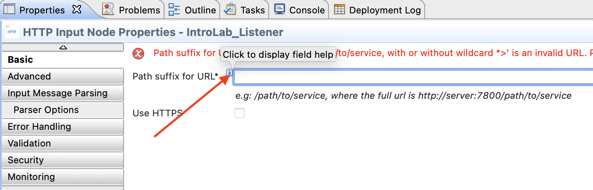
18. Enter **/IntroLabService** as the **Path suffix for URL**.

    |----|----|
    |  |**Note!** This name is case sensitive. The path suffix *must* begin with “/”.|

    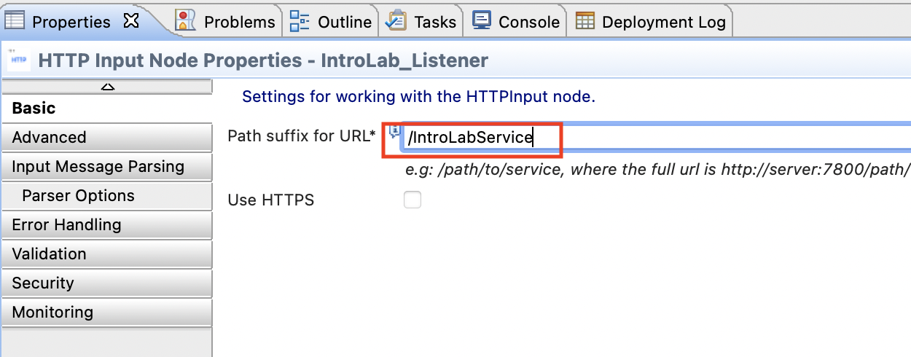
19. Select the **Description** tab. This section is used for documentation. The name of the node may also be changed here. The node name is shown in the message flow editor. It does not affect the operation of the message flow.
20. Enter **URL Suffix: IntroLabService** in the **Short description** field.
21. Enter your choice of text for the **Long description** (**Getting Started** is shown in the screen shot).

    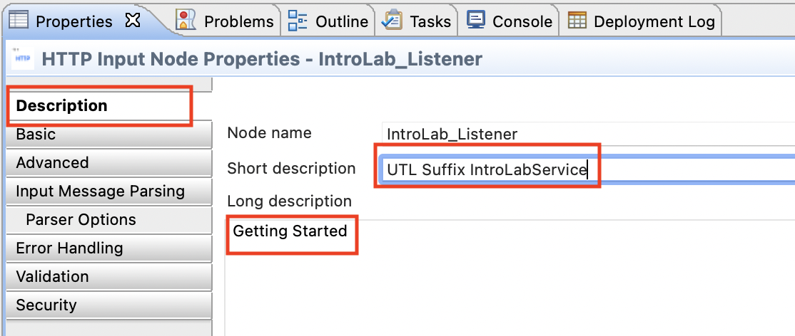
22. In the flow editor, hover the mouse pointer over the node name.

    The information in the Short description field is displayed. When there are multiple nodes on the canvas, if you move from node to node with the mouse, the same tab in the Properties will be displayed.

    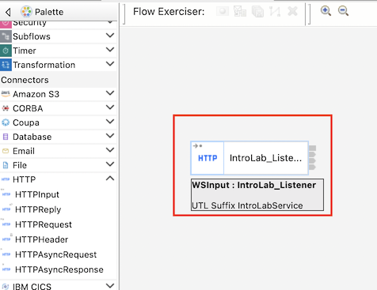
23. The **Trace** node is in the **Error handling** drawer.

    Open the 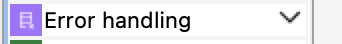 drawer by clicking it with the mouse.

    Hover over the  node to see a brief description of the node’s function.

    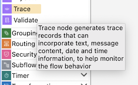
24. Select the  node and place it on the canvas to the right of the **IntroLab\_Listener** node. You do not need to rename the Trace node.
25. Press the **Enter** key to accept the default node name (**Trace**).
    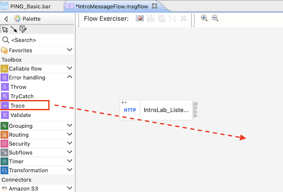
26. Click on the **Trace** node.
27. In Properties, click on the **Basic** tab.
    
28. Use the pull down list on the **Destination** field to select **File**.
    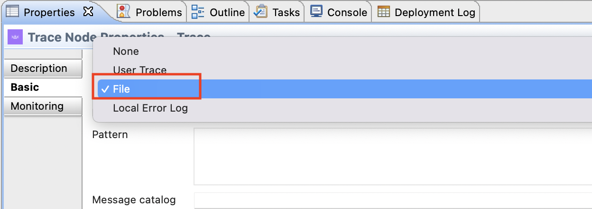
29. In the File Path field, enter a folder and file location in your hard drive.
    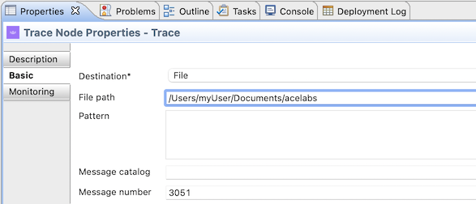

    The information in the **Pattern** box tells the node what information to produce in the trace output. If you type a line of raw text, it is echoed to the output.
30. Enter a line of ==================================== in the Pattern box.

    **Note!** You can actually enter any free-form text you like. You are doing this to make it easier to separate trace entries in the trace file, but this is not a requirement.

    In the **Pattern** box, enter the string **${Root}** *exactly as indicated* – this tells the trace node to dump out the entire contents of the message syntax tree that enters the node.

    |----|----|
    |  |**Note!** The pattern uses **curly braces**, *not* parenthesis! The pattern is *case sensitive*!|

    The expression between the curly braces will be evaluated at run time.

    Review the values you entered into the **Pattern** box. Does it match what you see below?
    
31. Double-check that **Destination** is set to **File**, the **File path** and name are valid (e.g. no embedded spaces), and that the **Pattern** is specified *exactly* as  **${Root}** 
    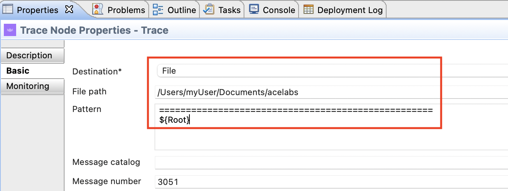
32. On the Palette, return to the **HTTP** drawer and open it.
33. Select an **HTTPReply** node from the drawer.
34. Place it to the right of the **Trace** node.
    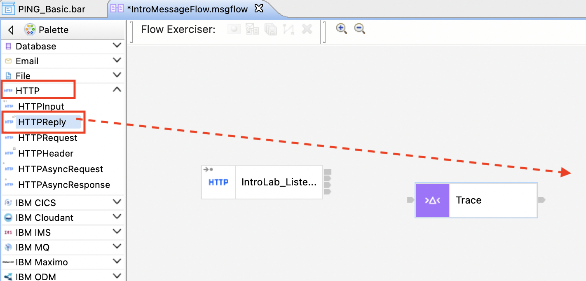
35. Press the **Enter** key to accept the default node name of HTTP Reply.
    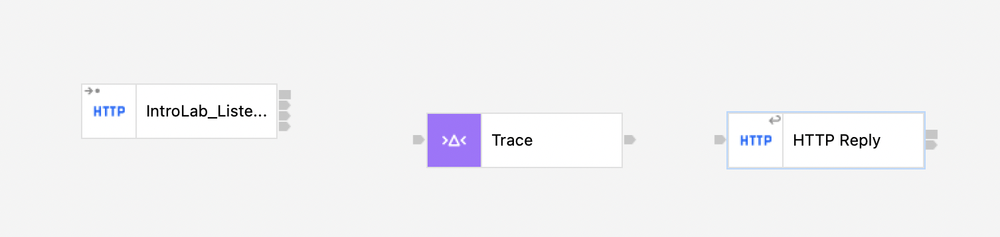
36. Click on the **HTTP Reply** node.
37. Review the properties for this node. We will be using the default values.

    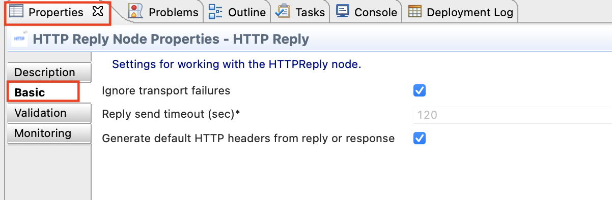

    The nodes for this flow are configured. Next we will wire the flow together using the Node Terminals.

    

### Key Concept: Node Terminals

|----|----|
| |**Key Concept:** Node Terminals. Read the section below for additional information on Node Terminals and their use.|

As you work with the various nodes, you will also be working with their Input and Output terminals. Input terminals are typically named **In**. Most nodes have an Output terminal named **Out**. They may have several others.
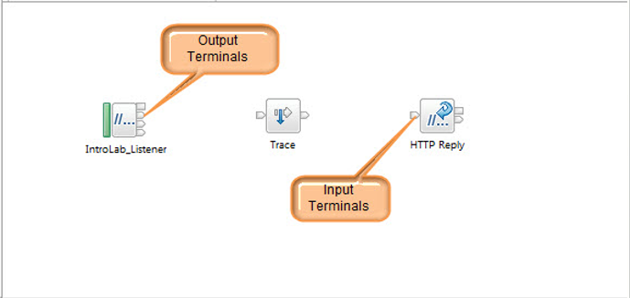

You can hover over the node terminals with the mouse pointer to see their names.

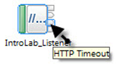

Some of these will have common names such as **Failure** or **Catch** and others will be unique to that particular node. Some nodes allow you to define the terminals. The terminals are given a name when they are defined.

The lab instructions will identify the Output terminal to be used when connecting nodes together. If you hover the mouse pointer over a terminal, a small popup will appear that identifies the name of the terminal.

You will now wire the nodes together to create a path of control for the message to follow through the message flow.

You want to wire the **Out** terminal of the *IntroLab\_Listener* node to the **In** terminal of the *Trace* node. There are two techniques:

**One** – position the mouse over the *Out* terminal (second from the top), click and drag to the target and click again.

**Two** – right-click on a node and select **Create Connection**. What follows is an example of Terminal Selection presented as a result of using Create Connection.

The rest of the Lab instructions show the second method for wiring.

1. Right click on the **IntroLab\_Listener** node.

   Select **Create Connection** from the menu.

   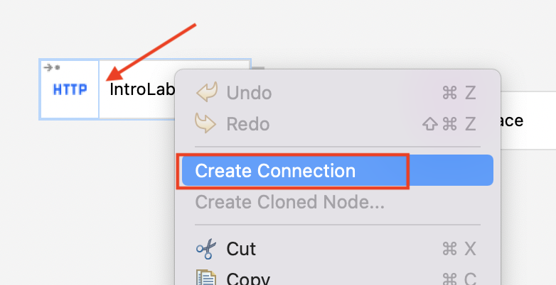
2. The *Add Connection* selection box is displayed.

   The list of the available Output terminals for the selected node is shown on the left.

   A list of available Input terminals for the nodes in the flow is shown on the right.
   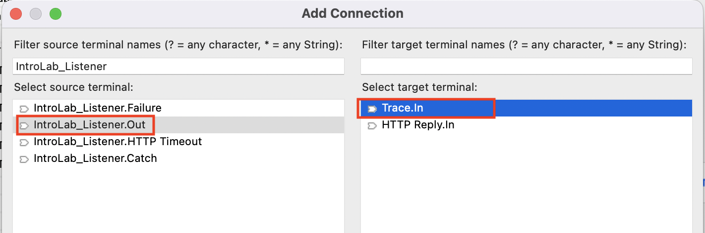
3. Select **IntroLab\_Listener.Out** on the left.
4. Select **Trace.In** on the right.
5. Click **OK**.

   The connection will be created.
6. Click on the output terminal of the Trace node and then click on the input terminal of the HTTP Reply node click on the **Trace** node.
7. The connection will be created.

   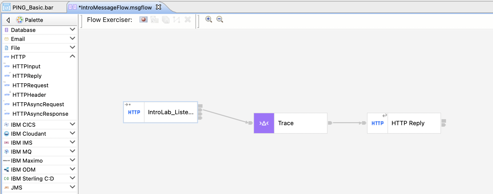

   Your message flow should now look like the above diagram.

   Notice the small asterisk next to the message flow name. This indicates that the message flow has not been saved to disk.
8. It is time to save your work – hold down the **Ctrl** key and press the **S** key to save the message flow. You can also click on the “diskette” icon or use **File** **Save** to perform a save.

   The following graphic will be used as a reminder when it is time to save your work. 

Test the Flow Using the Flow Exerciser
--------------------------------------

The message flow is now complete. The next step is to test it. The integrated Flow Exerciser will be used to test the message flow.

### Key Concept: The Flow Exerciser

|----|----|
|**Key Concept:** The Flow Exerciser. Read the section below for additional information on the Flow Exerciser.|

The IBM App Connect Enterprise Flow Exerciser provides the ability to capture a "snapshot" of the message assembly as it is processed from node to node in a flow. These snapshots capture the state of the message, as well as other structures in the message assembly, highlighting the path of control through the message flow, providing an easy, visual way to test new or modified flows.

The recorded snapshot includes all syntax trees in the message assembly -- message, local environment, environment and the exception list -- as well as several other properties such as a sequence number which give more context to the recorded message.

When using the Flow Exerciser, recorded messages are displayed using an XML representation, which shows the structure and content of the logical tree at each point in the message flow. This provides a convenient visualization of the logical tree, and is a simplified version of the internal representation that ACE uses to represent the logical tree.

Fields in the message tree can be modified, providing an easy way to exercise different paths in the message flow.

A Flow Exerciser toolbar is located at the top of the flow editor:

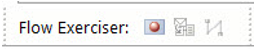

Start the Flow Exerciser. Once started, clicking this again will stop it.

 Create a message (or select an existing message or recorded message) to send through the flow.

 View the path a message takes through the flow

Using this toolbar, message recording and display can be performed with only a handful of mouse clicks. This toolbar is activated when the Integration Developer clicks the button to put the flow into record mode. This will deploy the message flow, along with any dependent resources, and enable recording. Once the message flow has been invoked, either by using an external client or injecting a message, the recorded message assembly at each stage in the flow can be displayed.

Message injection is a feature of the Flow Exerciser that provides the ability to "inject" recorded messages back into a flow, bypassing their normal transport method. For example, messages can be injected in the MQTT subscribe node even when an MQTT server is unavailable.

When recorded messages are displayed, those which are valid for injection include a "Save" icon in the top-right corner. Messages are saved to the same project as the message flow and can be shared with a project interchange file or backed up to a repository for use in a test environment.

Message injection is supported on the following nodes:

- MQInput
- MQTTSubscribe
- SOAPInput
- HTTPInput
- FileInput

Input nodes will only process injected messages if they have no incoming data via their regular transport. Output nodes "know" that a message has been injected and will deal with it differently from a normal message.

In this section, you will use the Flow Exerciser to test your message flow.

1. Download the following file you will use later for testing and save them to a folder in your hard drive:

   [IN\_Request.xml](./Assets/IN\_Request.xml)

   [IN\_Request.xsd](./Assets/IN\_Request.xsd)
2. Click the **Start** control on the Flow Exerciser toolbar to start recording.

   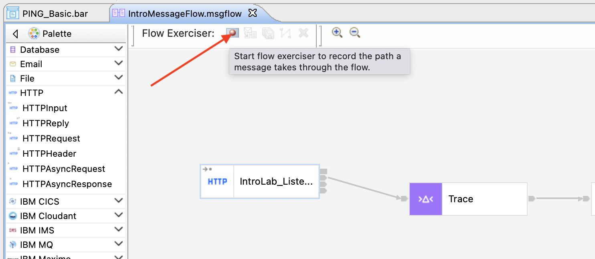
3. You might get the following warning if the flow had not been deployed :

   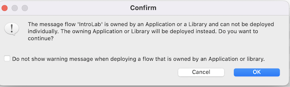

   Click **OK**.
4. The Application must be deployed to the **default** Integration Server of **POTNODE**. This will be done automatically for you by the Flow Exerciser:

   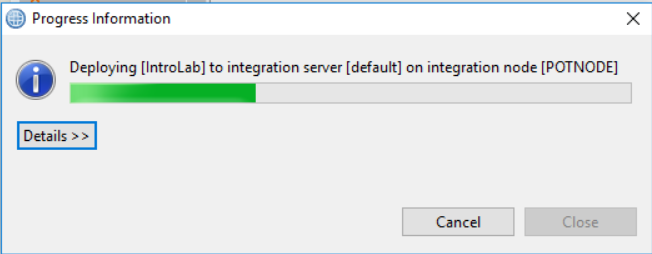
5. Once the Application has been deployed, the following will be displayed.

   Review, and when ready, click **Close**.

   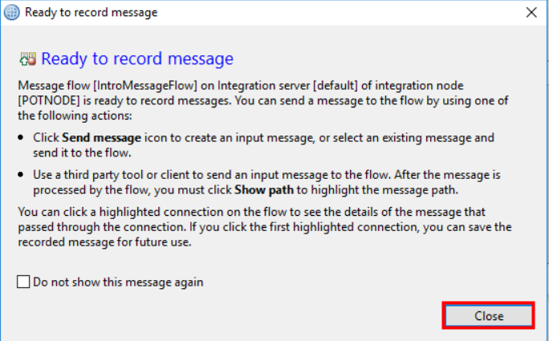
6. You are now ready to start recording. You will notice two changes:

   1. The Application has been deployed to the **default** Integration Server of **POTNODE**. You can see this by looking at the ***Integration Nodes*** view at the bottom left of the Toolkit:

      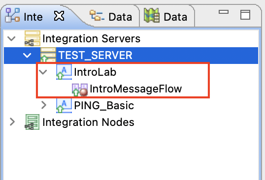
   2. The message flow is now “locked” – the background color of the flow editor has changed, and you cannot modify the flow
7. To select a message to send, click the **Send Message** control on the Flow Exerciser toolbar.

   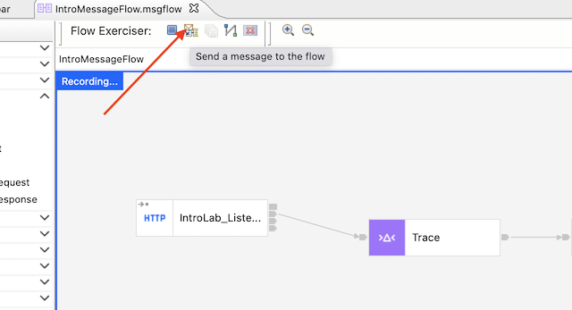
8. In the **Send Message** dialog, click the **New message** control.

   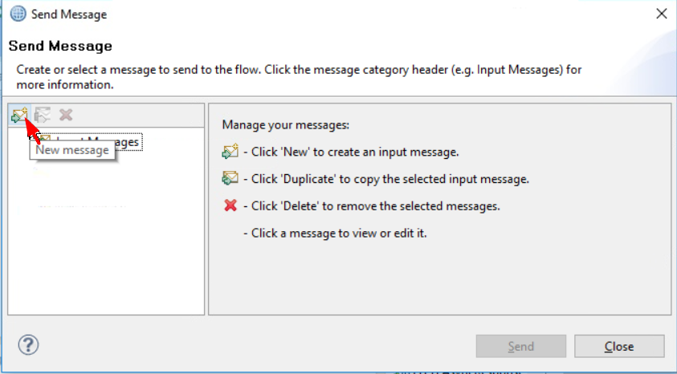
9. A new message (by default called **new message 1**) will be created.

   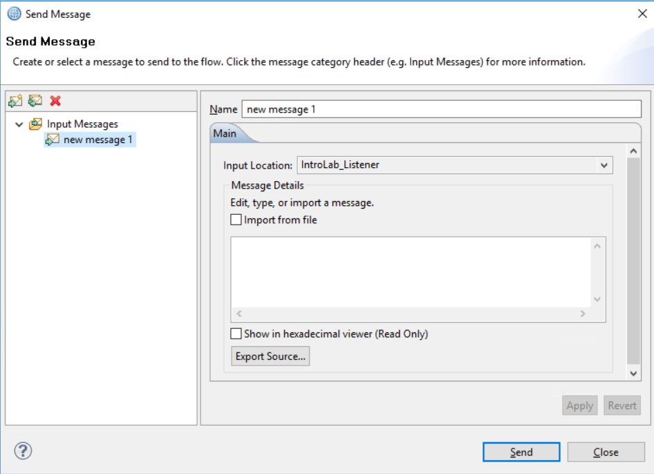
10. Change the name to ***Test message***, check the **Import from file** checkbox, and click the **File system…** button.

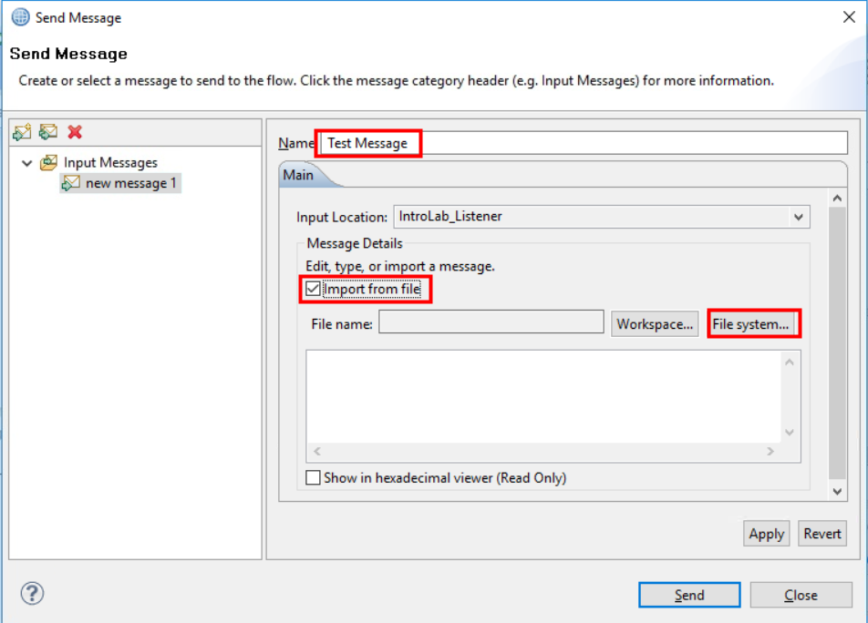

11. In the Import from file dialog, navigate to where you downloaded the IN\_Request.xml file, select the **IN\_Request.xml** file, and click **Open**.

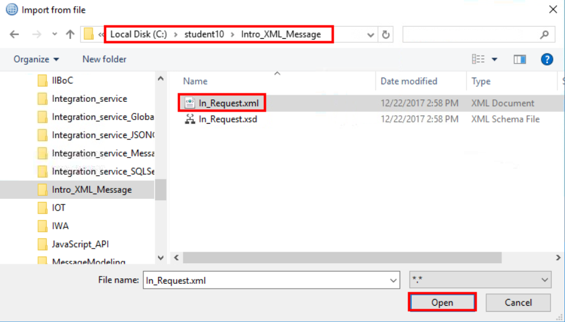

12. The selected file will be loaded.

Click **Send** to inject the message into the message flow.

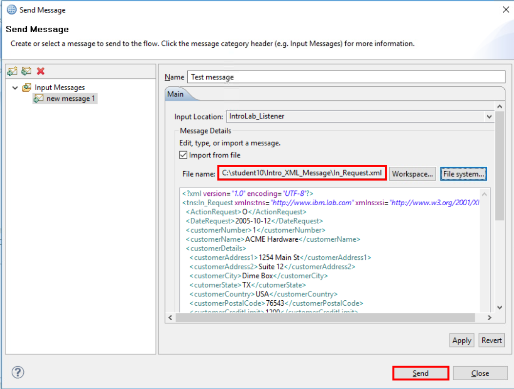

13. The Flow Exerciser will start the flow, inject the message into the flow, and capture the HTTP reply message for viewing.
14. Click **Close** when ready to proceed.

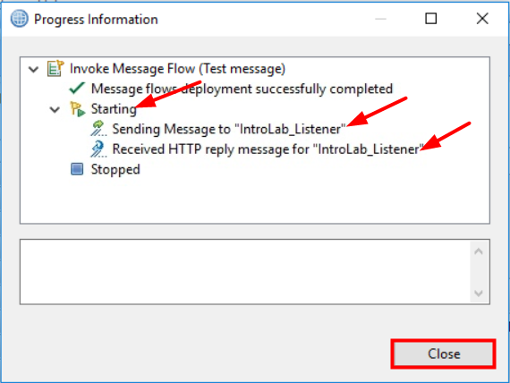

15. When returned to the flow, you will be pointed to the injected message for analysis and/or capture (saving).
16. Note the different icons on the connectors:

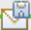 This icon means the recorded message can be viewed, changed and/or saved.

 This icon means the recorded message can only be viewed.

Click on the  icon to see the injected message.

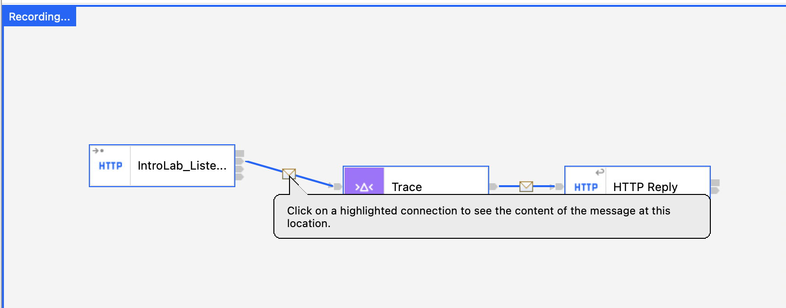

17. The Flow Exerciser will retrieve the recorded message tree, parse the folders that make up the tree, and render them in XML format for easy viewing

18. When complete, the message tree will be displayed, with the Message portion of the tree expanded.

Expand the other folders in the tree and examine them if you like.

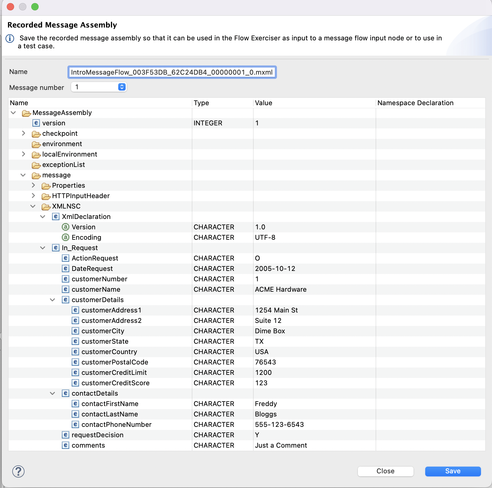

19. Focus on the **Message** portion of the tree.

You can see the folders representing the message **Properties**, followed by the **HTTP Input header**, followed by the payload (in the **&lt;BLOB&gt;** folder).

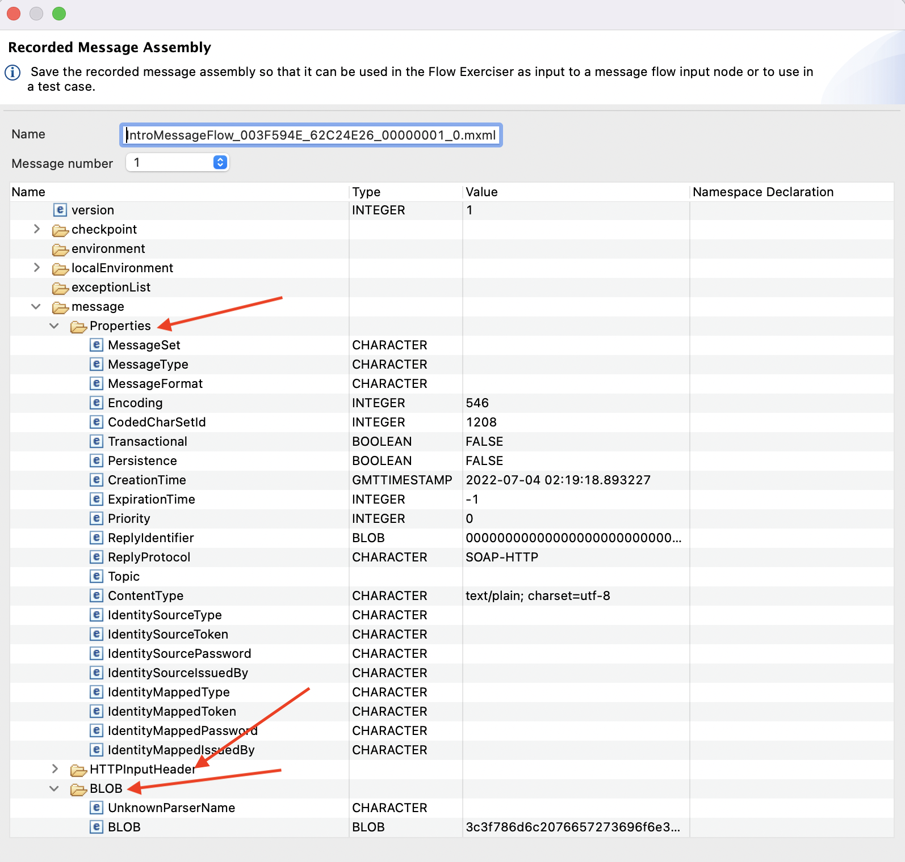

The XML rendering of the message tree makes it quite easy to interpret.

20. Compare this to a more literal representation of the tree.

The next node in your flow was a Trace node.

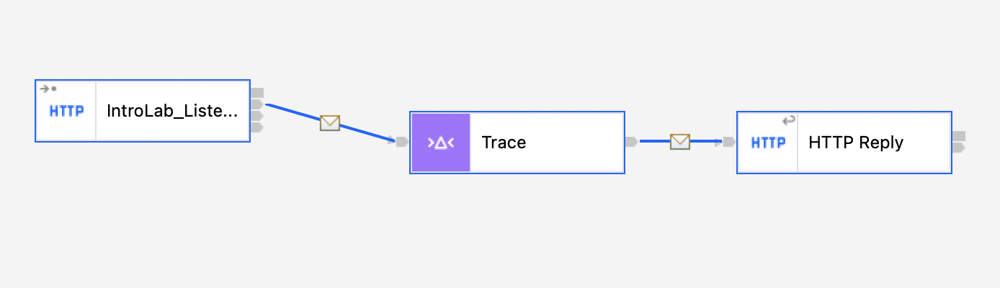

21. Use the Windows Explorer to locate the file the Trace node was configured to write to.

Navigate to the location of the file that you configured in the trace node, and double-click the file to open it.

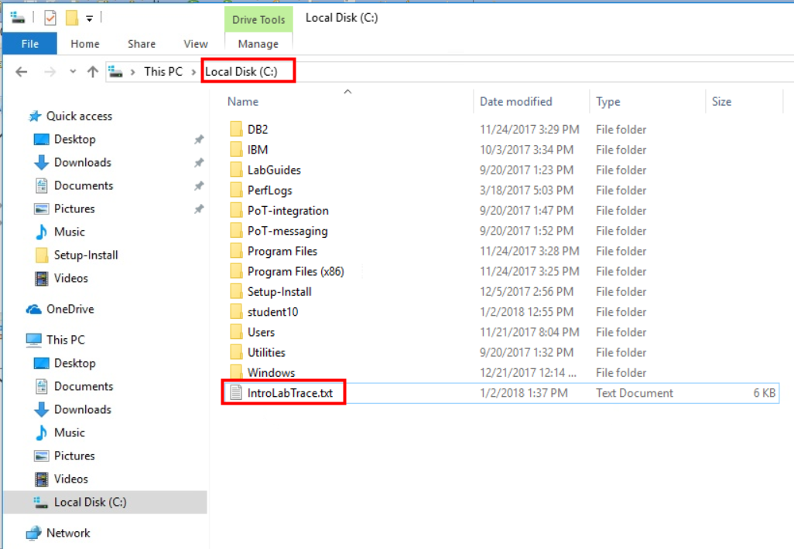

22. Recall that you configured the Trace node to capture the “ACE-internal” view of the message tree.

Examine the Trace output – you see ACE-supplied parsers for interpreting the Properties (“WSPROPERTYPARSER”) and HTTP Input Header (“WSINPHDR”). Trace output allows you to see more detail about the structure of header and message fields, such as their type (CHARACTER, INTEGER, BOOLEAN, etc).

While you see here ACE-supplied parsers for Properties (“WSPROPERTYPARSER”) and HTTP Input Header (“WSINPHDR”), what is missing is a parser for the payload – since **‘none’** is supplied, ACE treats the payload as a BLOB.

The next section will show how to tell ACE the payload is XML.

23. Close the Notepad window.
24. Return to the recorded message, and click save.

    

**Note!** If the recorded message is closed, you can double-click the  icon to reopen it.

25. Save the recorded message with the name ***Test message 1***, and click **OK**.
26. In the *Application Development* pane, expand the **Other Resources** folder under the *IntoLab* project. You will see the recorded message you saved, with the name **IntroMessageFlow\_recordedMessage.xml**.
27. Double-click this file to open it.

29. The Message Assembly Editor will open. You can see the name you assigned to the recorded message.

30. Close the Message Assembly editor.

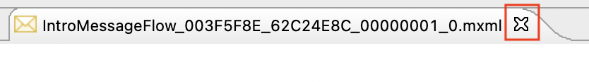

31. Stop the Flow Exerciser.

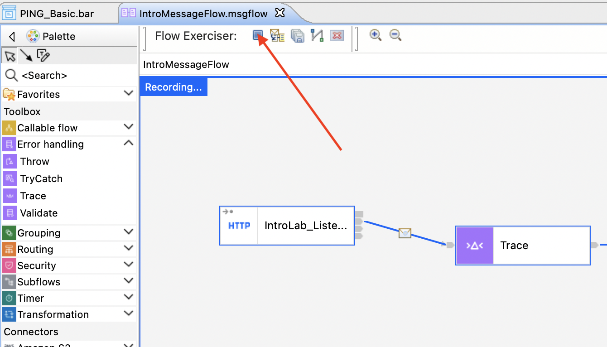

32. Click Yes on the pop-up.

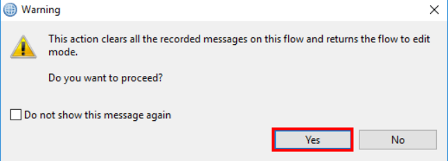

33. The Flow Exerciser is stopped, and the message flow is returned to editable mode.

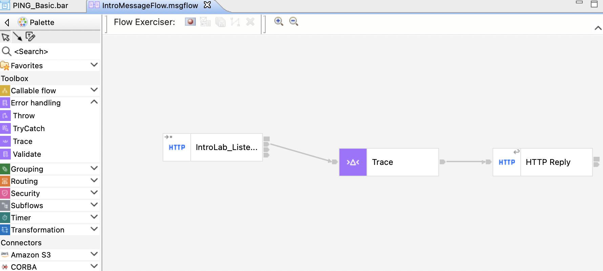

Continue to the next section to see how to tell ACE the payload is XML.

Message Models and Working with XML messages
--------------------------------------------

In this section, the IntroMessageFlow will be modified to identify the parser (XMLNSC) to be used to process the message.

The steps are very simple.

The properties of the Input node will be modified.

The Flow Exerciser will be used to run another test.

The recorded message, as well as the trace file contents, will be viewed to see the difference.

Using the XML Parser
--------------------

1. In the IBM Integration Toolkit, click on the **IntroMessageFlow** tab to bring the message flow into view.

   
2. Click on the **IntroLab\_Listener** node to bring its properties into view.

   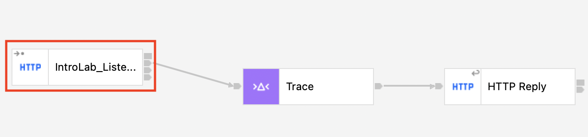

   The message flow will be modified so that it uses the XMLNSC parser to process the input message.
3. On the **Properties** view at the bottom of the screen, click the **Input Message Parsing** tab. Since nothing was specified when the node was added, the Message domain (i.e. the parser) defaults to **BLOB** – which you saw in the Flow Exerciser as well as the Trace file.
4. Click the pull-down for the **Message domain**. The various parsers are listed along with a short description. Depending on the Message domain selection, the other fields may be enabled or disabled.
5. Select the **XMLNSC** parser. The **XMLNSC** parser is the most modern and most efficient of the three XML parsers supplied with IBM App Connect Enterprise, and should be the parser of choice for most if not all message flows that handle XML messages (the others are there for backwards-compatibility).

   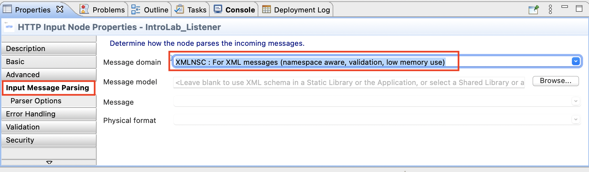
6. Save the message flow (**Ctrl+S**).

### Key Idea: Parsers and Message Domains

|----|----|
|**Key Idea:** Parsers and Message Domains. Read the section below for additional information on Parsers and Message Domains.|

As discussed previously, IBM App Connect Enterprise supplies a range of parsers to parse message content and serialize message trees in different formats.

A parser is called when the bit stream that represents an input request or event must be converted to the format that is used internally by the broker; this process is known as parsing. The input is a bit stream, and the output is a logical message syntax tree representation of the bit stream.

A parser is also used to serialize a logical syntax tree structure into a bit stream (for example on an Output node). This process is known as serializing.

Each parser is suited to a particular class of messages, known as a message domain. The following list contains some examples of the message domains used in IBM App Connect Enterprise:

- XMLNSC – for XML documents
- DFDL – for general text or binary data streams including industry standards
- JSON – for JSON documents
- DataObject – for data without a stream representation (used by adapters and connectors)

Now, with the parser for the payload identified, let’s re-run the Flow Exerciser.

1. Start the Flow Exerciser.

   
2. If the flow needs to be saved you will see this pop-up. Click **OK**.

   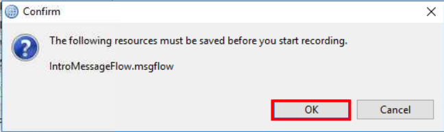
3. The Flow Exerciser will start.

   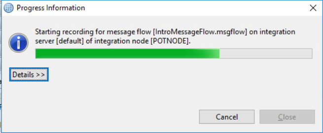
4. Click **Close** to start recording.

   
5. Click the Send message icon.

   
6. The Input message from our previous run is still available. Click **Test message**.

   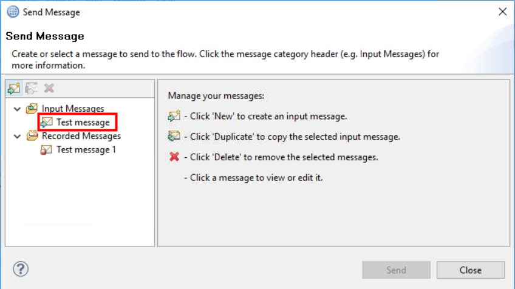
7. The test message will be loaded. Click **Send**.

   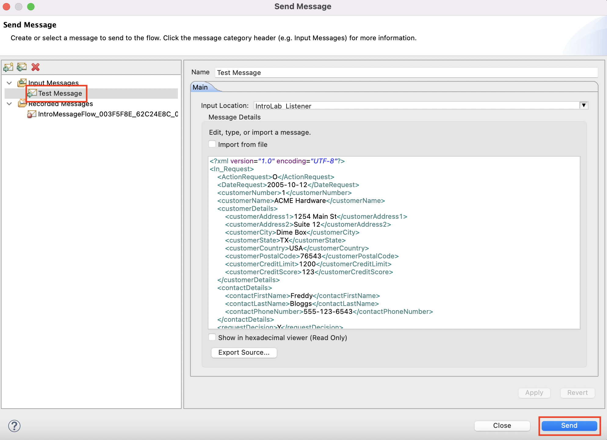
8. The Flow Exerciser will run. Click **Close** when Stopped.

   
9. Click on the highlighted message.

   
10. Note the difference between this run and the previous one.

    The Properties and HTTPInputHeader folders are there as before. But this time, instead of BLOB and UnknownParserName, you see the XMLNSC parser was used to successfully parse the message payload.

    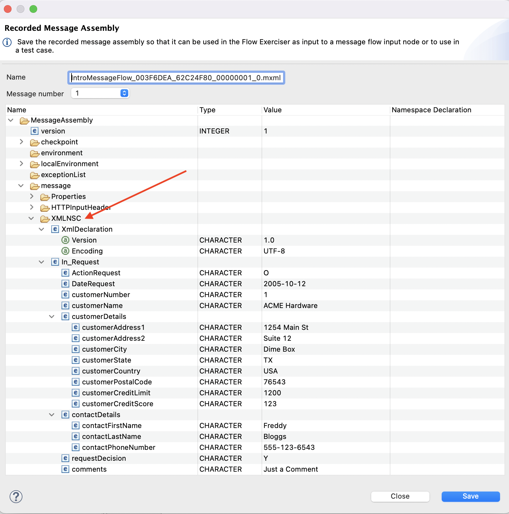
11. Call this recorded message ***Test message 2*** and click **Save**.

    
12. Close the Recorded Message window.
13. Locate the file the Trace node was configured to write to and double-click the file to open it.

    
14. Scroll to the bottom of the Trace file.

    Again you see the ACE-supplied parsers for interpreting the Properties and HTTP Input Header. But now you also see XMLNSC rather than BLOB for the payload parser, and you see the payload has been parsed and interpreted.

    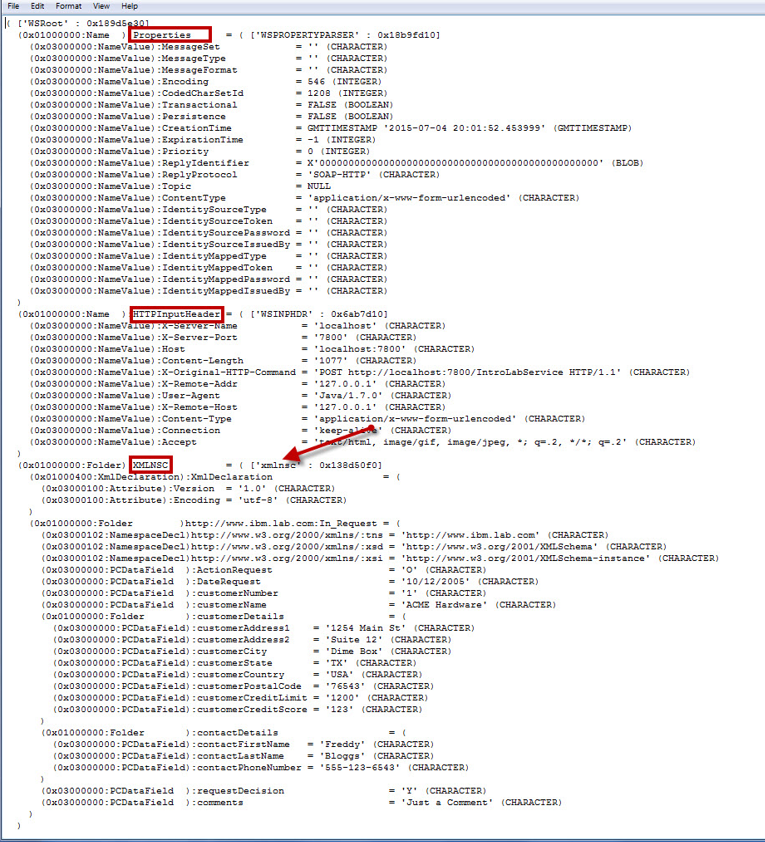

    One thing you will notice here is that all the XML fields are CHARACTER.

    Without a schema, ACE has no way to tell if any of the fields are another type.

    Next you will supply a schema, and tell ACE to validate the payload against that schema.
15. Close the Notepad window.
16. Stop the Flow Exerciser.

    
17. Click Yes on the pop-up.

    
18. The Flow Exerciser is stopped, and the message flow is returned to editable mode.

    
19. The next section will show how to tell ACE to use a message model (XML schema) to validate the message contents.

Using Message Models
--------------------

In this section, the IntroMessageFlow will again be modified, this time to identify the XML Schema file that the XMLNSC parser should use in order to correctly parse the input content and serialize the output, as well as perform schema-based validation.

This is needed in this case because the XML data contains three fields that are not CHARACTER data. A Message Model is needed for the XMLNSC parser to be able to correctly identify those fields.

### Key Idea: Message Models

|----|----|
|**Key Idea:** Message Models. Read the section below for additional information on Message Models and their purpose.|

Much of the business world relies on the exchange of information between applications. This information is contained in messages that have a defined structure that is known and agreed by the sender and the receiver.

Applications typically use a combination of message formats, including those message formats that are defined by the following structures or standards:

- Comma Separated Values (CSV)
- COBOL, C, PL1, and other language data structures
- Industry standards such as SWIFT, X12 or HL7
- XML including SOAP
- REST APIs using JSON

You can model a wide variety of message formats so that they can be understood by IBM App Connect Enterprise message flows. When the message format is known, the broker can parse an incoming message bit stream and convert it into a logical message tree for manipulation by a message flow.

Some message formats are self-defining and can be parsed without reference to a model. However, most message formats are not self-defining, and a parser must have access to a predefined model that describes the message if it is to parse the message correctly.

JSON is an example of a self-defining message format. Another is XML. With self-defining formats, the message itself contains metadata in addition to data values, and it is this metadata that enables JSON and XML parsers to understand these messages even if no model is available.

Examples of messages that do not have a self-defining message format are CSV text messages, binary messages that originate from a COBOL program, and SWIFT formatted text messages. None of these message formats contain sufficient information to enable a parser to fully understand the message. In these cases, a model is required to describe them.

Even if your messages are self-defining, and do not require modeling, message modeling has the following advantages:

- *Runtime validation of messages*. Without a message model, a parser cannot check whether input and output messages have the correct structure and data values.
- *Enhanced parsing of XML messages*. Although XML is self-defining, all data values are treated as strings if a message model is not used. If a message model is used, the parser is provided with the data type of data values, and can cast the data accordingly.
- *Code completion assistance when coding transformation*. When you are creating ESQL or Java code as part of your message flows, the language editors can use message models to provide code completion assistance.
- *Reuse of message models*, in whole or in part, by creating additional messages that are based on existing messages.
- *Generation of documentation*.
- *Provision of version control and access control* for message models by storing them in a central repository.

Message models allow the full use of the facilities that are offered by IBM App Connect Enterprise.

To speed up the creation of message models, importers are provided to read metadata such as C header files, COBOL copybooks, and EIS (Enterprise Information System, such as SAP®) metadata, and to create message models from that metadata. Additionally, predefined models are available for common industry standard message formats such as SWIFT, EDIFACT, X12, FIX, HL7, and TLOG.

The XML Parser was run in *programmatic* mode where it parsed the XML message, so it assumed everything was a string. By parsing with a model, we can get a message with typed elements and one that is subject to constraints (such as required fields, max field lengths, etc.). The toolkit provides wizards to import your existing models (such as WSDLs, XSDs, copybooks, etc.)

1. In the *Application Development* view (project navigator) on the left, right-click the whitespace.
2. Select **New->Message Model…** from the menu.

   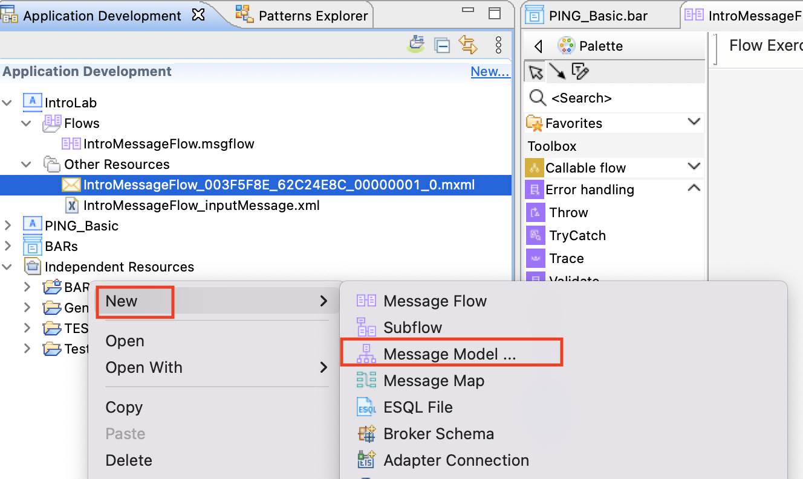
3. Select the **Other XML** radio button (under **XML**).

   Click **Next**.

   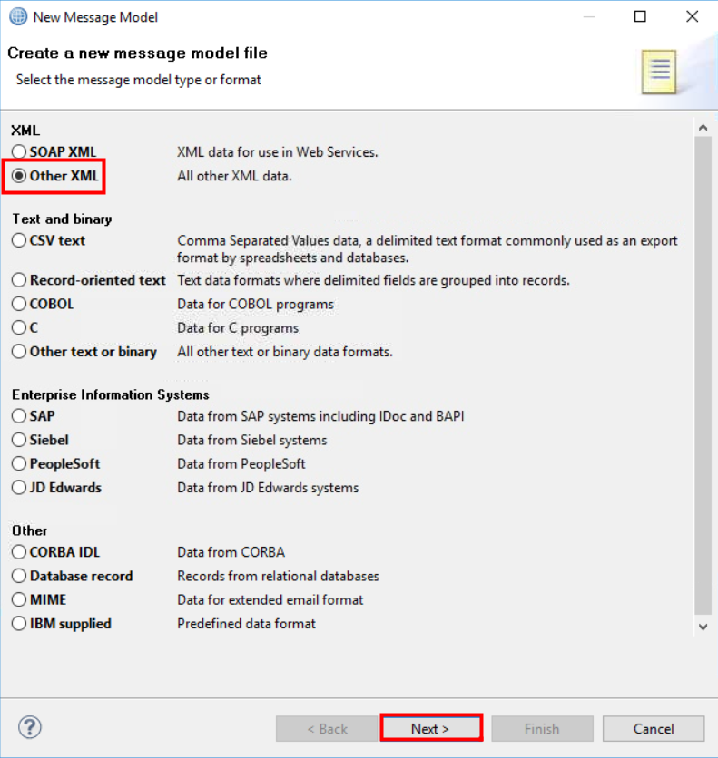
4. Select the I already have an XML schema for my data radio button.

   Click Next.

   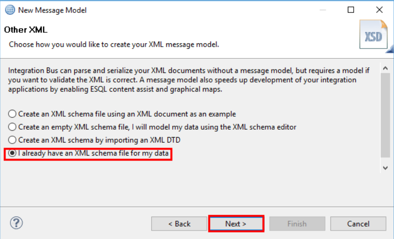
5. Click the **New..** button next to the **Application or Library** field.

   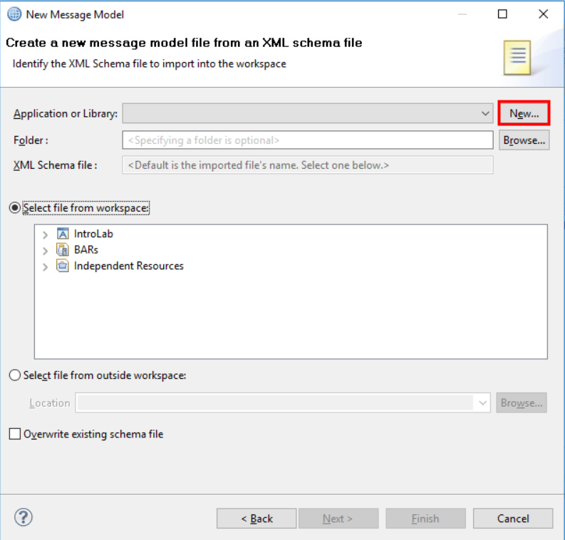
6. In the popup dialog, select **Library**.

   Click **OK**.

   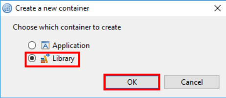
7. In the *New Library* dialog, type **IntroLab\_Lib** as the **Library name**.

   Click the **Static Library** radio button. This means the contents of this library will not be shared across Applications and Services.

   Click **Finish**.

   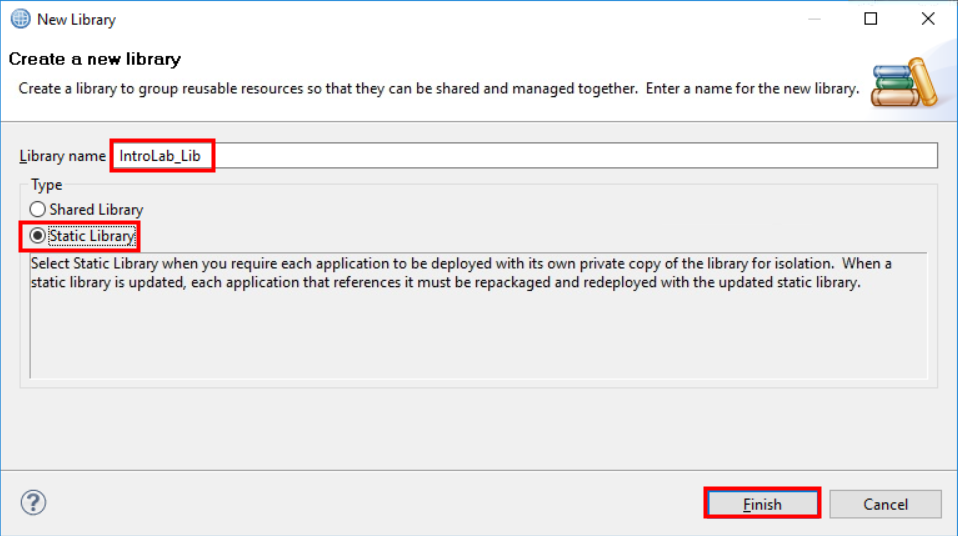
8. Back in the Message Model wizard, check the radio button **Select file from outside workspace**.
9. Click **Browse…**

   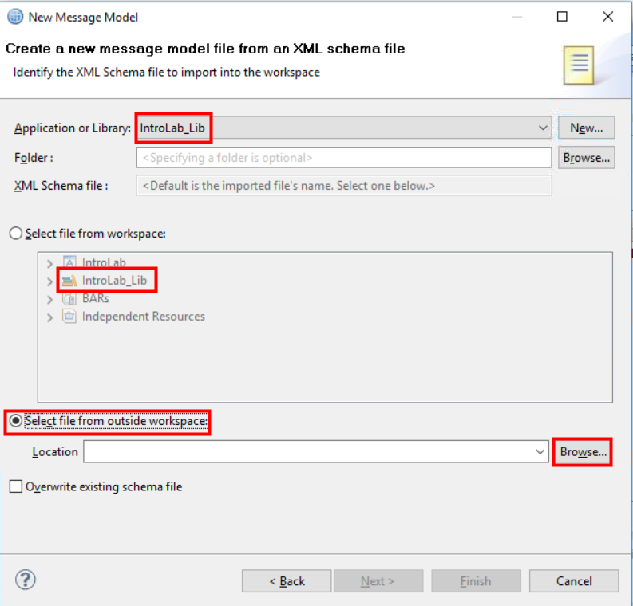
10. Navigate to where you downloaded the XML and XSD files folder.

    Select **IN\_Request.xsd**.

    Click **Open**.

    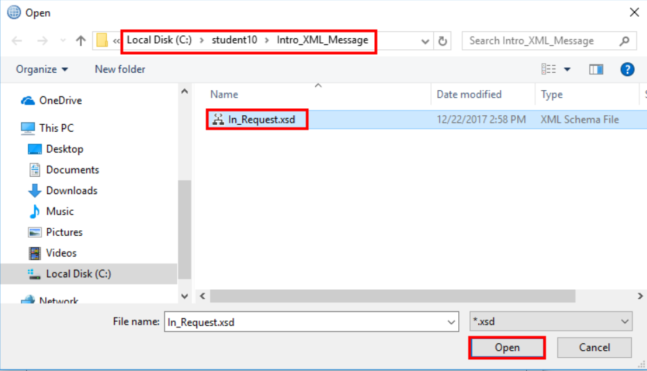
11. Back in the Message Model Wizard, click **Finish.**

    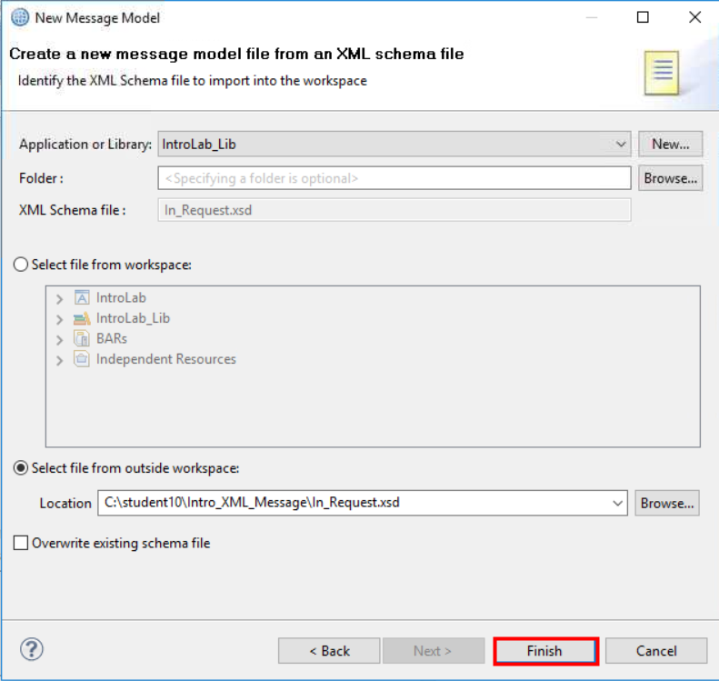

    You now have a Library project with the XML message model for the input message.

    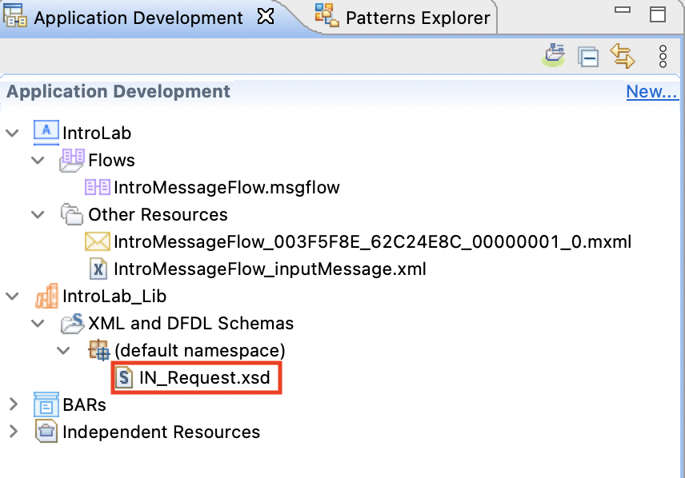

### Key Idea: Library Projects

|----|----|
| **Key Idea:** Library Projects. Read the section below for additional information on Message Models and the purpose and use of Library Projects.|

*Applications* and *Libraries* are deployable containers of resources: The contents of these can include message flows, message definitions (DFDL, XSD files), JAR files, XSL style sheets, and WebSphere Adapters files.

A *Library* is a logical grouping of related code, data, or both. A library contains references to reusable resources, such as a message model or map. A library can refer to a resource that is contained in another library. Libraries are optional. They are typically used to reuse resources. Use multiple libraries to group related resources (for example, by type or function).

Libraries can be either *Static* (embedded in the Applications or Services that use them) or *Shared* (meaning they can be referenced across multiple Applications or Services).

Consider using libraries if you want to share routines and definitions across multiple teams, projects, or brokers. Libraries are also useful if you need to use different versions of a coherent set of routines and definitions.

Using a library is typically not necessary if you do not need to regularly reuse IBM App Connect Enterprise routines or definitions.

1. The XML Schema Editor should be opened for you after import.

   If it is not, double-click on **In\_Request.xsd** to open it.

   
2. The message model should now be visible in the XML Schema Editor.

   Double-click on the **In\_Request** element to view the message elements.

   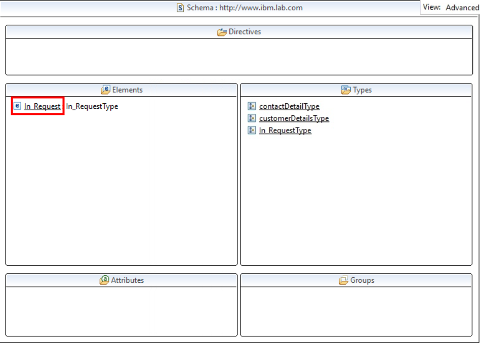
3. Double-click on the (IN\_RequestType) title bar to expand the schema view.

   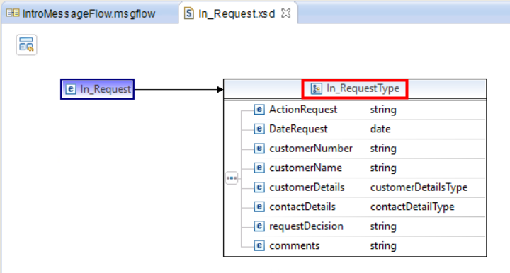
4. Note that some elements (such as customerCeditLimit and customerCreditScore) are integers (ints) and not strings and DateRequest is a date.

   
5. Close the **IN\_Request.xsd** tab.

   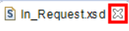

   Now, in the message flow, we need to tell the parser to run in *schema-driven* mode, rather than operate in *programmatic* mode.
6. Click on the **IntroMessageFlow** tab to bring the message flow into view.

   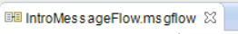
7. Click on the **IntroLab\_Listener** node to bring its properties into view.

   
8. In the **Properties** view, click on the **Validation** tab.

   In the **Validation** dropdown, select **Content**.

   
9. Select the **Parser Options** tab.

   Select the *Build tree using XML schema data types* check box.

   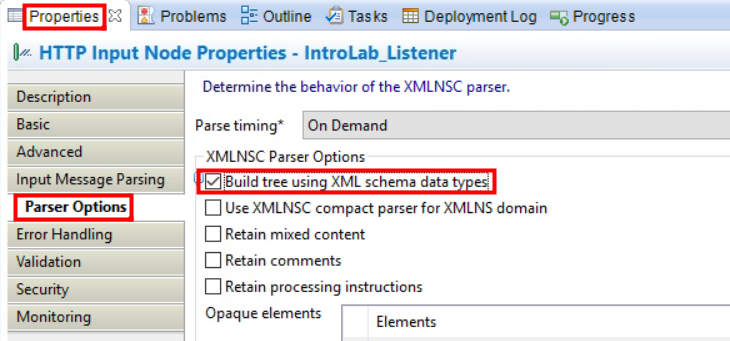
10.  Save the message flow (**Ctrl+S**).
11. Note that when the flow is saved, a warning appears on the Input node.

    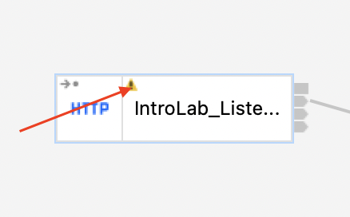
12. Hover the mouse pointer over the node to see the warning.

    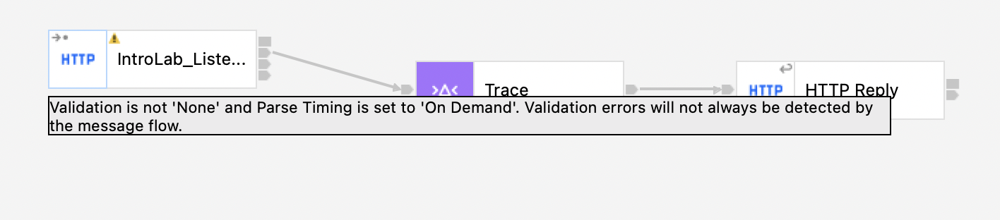
13. You can also see this warning if you click on the **Problems** tab in the lower right window.

    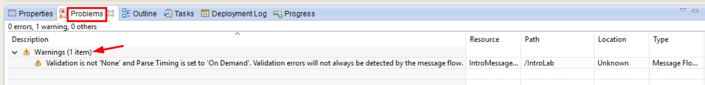

    You could resolve this warning, but for now you will ignore it.

    However, this is a good point to spend a minute reviewing how IBM App Connect Enterprise handles parsing.

### Key Concept: Parse Timing

|----|----|
| . Or, you may be modifying the message, but only in a trivial way. In such cases, parsing the entire message may incur needless overhead.

For this reason, IBM App Connect Enterprise gives you the ability to dictate when and to what extent parsing is to be performed. One example of this is *Parse Timing*.

By default, App Connect Enterprise will use *On-Demand parsing*. This means the message will only be parsed if elements within it are referenced, the parsing will occur at the time of reference (“on demand”), and the message will only be parsed up to the point of reference. In many cases, On-Demand parsing will save memory and processor overhead – particularly if referenced fields are near the beginning of a message.

On-Demand parsing involves a trade-off, though: If a message is malformed, that fact may not be discovered, as the malformation may be at a point in the message for which parsing was avoided. Similarly, if validation is requested, it will only be performed for those parts of the message that are parsed, and so an invalid message may not be detected.

The latter situation is the reason for the warning you see on the IntroLab\_Listener node. As the warning indicated, you requested that validation be performed on the content of the message, but the parse timing was set to its default value of *On Demand*, creating the possibility that validation errors would not be detected.

If Parse Timing were set to *Immediate*, the result would be that the entire message would be parsed, allowing validation to be performed against the full message.

As mentioned, you could resolve this warning, but for now you will ignore it. You will explore dealing with errors and problem determination in a later lab, including parsing errors.

Project References
------------------

Because **IntroLab\_Lib** is defined as a *Static Library*, the **IntroLab** *Application* must have a reference to it so that it is included when the Application is deployed.

1. In the Application Development pane, right-click on the **IntroLab** Application, and select **Manage Library References** from the menu.

   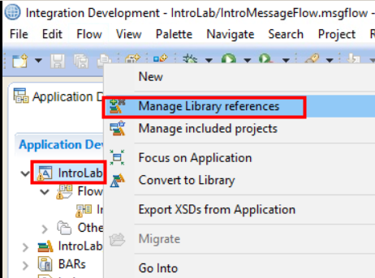
2. Click the **IntroLab\_Lib** checkbox.

   Click **OK**.

   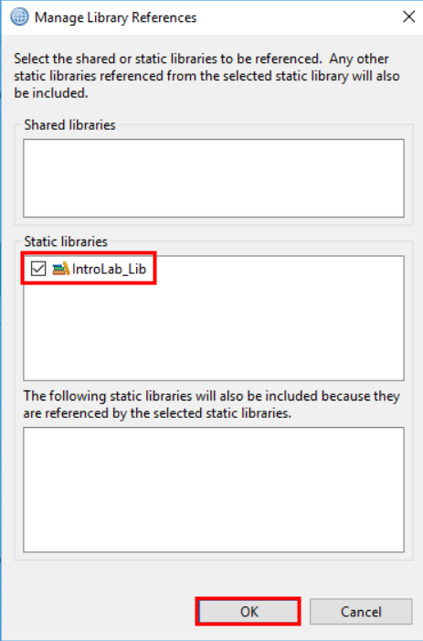
3. In the Application Development pane, you should now see that **IntroLab** includes a reference to the **IntroLab\_Lib** library.

   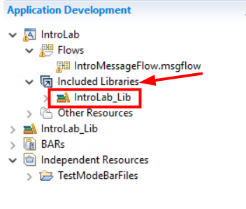

   You are now ready to test the Application again, using the Flow Exerciser.

Test Again Using the Flow Exerciser
-----------------------------------

The flow will now be run again. The trace output will then be examined.

1. In the IBM Integration Toolkit, click on the **IntroMessageFlow** tab to bring the message flow into view.

   
2. Start the Flow Exerciser.

   
3. If the flow needs to be saved you will see this pop-up. Click **OK**.

   
4. The Flow Exerciser will start.

   
5. Click **Close** to start recording.

   
6. Click the **Send** message icon.

   
7. The Input message from our previous tests is still available. Click **Test message**.

   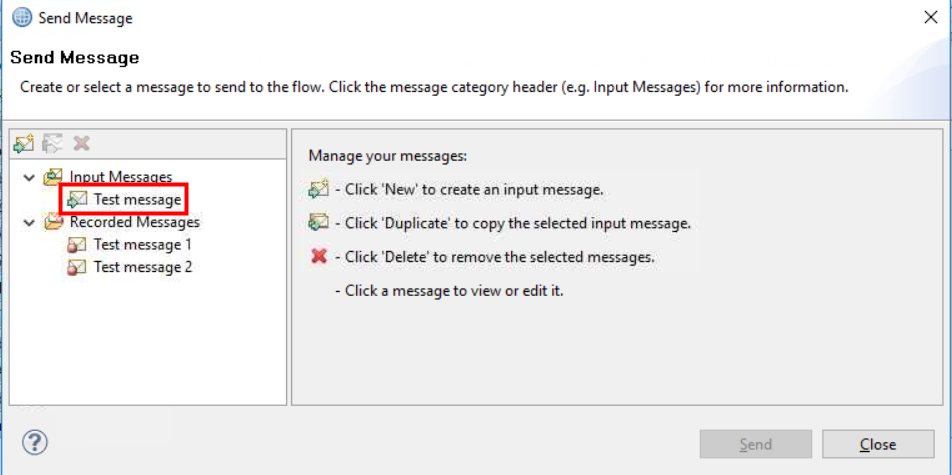
8. The test message will be loaded. Click **Send**.

   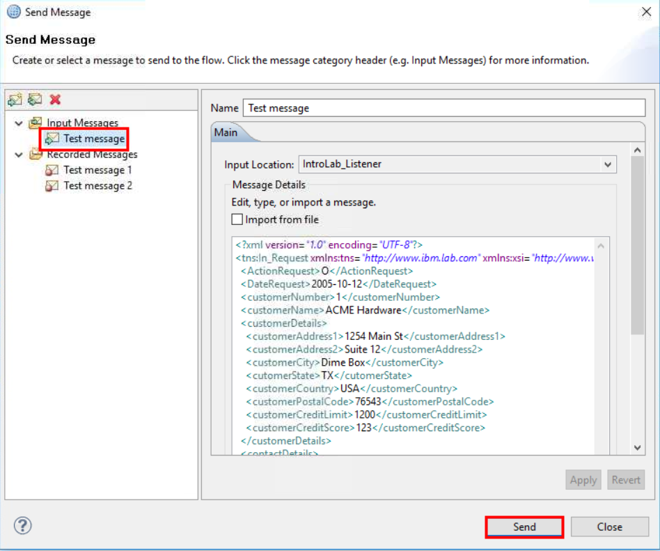
9. The Flow Exerciser will run. Click **Close** when Stopped.

   
10. Click on the highlighted message.

    
11. Note that the elements the XML schema identified as integers and date look no different here than in the previous test.

    But that’s to be expected, since the Flow Exerciser renders the message tree using an XML representation, regardless of their format, and elements in those messages as strings, again regardless of their actual type.

    We can return to the Trace file to see the actual physical representation of tree elements, to see if the schema was in fact used when parsing the message.

    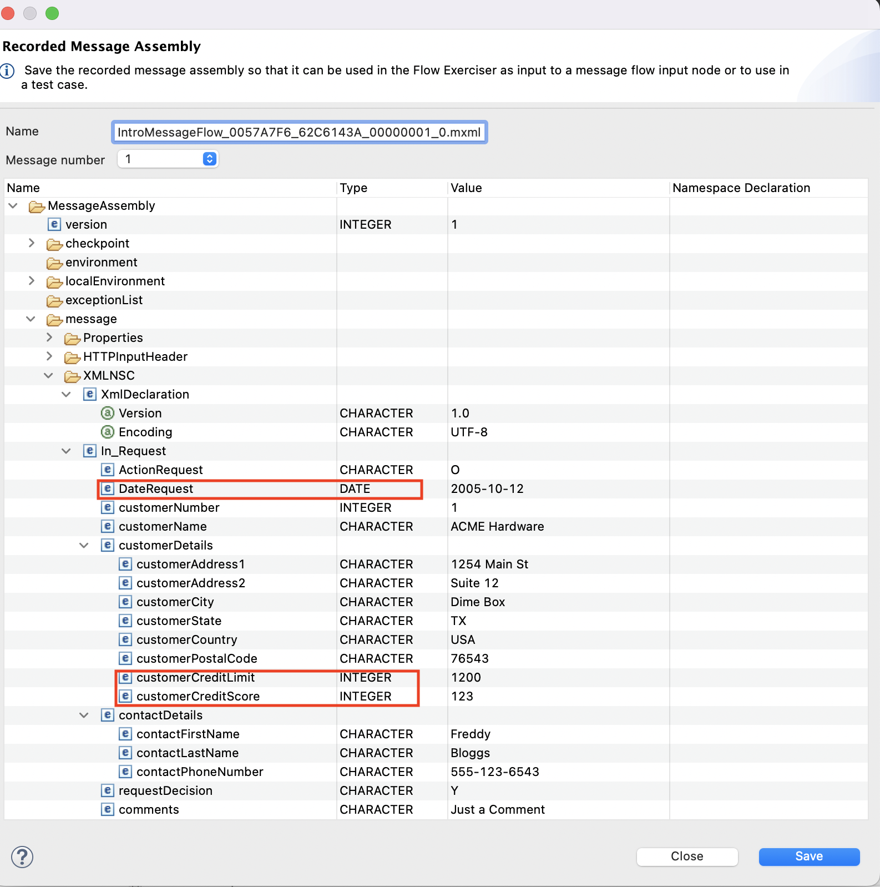
12. Close the message assembly editor
13. Stop the Flow Exerciser.

    
14. Click **Yes** on the pop-up.

    
15. The Flow Exerciser is stopped, and the message flow is returned to editable mode.

    

**End of Lab**
