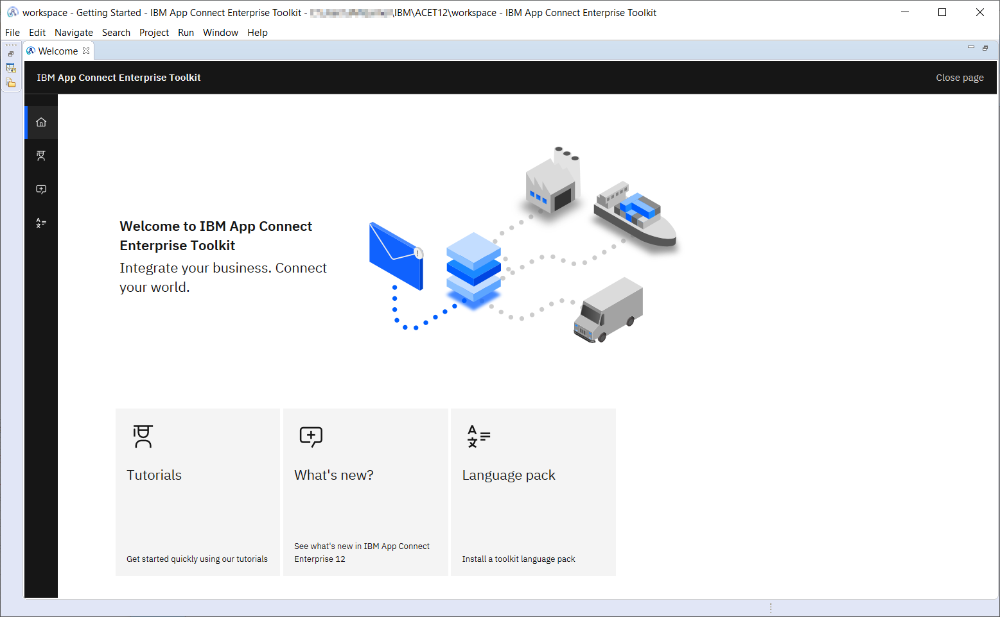

[Return to main lab page](../../acelabs/Overview/)

---
# Table of Contents
1. [Download and Setup Toolkit](#toolkit_setup)
2. [Install Connectors](#install_connectors)
---

# Download and Setup App Connect Enterprise Developer Toolkit 

You can use the IBM App Connect Enterprise Toolkit to build powerful integration applications, services, and APIs. You can then deploy your integration solutions to the software run time, IBM App Connect on IBM Cloud®, containers, or a combination of environments.

What you need to start this tutorial
To start this tutorial, all you need is your laptop.

---
**NOTE**

IBM App Connect Enterprise for Developers is a full-function version of IBM App Connect Enterprise that you can use to evaluate the software, for an unlimited time, within the terms of the license.

---

IBM App Connect Enterprise for Developers is a full-function version of IBM App Connect Enterprise that you can use to evaluate the software, for an unlimited time, within the terms of the license.

## 1. Download IBM App Connect Enterprise for Developers
Duration: 3 - 30 minutes, depending on the speed of your internet connection.

To download IBM App Connect Enterprise for Developers, choose Linux®, macOS, or Windows as your target operating system, provide some details about your interests, and agree to the license.

To download now, click [Download](https://www-01.ibm.com/marketing/iwm/iwm/web/pickUrxNew.do?source=swg-wmbfd).

---
**Tip:**  
If the download page does not show the options for IBM App Connect Enterprise, such as ACE-WIN64-DEVELOPER.exe, open the link in a private browser window or clear your browser cache and try again.

---

Provide the requested details and confirm your privacy settings and acceptance of the license. Then select the appropriate download option (for example, ACE-WIN64-DEVELOPER.exe 1.26 GB), and click [Download](https://www-01.ibm.com/marketing/iwm/iwm/web/pickUrxNew.do?source=swg-wmbfd).

Result: The software is downloaded to your computer and you are ready to install IBM App Connect Enterprise for Developers.

## 2. Install IBM App Connect Enterprise
Duration: A few minutes.

Install IBM App Connect Enterprise for Developers on your chosen platform by completing one of the following tasks:

-  Install on Windows by completing the following steps:
    1. Unpack the software, which sets up IBM App Connect Enterprise Toolkit by extracting the downloaded .zip file into a local directory.
    2. Run the installation file that you downloaded by running the following command with the options that you require:  
        
       `ACESetup12.0.n.0.exe`

        For more information about installing IBM App Connect Enterprise on Windows, see Installing IBM App Connect Enterprise on Windows.

-  Install on Linux by completing the following steps:
    1. Create or navigate to a directory where you have write access.
    2. Unpack the software, which sets up the IBM App Connect Enterprise Toolkit by running the following command:  

        `tar -xzvf ace-12.0.n.0.tar.gz`

    3. Accept the license and run the installation file that you downloaded by running the command ./ace accept license for a single user installation or `./ace make registry global accept license` for a shared installation.
        
        For more information about installing IBM App Connect Enterprise on Linux, see Installing IBM App Connect Enterprise on Linux.

-  Install on macOS by completing the following steps:
    1. Open the installation wizard by double-clicking the installation file that you downloaded. The installation file has a name similar to IBM App Connect Enterprise 12.0.0.x.pkg but it might be automatically renamed when you download it.
    2. Follow the instructions in the installation wizard. IBM App Connect Enterprise is installed as a standard mac application with the name IBM App Connect Enterprise in the /Applications folder.
        
Result: IBM App Connect Enterprise for Developers is installed on your computer, and you are ready to test if the installation is successful.

## 3. Test that installation is successful by starting the IBM App Connect Enterprise Toolkit
Duration: A few minutes.

Start the IBM App Connect Enterprise Toolkit on your chosen platform by completing one of the following tasks:
-  Windows: From the Windows Start menu, expand IBM App Connect Enterprise xx.0.0.y Developer Edition (where x denotes the version), then click IBM App Connect Enterprise Toolkit.
-  Linux: From the command environment, type ./ace toolkit.
-  macOS: Run the application /Applications/IBM App Connect Enterprise to start the toolkit.

IBM App Connect Enterprise Toolkit opens to display its welcome page.

The welcome page provides access to the Tutorials Gallery, which you can use to get started, what’s new information, and an option to install language packs.

Result: IBM App Connect Enterprise for Developers is installed on your computer, and you are ready to develop, deploy, and test integration solutions.

# Generating credentials for Designer connectors on CP4i 

## Salesforce Connector

To get started you will require admin level access to your Salesforce account. If you want to create a free Salesforce account to test, make sure that you create a Developer account rather than a Trial account. If you connect to App Connect with a Trial account, the Salesforce events do not work. To create a devloper account go to https://developer.salesforce.com. 

![alt text][pic0]

To get your login URL, click on your user profile. The URL text below your Account Name is your login URL.

![alt text][pic1]

Once logged into your Salesforce account, on the left-hand Finder panel go to: PLATFORM TOOLS > Apps > App Manager

![alt text][pic2]

You then want to create a New Connected App or use an existing one. Steps for creating a new app are as follows:
![alt text][pic3]

Provide Connect App Name and API Name is automatically generated for you. Provide Contact Email usually admin email address.
Please make sure you Enable OAuth Settings and follow steps below to configure OAuth setting.

![alt text][pic4]

Click on Enable OAuth Settings to get the configuration panel.
Click on Enable for Device Flow and that will auto-generate Callback URL.

Next step is to configure scope of access for our connectors which will be the Connected App in this case. Connectors technically only require data api, you can optionally choose to enable all the scopes for this connected app.

And then Click on Save.

![alt text][pic5]

It may take several minutes for newly created Connected App to be registered. Once registered go back to App Manager, select and view the created App
![alt text][pic6]

Use Consumer Key and Secret as Client ID and Client Secret as needed in the connector template. Next we will need to retrieve Security Token. For this click on your user profile and select Settings option in the profile panel.

![alt text][pic7]

Under Settings find and click Reset Security Token option
![alt text][pic8]

Click on Reset Security Token Button and it will send the newly generated security token to your admin email address. Use the token for your credentials.

[Return to main lab page](../../acelabs/Overview/)

[pic0]: images/0.png
[pic1]: images/1.png
[pic2]: images/2.png
[pic3]: images/3.png
[pic4]: images/4.png
[pic5]: images/5.png
[pic6]: images/6.png
[pic7]: images/7.png
[pic8]: images/8.png
[pic9]: images/9.png
[pic10]: images/10.png
[pic11]: images/11.png
[pic12]: images/12.png
[pic13]: images/13.png
[pic14]: images/14.png
[pic15]: images/15.png
[pic16]: images/16.png
[pic17]: images/17.png
[pic18]: images/18.png
[pic19]: images/19.png
[pic20]: images/20.png
[pic21]: images/21.png
[pic22]: images/22.png
[pic23]: images/23.png
[pic24]: images/24.png
[pic25]: images/25.png
