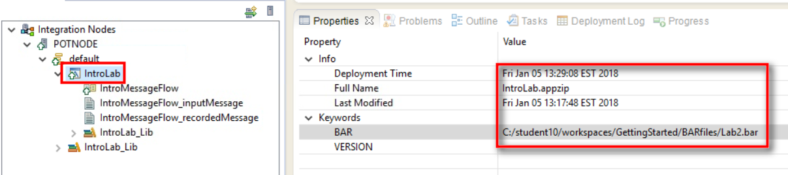

[Return to main lab page](../../acelabs/Overview/)

## Overview 

In this lab, you will modify the flow you created in Lab 1 to perform simple routing. Input messages will be sent to one of two destinations depending on the country code. Addresses in the United States will be routed to a US reply path, while addresses in Canada will be routed to a Canadian reply path.

You will also include some basic exception handling, to deal with addresses that are not in the United States or Canada.

Add Routing Logic
-----------------

1.  Return to the Integration Bus Toolkit.

2.  Select the **IntroMessageFlow** message flow in the **message flow editor**.

3.  Select the **Trace** node.

    Drag the node down a short distance.

	
    
4.  Click the **Out -&gt; In** connector shown – the connector will turn **blue**. Press the **Delete** key to remove the connector.
  
	

5.  Click the other **Out -&gt; In** connector shown – the connector will turn **blue**. Press the **Delete** key to remove the connector.

	

1.  Leave the Trace node unwired for now. Do *not* delete it. We will be repurposing it in a later lab.

	

1.  Expand the **Routing** drawer in the **Palette**.

2.  Select a **Route** node and place it between the **IntroLab\_Listener** and **HTTP Reply** nodes.

	

3.  Change the name of the new routing node to **CheckCountry**.

    Press the **Enter** key to complete the rename operation.

	
    
1.  Expand the **HTTP** drawer in the **Palette**.

2.  Select an **HTTPReply** node and place it beneath the existing **HTTP Reply** node.

    

3.  Your flow should look something like this.

    Don’t rename the new HTTP Reply node – you will be renaming them both shortly.

	
    
    Terminals will now be added to the **CheckCountry** routing node for **US** and **Canadian** addresses.

1.  Select the **CheckCountry** route node.

    Press the right mouse button.

    Select **Add Output Terminal** from the menu.

	
    
1.  Enter **US** as the name of the new output terminal.

    Press the **OK** button to continue.

	
    
    The steps will now be repeated to add a terminal called **Canada**.

1.  Select the **CheckCountry** node.

    Press the right mouse button.

    Select **Add Output Terminal** from the menu.

	

1.  Enter **Canada** as the name of the new output terminal.

    Press the **OK** button to continue.

	
    
1.  Notice that the shape of the CheckCountry node has changed slightly.

    Once there are too many terminals to display discretely, they will be grouped together.

	
    
1.  Change the name of the **HTTP Reply** node to **Reply if US**.

    Press the **Enter** key to complete the rename operation.

	
   
1.  Change the name of the **HTTP Reply1** node to **Reply if Canada**

	|----|----|
	|  |**Note!**  Two HTTPReply nodes are not actually necessary – a single one could have been used. But separate nodes were used here for clarity, as well as to make the flow more self-documenting.|

1.  Press the **Enter** key to complete the rename operation.

	
    
2.  Another way to make a connection is just to click the terminal itself.

    Try this by selecting the **Out** terminal (second from the top) of the **IntroLab\_Listener** node.

	
    
1.  Wire the **Out** terminal of the **IntroLab\_Listener** to the **In** terminal of the **CheckCountry** node.

	

2.  Hover the mouse pointer over the connector, to verify that the correct terminals are wired.

	

3.  Click the group of output terminals on the **CheckCountry** route node.

	
   
4.  A Terminal Selection list will appear.

    Select **US** and click **OK**.

	
    
1.  Verify that the correct terminals are wired.

	
    
2.  Again click the group of output terminals on the **CheckCountry** route node.

	
    
3.  Select **Canada** from the list.

    Click **OK**.

	
    
1.  Verify that the correct terminals are wired.

	
   
    The criteria to be used by the **CheckCountry** routing node must now be specified.

1.  Select the **CheckCountry** node.

    In the **Properties** pane select the **Basic** tab.

    Press the **Add** button.

	
   
1.  Use the drop down menu to select the **US** terminal as the **Routing output terminal**.

    Press the **Edit…** button.

	
    
1.  Expand **$Root**.

    Select **(Add Data Type …)**.

	
    
1.  Select **In\_Request**.

	|----|----|
	|  |**Note!** If you do not see **In\_Request** in the list, then you must add a reference to the Library by right clicking the IntroLab application and selecting **Manage Library references**.|

    Press the **OK** button to continue.

	
   
1.  Expand the **Root->tns:In\_Request->customerDetails** elements.

    Select the **customerCountry** element and ***drag*** it into the **XPath Expression** dialog box.

	
   
1.  Drag an equal sign from the **Operators** pane to the end of the expression.

    Append the letters **‘US’** (including the *single quotes*) after the equal sign.

    Press the **Finish** button to complete the XPath expression.

	
   
1.  Press the **OK** button to complete the **Filter table entry**.

	
   
    The filter pattern for the **US** terminal should now be visible. The process will now be repeated to create a Filter table entry for the **Canada** terminal.

1.  Press the **Add** button to enter a filter pattern for the **Canada** terminal.

	
    
1.  Use the drop down menu to select the **Canada** terminal as the **Routing output terminal**.

    Press the **Edit…** button.

	
    
1.  Expand **Root->tns:In\_Request->customerDetails**. Tip: If you do not see In\_Request in the Viewer, re-add it as done in steps 32-33.

2.  Select the **customerCountry** field and drag it to the **XPath Expression** window.

	
   
3.  Complete the XPath Expression by typing **= ’CA’**.

    Press the **Finish** button to complete the XPath expression.

	
    
4.  Press the **OK** button to complete the Filter table entry.

	
   
    The filter pattern for the **Canada** terminal should now be visible.

    *Verify* that the two Filter table entries appear as shown below.

	
    
    The updates to the message flow are now complete.

1.  Save the message flow.

Test Content-based Routing Using the Flow Exerciser
---------------------------------------------------

You will use the Flow Exerciser to test the flow. In this lab you will see some additional features of the Flow Exerciser that make it a very useful tool when testing and debugging more complex message flows.

1.  Start the Flow Exerciser.

     **Note!** The **Trace** node is still unwired. But this will not cause any problems.

	
    
1.  Click **Close** to start recording.

	
    
2.  Click the **Send** message icon.

	
    
1.  The Input message from our previous tests is still available. Click **Test message**.

    In the Test message, locate **customerCountry**. The value should be **USA**.

	
    
1.  Change the value of **customerCountry** to **US**.

    Click **Send**.

	
    
1.  The Flow Exerciser will run. Click **Close** when Stopped.

	
   
2.  The Flow Exerciser shows the path the **US** message took through the flow.

	
   
1.  Click the recorded message to view it.

	
   
2.  Note that the Recorded Message does reflect the change you made.

	
    
3.  Save this recorded message by clicking the  save icon in the upper right corner.

	
    
4.  Call this recorded message ***Test customerCountry=US***.

    Click **OK**.

	
    
1.  Close the Recorded Message window.

	
    
1.  Repeat these steps to test the Canada path in the message flow.

    Click **Send** to configure another message.

	
    
1.  Select ***Test message***.

    Change *customerCountry* to **CA**

    Click **Send**.

	
    
1.  The Flow Exerciser will run. Click **Close** when Stopped

	
   
2.  This time the Flow Exerciser shows that the **CA** path was taken.

	
   
1.  Click the recorded message to view it.

	
   
2.  Note that the Recorded Message does reflect the change you made.

	
  
3.  Save this recorded message by clicking the  save icon in the upper right corner.

	
    
4.  Call this recorded message ***Test customerCountry=CA***.

    Click **OK**.

	
    
1.  Close the Recorded Message window.

	
    
1.  In the *Application Development* pane, expand **Other Resources**.

    Double-click IntroMessageFlow\_recordedMessage.xml to open it.

	
    
1.  In the XML Editor, expand the two most recent testData entries. You should see the recorded messages for **US** and **CA**.

	
   
2.  Close the XML Editor.

	
    
3.  You have tested your two expected paths (US and CA). But what will happen if some other customerCountry value is received by the message flow? Let’s find out.

4.  Click **Send** to configure another message.

	
    
5.  Click **Test message**. Change the *customerCountry* to **MX**. Click **Send**.

	
   
6.  Hmmm. The message was sent…but no HTTP Reply was received. Why not?

    Click **Close**.

	
   
1.  In the Flow Exerciser, notice that control reached the CheckCountry node. But it stopped there. Why didn’t it continue?

	
   
2.  To answer that, let’s look again at the flow.

    Stop the Flow Exerciser.

	
   
1.  Click **Yes** on the pop-up.

	
   
2.  The Flow Exerciser is stopped, and the message flow is returned to editable mode.

    Click the **CheckCountry** route node. Only **US** and **CA** are handled.

	
   
1.  Click the Output Terminal group.

	
   
1.  Review the available Output terminals.

	

	-   **US** and **Canada** are wired. But **MX** is not going to match either of those.

	-   There was neither a **Match** or a **Failure**.

	-   **Default** would be the terminal normally taken when there was no match. But this was not wired. *So the message was discarded*. This might not be what we want to happen.

    One approach would be to wire the Default terminal to an “Unsupported Country” path.

    But many things could potentially go wrong in a message flow. Rather than wire every possible exception path on every node in a flow, you will explore approaches to dealing with situations like this one in a later lab.

1.  Press the **Cancel** key to cancel the unattached connector.

In a later lab you will explore one approach for dealing with unexpected conditions such as this one, as well as how to implement some basic flow-level exception handling.

Generating Documentation from your Application or Service
---------------------------------------------------------

In this section, you are going to see how the IBM Integration Bus Toolkit can be used to generate documentation from Application and Service artifacts such as message flows.

The Document Generation feature of the Toolkit uses information such as metadata from flows and other development artifacts, as well as description information specified by solution developers,

This documentation can be combined with test messages and results to create a package of documentation, testing artifacts and scenarios.

1.  In the Application Development pane, select the **IntroMessageFlow.msgflow** file, right-click the file, and select **Generate Documentation…** from the menu.

	
   
2.  In the *Document Generation* pop-up, specify:

     a. **Author** (“Your Name”)

    b. A suitable **Title**

    c. A **Location** and name for the generated file (by default this is the current workspace)

    Click **Next &gt;**

	
    
1.  Make sure ***Generate documentation from the selected resource*** is selected.

    Click **Next >**

	
    
1.  Accept the default layout and click **Finish**.

	
   
2.  Click **Yes** to view the generated report.

	
   
3.  Review the generated report (the first page of which is shown here).

    Notice how the Toolkit uses both flow metadata as well as descriptions you entered, version numbers, etc to generate the report.

    Many of these fields were left blank in the labs you did, but a Best Practice would be for you to make the fullest use possible of these fields, in order to make your integration solutions as well-documented and maintainable as possible.

	
   
1.  Close the browser.

The next section will take a closer look at the Deployment process.

A Closer Look at the Deployment Process
---------------------------------------

In the first two labs, you have been utilizing the Flow Exerciser to initiate your unit testing and it has been handling the deployment process for you “behind the scenes”. To finish this lab, we will briefly examine the deployment process, and you will manually do your own deploy.

### Key Idea: The Deployment Process

|----|----|
||**Key Idea -- The Deployment Process** Deployment of Integration Solutions up to this point have been done *implicitly* – by virtue of your using the Flow Exerciser. This section will explore other approaches to solution deployment.|

When you create an Application, Integration Service or REST API project in the IBM® Integration Toolkit, you must distribute them to the Integration Nodes where you want them to run. Artifacts for message flows and associated resources are packaged in a broker archive (BAR) file before being deployed to the integration server.

You can initiate a deployment in the following ways:

-   From the IBM Integration Toolkit

-   From the IBM Integration Web UI

-   By using the **mqsideploy** command

-   By using functions defined by the IBM Integration API

Depending on your work patterns, you might use all these methods at different times.

The Integration Toolkit provides an *Integration Nodes* view in the lower left hand corner of the Integration Development perspective. If you expand an Integration Node, all the Integration Servers in that node are displayed, as well as deployed Applications, Services, REST APIs, and their underlying message flows and their associated resources. You can drag an Application or Library, message flow, or a broker archive (BAR) file from the Application Development view onto an Integration Server to deploy it. Alternatively, you can right click an Integration Server to select an Application or Library, message flow, or BAR file to deploy to the selected Integration Server.

If you are working with an Application and want to deploy and test it quickly, you can deploy just that resource. Drag the resource onto the Integration Server to which you want to deploy it. A BAR file is generated automatically and deployed. If Static Libraries are referenced, they are added automatically to the BAR file and deployed. If a message flow contains a subflow that is defined in a “.subflow” file, the subflow is automatically included in the BAR file, and deployed with the message flow. If you drag a flow that is contained in an Application or Library, you will see a message saying that the whole application or library will be deployed, because you cannot deploy a message flow on its own if it belongs to an Application or Library.

### Key Concept: The BAR file

|----|----|
||**Key Concept -- Broker Archive (BAR) Files.** The unit of deployment to an Integration Server is the Broker Archive (BAR) file. This section will explore what BAR files are and how you make use of them.|

The Broker Archive (BAR) file is a .zip file which contains the flows, models, .jar files, maps, and any other resources in the workspace needed to run your Applications. The BAR file also contains a deployment descriptor .xml file, which exposes flow and node properties for override at build or deploy time. The following sequence of events illustrates how to deploy with a BAR file.

1. Create a broker archive.
	
2.  Add Applications, Libraries, Services, REST APIs, message flows and other flow dependencies to the broker archive.
	
3.  If necessary, you edit the configurable properties of the message flows or applications in the broker archive.
	
4.  Deploy the BAR file by sending it to an Integration Server.

A BAR file can be deployed in two ways:

-   [Incremental BAR file deployment](http://publib.boulder.ibm.com/infocenter/wmbhelp/v8r0m0/topic/com.ibm.etools.mft.doc/af02070_.htm#af02070_i). Deployed files are added to the execution group. Files that exist in the execution group are replaced by the new version.

-   [Complete BAR file deployment](http://publib.boulder.ibm.com/infocenter/wmbhelp/v8r0m0/topic/com.ibm.etools.mft.doc/af02070_.htm#af02070_c). Files that are already deployed to the execution group are removed before the entire contents of the BAR file are deployed. Therefore, nothing is left in the execution group from previous deployments.

1.  Return to the Integration Toolkit.

    In the *Application Development* pane, right-click in the whitespace.

1.  Select **New->BAR file** from the menu.

	
    
2.  Enter **Lab2** as the name of the new broker archive file.

    Click **Finish**.

	
    
3.  In the BAR editor, check the box to select the **IntroLab** Application.

	
    
4.  Click the **Message flows, static libraries and other message flow dependencies** radio button.

5.  Check the box to select the **IntroLab\_Lib** Library.

	
    
6.  Click the **Build and Save**… button.

	
   
7.  If prompted to Save the message flow, click **Yes**.

	
   
8.  Press the **OK** button.

	
    
9.  In the BAR editor, select the **Manage** tab.

    Expand the **IntroLab** app and select the various resources.

    Look at the **Properties view** below to see what properties are exposed in order to be overridden within the BAR file. For example, select the **IntroLab\_Listener** node. You can see that the *Path suffix for URL* property can be overridden at deployment time.

	
    
1.  To deploy, find the **Lab2.bar** file in the navigator in the **BARs** container.

    Drag and drop it onto the **default** integration server on **POTNODE**.

	
    
1.  Wait for deployment to complete.

	
   
2.  Once deployment is complete, click the **default** integration server to open it to see the assets deployed to it.

    The **IntroLab** application has been deployed, which included the **IntroMessageFlow** message flow. The **IntroLab\_Lib** static library, which contains the **IN\_Request** XML Schema, has also been deployed.

    Note too that the deployment date and time should reflect the actual time of deployment.

	
  
Close all the open editor tabs but leave the Toolkit running.

Lab Clean-Up
------------

Optionally, you can clean up the resources you created in Labs 1 and 2.

The following steps will delete the run-time artifacts from the POTNODE server.

This will make things less cluttered while you continue through the remainder of the labs.

1.  In the *Application Development* pane, collapse any folders that are currently expanded.

	
  
1.  In the *Integration Nodes* pane, right-click the default Integration Server, and select **Delete-&gt;All Flows And Resources**.

	
    
2.  Click **OK** to proceed.

	
   
3.  Wait while the **default** Integration Server is cleared.

	
    
4.  All deployed objects should be cleared from the **default** Integration Server.

	
   
1.  Close all the open editor tabs but leave the Toolkit running.

	
 
**End of Lab**
