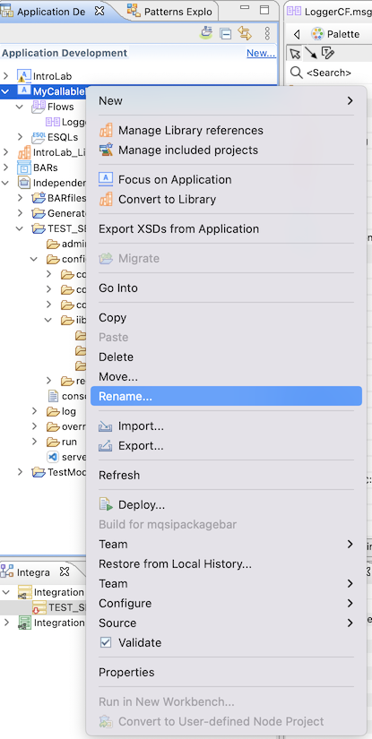
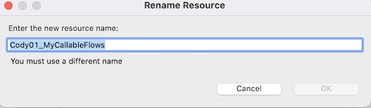
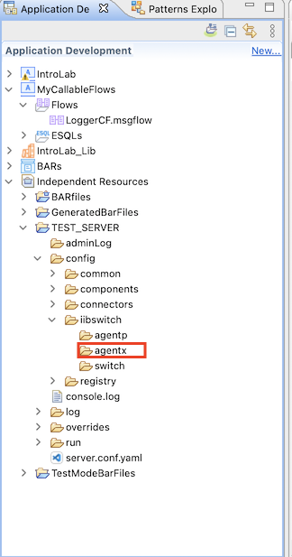

[Return to main lab page](../../acelabs/Overview/)

## Featuring:

- Callable Flows
- IBM App Connect on Cloud Pak for Integration (CP4I)
- IBM App Connect Enterprise v12

---

# Table of Contents

- [Table of Contents](#table-of-contents)
- [1\. Introduction ](#1-introduction-)
- [2\. Create MyLoggerCF ](#2-create-myloggercf-)
  - [2.1 Putting integration servers to work! ](#21-putting-integration-servers-to-work-)
  - [2.1.1 Import MyCallableFlows ](#211-import-mycallableflows-)
  - [2.1.2 Review MyCallableFlows ](#212-review-mycallableflows-)
  - [2.1.3 Deploy MyCallableFlows ](#213-deploy-mycallableflows-)
  - [2.2 Configure the Callable Flows in Cloud Pak for Integration (CP4I) ](#22-configure-the-callable-flows-in-cloud-pak-for-integration-cp4i-)
  - [2.3 Create a Designer flow in CP4I to call on-prem flow ](#23-create-a-designer-flow-in-cp4i-to-call-on-prem-flow-)
  - [2.4 Test from the Designer Test tab ](#24-test-from-the-designer-test-tab-)
- [END OF LAB GUIDE](#end-of-lab-guide)

---

# 1\. Introduction 

The purpose of this LAB is to show the configuration needed to distribute workload using IBM App Connect Enterprise Callable Flows.

This lab was built using IBM App Connect Enterprise FP3 in a Windows 2010 environment.

# 2\. Create MyLoggerCF 

1\. Open the IBM App Connect Enterprise Toolkit

## 2.1 Putting integration servers to work! 

You now have a integration servers running: TEST_SERVER running with defaults settings;  You will now review a very simple application called PING_Basic and deploy it to integration servers you have running in your environment.

## 2.1.1 Import MyCallableFlows 

In this section we use the App Connect Enterprise Toolkit (Enterprise Toolkit) to develop and deploy a simple callable flow into an on-premises ACE integration server so that the flow is visible in Cloud Pak for Integration.

Now download the **MyCallableFlows-PI.zip**
Click here and save the zip file - [MyCallableFlows-PI.zip](MyCallableFlows-PI.zip)

The sample we will be using a Trace node to write a copy of the incoming payload to a file and a Compute node to modify the incoming message to add a status element.
In this next section you will import the application into your workspace so that you can review what it will do.

1\. With your mouse right click on the background of the Application Development window and select “Import”

![alt text][images/2.png]

2.\ Select **IBM Integration** > **Project Interchange** then click the Next button:

![alt text][images/3.png]

3\. Use the browse button to import the file MyCallableFlows-PI.zip from where you had downloaded it.

Click Finish:

![alt text][images/4.png]

4\. The **MyCallableFlows** Application will be imported into your workspace. Right click on the application and select Rename. Prepend your username to the application name. For example: Cody01_MyCallableFlows.

## 2.1.2 Review MyCallableFlows 

1\. Double click on LoggerCF.msgflow, this will open the message flow in window **(B)**.

This flow has two paths.   For this lab the input node is a CallableInput node that will allow this flow to be invoked from the cloud.

![alt text][images/6.png]

2\. Here if you click on the CallableInput you will see the Endpoint Name that will invoke this flow.  Next click on the Node Trace this will write the in coming payload to the file name **logger.out**.

**Note:** ***This is showing a Unix directory but the artifacts have a windows directory.  Change this to match the enviroment you are running the Toolkit in.***

Click on the ModifyMessage Compute node and it shows we add a status of ‘done’

![alt text][images/7.png]

4\. Double click on the node called “Compute” to see the data that will be returned from the http request when the message flow us started:

The flow will return the following:

SET  OutputRoot.JSON.Data.status = 'done';

SET  OutputRoot.JSON.Data.myName = InputRoot.JSON.Data.aName;

SET  OutputRoot.JSON.Data.myName = InputRoot.JSON.Data.aName;

i.e. The **server name** that the flow is running on; the **WorkPath** of the server; the **message flow name**; the **current timestamp**;

5\. Close the esql editor and the message flow without making any changes:

![alt text][images/8.png]

## 2.1.3 Deploy MyCallableFlows 

1\. Right click on the MyCallableFlow and select Deploy

![alt text][images/1.png0]

2\. Select the Integration Servers TEST_SERVER to deploy our flow

![alt text][images/1.png1]

3\.

![alt text][images/1.png2]

4\. We now have our Callable flow deployed and running on the local Integration Server

![alt text][images/1.png3]

## 2.2 Configure the Callable Flows in Cloud Pak for Integration (CP4I) 

In this section we use App Connect Designer to configure callable flows, to enable secure connectivity between flows running in IBM App Connect on IBM Cloud and in an integration server in your on-premises App Connect Enterprise.

1\. Open a Firefox browser window and go to the Platform Navigator URL:

**Note:** ***if you already have the CP4I Platform Navigator page open go to step 4***

2\. Select the Enterprise LDAP:

![alt text][images/1.png4]

3\. When prompted use the username and password provided to you for this lab. In this example we are using cody01.

4\. Click on the App Connect Designer link to take you to the designer dashboard.”

![alt text][images/1.png6]

5\. Click on the Callable flows icon:

![alt text][images/1.png7]

6\. This is the configure callable flow page.   Click on the Connect callable flows to get to the download page.

![alt text][images/1.png8]

7\. Now we will need to download the agent configuration json file that we will add to the on prem server to create the secure connection between the onprem and CP4I.

**Note:** ***don’t close this window we will use it to test the connection***

![alt text][images/1.png9]

8\. Take the agentx.json file we just downloaded and copy to the TEST_SERVER config location. Copy the json file to the location in the server directioy in the agentx directory.

9\. Stop and start the **Test_Server**

10\. Now return to the window that you opened in CP4I designer to download the json file.   Click on the Test your agent and you will see agents connected.

You will see at least 1 agent.

**Note:** ***If you closed the window go back to step 2 and that will open the window again just disregard the download button.***

![alt text][images/2.png1]

## 2.3 Create a Designer flow in CP4I to call on-prem flow 

In this section we use App Connect Designer to configure callable flows, to enable secure connectivity between flows running in IBM App Connect on IBM Cloud and in an integration server in your on-premises App Connect Enterprise.

1\. Click on the **App Connect Designer** dashboard icon:

![alt text][images/2.png2]

2\. Select from the New drop down to create a new API flow:

![alt text][images/2.png3]

3\. First thing we will do is create the model for this.  We will call the model **CallableFlow**

![alt text][images/2.png4]

4\. We will add 3 properties to this model: Name, Message, and Status

![alt text][images/2.png5]

5\. Now that we have the model we will select the Operations tab and select the Create CallableFlow.

![alt text][images/2.png6]

6\. Now select the Implement flow button and that will open the flow editor.

![alt text][images/2.png7]

7\. ![alt text][images/2.png8]

8\. Here we will select the MyCallableFlows for the application.  This is the integration running on-prem.  The endpoint is the name of the CallableInput node in the flow.

We will add the data objects aName and aMessage that will pass data to the on-prem flow. For this click on the Add property link under Message.JSON.Data and add the aName and aMessage fields, click in the Edit Mappings Link and then on the three-row icon on the right to select the corresponding field from the model we created previously.

![alt text][images/2.png9]

9\. Now we will select the Response and update the Reponse body.

We will leave the Reponse header as 201.

For the Response body will add the Name that we input to the API call.

![alt text][images/3.png0]

10\. For the status we will take the update that was made in the compute node on the on-prem flow.   Cut and paste this into the Status field: **{{$CallableflowInvoke.message.status}}**

![alt text][images/3.png1]

Click Done.

11\. Before starting the API make sure we have the name set to CallableFlow_Test.   This is used as part of the base URL of the API we will be testing.

Click on the 3 dots and select Start API on the right side.

![alt text][images/3.png2]

## 2.4 Test from the Designer Test tab 

1\. Now click on the Test tab to get the info needed to test this API.  Once on the following the select the POST/CallableFlow to be able to test your API.

![alt text][images/3.png3]

2\. Next Select the Try it tab and you will see that for the Authorization Username and Password are populated.

![alt text][images/3.png4]

3\. Scroll down and for in the body you will put a Name and Message in the format below:

<!-- <code> -->

{
"Name": "Joe Jodl",
"Message": "Test my on-prem callable flow from CP4I"
}

<!-- </code> -->

![alt text][images/3.png5]

4\. Click the Send button and you will see the results of the call.

![alt text][images/3.png6]

5\. Go back to your on-prem server where you set the trace node to log info.  Open the logger file and you will see the results of the on-prem flow running.

![alt text][images/3.png7]
![alt text][images/3.png8]

[Return to main lab page](/acelabs/Overview)

# END OF LAB GUIDE

[images/2.png]: images/2.png
[images/3.png]: images/3.png
[images/4.png]: images/4.png
[images/5.png]: images/5.png
[images/6.png]: images/6.png
[images/7.png]: images/7.png
[images/8.png]: images/8.png
[images/1.png0]: images/10.png
[images/1.png1]: images/11.png
[images/1.png2]: images/12.png
[images/1.png3]: images/13.png
[images/1.png4]: images/14.png
[images/1.png5]: images/15.png
[images/1.png6]: images/16.png
[images/1.png7]: images/17.png
[images/1.png8]: images/18.png
[images/1.png9]: images/19.png
[images/2.png0]: images/20.png
[images/2.png1]: images/21.png
[images/2.png2]: images/22.png
[images/2.png3]: images/23.png
[images/2.png4]: images/24.png
[images/2.png5]: images/25.png
[images/2.png6]: images/26.png
[images/2.png7]: images/27.png
[images/2.png8]: images/28.png
[images/2.png9]: images/29.png
[images/3.png0]: images/30.png
[images/3.png1]: images/31.png
[images/3.png2]: images/32.png
[images/3.png3]: images/33.png
[images/3.png4]: images/34.png
[images/3.png5]: images/35.png
[images/3.png6]: images/36.png
[images/3.png7]: images/37.png
[images/3.png8]: images/38.png
