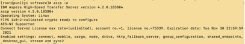
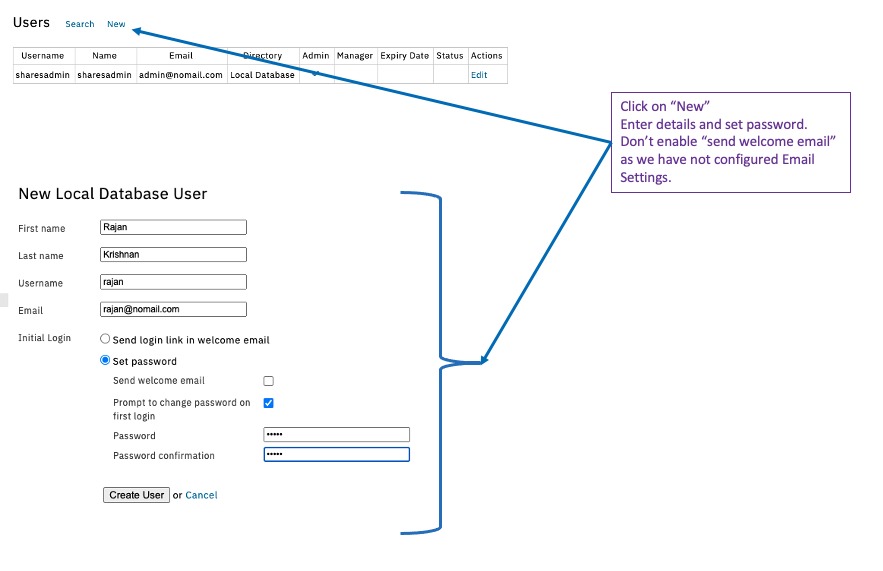

##	About this lab.
In this lab, you will learn:  
* To install and configure HSTS.   
* To install and configure HSTS.   
* To install and configure Console.   
* To install and configure Shares.   
* To install and configure Faspex5 Beta (in container).  
* To integrate HSTS to Console, Shares and Faspex5.   
* To create users and authorize users in Shares.   
* To create users and authorize users in Faspex5.   
* To use different clients to transfer files.   
* Basic Functionalities of Console.  

References:   
HSTS: [https://www.ibm.com/docs/en/ahts/4.3](https://www.ibm.com/docs/en/ahts/4.3).  
Console: [https://www.ibm.com/docs/en/aspera-console/3.4](https://www.ibm.com/docs/en/aspera-console/3.4).  
Shares: [https://www.ibm.com/docs/en/aspera-shares/1.10](https://www.ibm.com/docs/en/aspera-shares/1.10).  
Faspex5: [https://www.ibm.com/docs/en/aspera-faspex/5.0](https://www.ibm.com/docs/en/aspera-faspex/5.0). 

Software Download:  
All the latest software will be available from here.   
[https://www.ibm.com/products/aspera/downloads](https://www.ibm.com/products/aspera/downloads).  

Learning Paths:   
There are 2 paths for learning the Aspera products here. Suggestion will be to start with Path 1 and then move on to Path 2 if time permits. 

Path 1 – HSTS, Console and Shares (Estimated time: 2 hours).  

Path 2 – HSTS and Faspex5 (Estimated time: 1 hour).  
 

## Lab Prerequisites.

1. A server (physical or VM) with at least 4 cores, 8GB RAM and 20GB storage. CentOS 8.x or RHEL 8.x operating system. [ This hardware spec and co-hosting of components is for lab purposes only. NOT suitable for customer environment]
1. Login in to your server using Mac terminal or Putty (Windows users). If you do not have root access, you will have to use sudo to run the commands. 
3.	The following installation software should be made available in /opt/software. 

	> ibm-aspera-common-1.6.0.183823-0.x86_64.rpm.   
	> ibm-aspera-console-3.4.2.183921-0.x86_64.rpm.   
	> ibm-aspera-faspex-5.0.0.3894.x86_64.rpm.   
	> ibm-aspera-hsts-4.3.1.184714-linux-64-release.rpm.   
	> ibm-aspera-shares-1.10.0.184434-1.x86_64.rpm.   

4. The following licenses should be made available in /opt/software.
	> AsperaEnterprise-unlim.eval.aspera-license.  
	> Shares.eval.aspera-license.  
	> aspera.Console.eval.license.  

5. Docker installed and started [Required for Faspex5 ONLY].   
> > 	Check:    
> > 	systemctl status docker.   
> > 	docker versaion.  
    
If it is not installed, refer here to get it installed.   
[https://docs.docker.com/engine/install/centos/#install-using-the-repository](https://docs.docker.com/engine/install/centos/#install-using-the-repository)   

6. Stop and Disable Firewalld
> > 	Check: systemctl status firewalld.  
> > 	Disable: systemctl disable firewalld.  
> > 	Stop: systemctl stop firewalld.  

7. Set selinux to permissive.   
Edit /etc/selinux/config. Change the following line.  
> > 	SELINUX=permissive    

Save and Reboot the machine.  
8. Access to a SMTP server (Mandatory for Faspex5. Optional for Console and Shares).    
Main part of Faspex5 is to send notification when there is a package for a user. For this, it is necessary to add a SMTP server to Faspex5. As part of the lab, we will add the SMTP server to Shares, Console and Faspex5. However, participants will need to have access to a SMTP server. If needed, Gmail can be used for this. Please see the section “Using Gmail as SMTP server”.

## Install HSTS
1. From the folder that has the installation files, run this command.
 `yum install /opt/software/ibm-aspera-hsts-4.3.1.184714-linux-64-release.rpm  `

2. Install the license
`cp /opt/software/AsperaEnterprise-unlim.eval.aspera-license /opt/aspera/etc/aspera-license`
3. Check the installation    
`ascp -A`.  

4. Set the Transfer Node IP address and SSH Port number
> > 	asconfigurator -F "set_server_data;server_name,<IP ADDRESS>;ssh_port,<PORT>"
> > 	Example:
> > 	asconfigurator -F "set_server_data;server_name,67.228.82.52;ssh_port,2222"

5. Enable Activity Logging
> >		asconfigurator -x "set_server_data;activity_logging,true"
6. Create a root folder /data to be used to store transferred data.
> >		mkdir /data
> >		chmod 777 /data

## Prepare HSTS for Shares Integration
The HSTS will need to be configured to be integrated with Shares.   
1. Create a transfer user (sharesuser) to be used for Shares based transfer. Setup the user for SSH Key based authentication. Set the user for token authentication and define a token. Define root folder for storing files.   
> > 	useradd sharesuser 
> > 	mkdir /home/sharesuser/.ssh 
> > 	chown sharesuser:sharesuser /home/sharesuser/.ssh/	 
> > 	chmod 700 /home/sharesuser/.ssh/ 
> > 	cp /opt/aspera/var/aspera_id_dsa.pub /home/sharesuser/.ssh/authorized_keys 
> > 	chown sharesuser:sharesuser /home/sharesuser/.ssh/authorized_keys 
> > 	chmod 600 /home/sharesuser/.ssh/authorized_keys 
> > 	
> > 	Create a sub folder under /data where all transfers via shares is stored.
> > 	mkdir /data/shares_data
> > 	chown sharesuser:sharesuser /data/shares_data 
> > 	
> > 	Define Token authorization for sharesuser
> > 	asconfigurator -F \ "set_user_data;user_name,sharesuser;authorization_transfer_in_value,token; \
> > 	authorization_transfer_out_value,token"
> > 	
> > 	asconfigurator -F \ "set_user_data;user_name,sharesuser;token_encryption_key,<RANDOM STRING>"
> > 	Example:
> > 	asconfigurator -F \ "set_user_data;user_name,sharesuser;token_encryption_key,dghjeygvbqweafygf"
> > 	
> > 	Define Docroot storage for sharesuser
> > 	asconfigurator -F \ "set_user_data;user_name,sharesuser;absolute,/data/shares_data/"

	Check the result of the above commands:
	ls -lta /home/sharesuser/
	ls -lta /home/sharesuser/.ssh/
	ls -lta /data/
.  
> > 	asconfigurator -F "get_user_data;user_name,sharesuser" | grep in_value
> > 	asconfigurator -F "get_user_data;user_name,sharesuser" | grep out_value
> > 	asconfigurator -F "get_user_data;user_name,sharesuser" | grep token_encryption_key
> > 	asconfigurator -F "get_user_data;user_name,sharesuser" | grep docroot

2. Create a Shares Node user.  
*We will be creating multiple Node users throughout the labs. Take note of what node user you are creating. The one we are creating now is the “Shares Node User”.*.  

> > 	/opt/aspera/bin/asnodeadmin -a -u sharesnodeuser -p sharesnodeuser -x sharesuser
> > 	/opt/aspera/bin/asnodeadmin -l

## Prepare HSTS for Faspex5 Integration
The steps are pretty similar to what we did for Shares. 
1. Create a transfer user (faspex5user) to be used for Faspex based transfer. Setup the user for SSH Key based authentication. Set the user for token authentication and define a token. Define root folder for storing packages.   

> > 	useradd faspex5user	
> > 	mkdir /home/faspex5user/.ssh
> > 	chown faspex5user:faspex5user /home/faspex5user/.ssh/	
> > 	chmod 700 /home/faspex5user/.ssh/
> > 	cp /opt/aspera/var/aspera_id_dsa.pub /home/faspex5user/.ssh/authorized_keys
> > 	chown faspex5user:faspex5user /home/faspex5user/.ssh/authorized_keys
> > 	chmod 600 /home/faspex5user/.ssh/authorized_keys
> > 	
> > 	Create a sub folder under /data where all transfers via shares is stored.
> > 	mkdir /data/faspex5_data
> > 	chown faspex5user:faspex5user /data/faspex5_data
> > 	
> > 	Define Token authorization for faspex5user
> > 	asconfigurator -F \ "set_user_data;user_name,faspex5user;authorization_transfer_in_value,token; \
> > 	authorization_transfer_out_value,token"
> > 	
> > 	asconfigurator -F \ "set_user_data;user_name,faspex5user;token_encryption_key,<RANDOM STRING>"
> > 	Example:
> > 	asconfigurator -F \ "set_user_data;user_name,faspex5user;token_encryption_key,dghjeygvbqweafygf"
> > 	
> > 	Define Docroot storage for faspex5user
> > 	asconfigurator -F \ "set_user_data;user_name,faspex5user;absolute,/data/faspex5_data/"

	Check the result of the above commands:
	ls -lta /home/faspex5user/
	ls -lta /home/faspex5user/.ssh/
	ls -lta /data/

> > 	asconfigurator -F "get_user_data;user_name,faspex5user" | grep in_value
> > 	asconfigurator -F "get_user_data;user_name,faspex5user" | grep out_value
> > 	asconfigurator -F "get_user_data;user_name,faspex5user" | grep token_encryption_key
> > 	asconfigurator -F "get_user_data;user_name,faspex5user" | grep docroot

2. Create a Faspex5 Node user.   
*We will be creating multiple Node users throughout the labs. Take note of what node user you are creating. The one we are creating now is the “Faspex5 Node User”.*

> > 	/opt/aspera/bin/asnodeadmin -a -u faspex5nodeuser -p faspex5nodeuser -x faspex5user
> > 	/opt/aspera/bin/asnodeadmin -l

## Prepare HSTS for Console Integration
The following steps are required for integrating HSTS with Console for monitoring purposes.    
1. Create a transfer user (consoleuser). This user will NOT be used for any transfers. Hence, there is no need to setup token based authentication for the user. 

> > 	useradd consoleuser
> > 	
> > 	Define Docroot storage for consoleuser [this is to avoid unnecessary errors in logs]
> > 	asconfigurator -F \ "set_user_data;user_name,consoleuser;absolute,/tmp/"
> > 	
> > 	/opt/aspera/bin/asnodeadmin -a -u consolenodeuser -p consolenodeuser \
> > 	-x consoleuser --acl-set "admin,impersonation"
> > 	
> > 	/opt/aspera/bin/asnodeadmin -l

*We will be creating multiple Node users throughout the labs. Take note of what node user you are creating. The one we have created in the above step is the “Console Node User”.*

## Install and Setup Console
For scenarios where the Console and Shares are installed in the same machine, it is necessary to install the Console first.    
1. Install Console
> > 	Install common and console rpms. 
> > 	yum install /opt/software/ibm-aspera-common-1.6.0.183823-0.x86_64.rpm 
> > 	yum install /opt/software/ibm-aspera-console-3.4.2.183921-0.x86_64.rpm
> > 	[ Ignore any "xterm-256color" related notifications.]
> > 	
> > 	Now setup Console.
> > 	asctl console:setup

This takes a few minutes to complete. At the end, you will be asked to restart apache, mysql and console. Type ‘y’ to accept and restart.    
If setup was completed successfully, you will see this message.

Run this command to check the status:
> > 	asctl all:status  

All services should be in running status (may take a few minutes).

2. Install License for Console.  

> > 	Open the console in a browser
> > 	https://<IP ADDRESS>:443/aspera/console
> > 	E.g. https://9.30.188.131:443/aspera/console
> > 	Enter the username and password used during the "asctl console:setup" step. 
> > 	
> > 	You’ll be asked to change the password. Change the password. 
> > 	
> > 	Paste the contents of the Console license file [aspera.Console.eval.license] (OR choose “Upload a license file” and pick the license file). 
> > 	
> > 	You should see a “license updated successfully” message. 

.  

3. Add HSTS as a node in Console.  

> > 	From the Console Web admin interface, 
> > 	Go to Nodes -> New Managed Node
> > 	Enter the IP address of the HSTS machine and tick “Create Default Console Groups”. Leave the rest to defaults.
> > 	Then click on Create.

.  

> > 	In this page, you will need to enter the root or an admin level SSH account details. If you do not have one, you can skip the SSH portion and fill in the NodeAPI portion. 
> > 	
> > 	Enter the “Console Node User” and password created during “Prepare HSTS for Console Integration” step. This is mandatory. 
> > 	Click on Update

In the next screen click on “Test Credentials”. You should see a message saying “Sucessfully connected to node via ….”. That indicates that the Console is now ready to monitor and manage the HSTS. 

## Install and Setup Shares
1. Install Shares.  

	> >		yum install /opt/software/ibm-aspera-shares-1.10.0.184434-1.x86_64.rpm. 

2. Configure MySQL to make Shares use the same database as Console
> 	Edit /opt/aspera/shares/etc/my.cnf.setup
> 	Insert the MySQL username and password that you used during the install of Console and set host to 127.0.0.1. For the Port, use 5506 if faspex5 is also installed in the same server. Otherwise, leave it at 4406.   

3. Run the Shares Installer
> > 	/opt/aspera/shares/u/setup/bin/install
> > 	Wait for the installation to complete. It may take a few minutes. 
> > 	
> > 	When it completes, create a Shares Web Admin username and password.
> > 	/opt/aspera/shares/u/shares/bin/run rake aspera:admin NAME="sharesadmin" PASSWORD="admin" EMAIL="admin@nomail.com"

4. Disable apache web server and setup nginx web server.
> > 	asctl apache:stop
> > 	asctl apache:disable
> > 	ln -s /opt/aspera/shares/etc/nginx/locations-available/console  /opt/aspera/shares/etc/nginx/locations-enabled/
> > 	
> > 	Restart nginx
> > 	service aspera-shares restart

5. Add an ‘AcceptedHosts’ entry
> > 	Edit this file: /opt/aspera/shares/u/shares/config/shares.yml.  [Make sure to add the host’s IP address]
> > 	AcceptedHosts: [localhost, 127.0.0.1, <IP Address of Machine>]
> > 	E.g. 
> > 	AcceptedHosts: [localhost, 127.0.0.1, 9.30.188.131]
> > 	Restart nginx
> > 	service aspera-shares restart

6. Change nginx Web Server listening ports.  
This step is needed to allow Console to use Nginx and also for Faspex5 to be installed in the same machine.    
> > 	Edit this file: /opt/aspera/shares/etc/nginx/nginx.conf
> > 	Change the port from 80 to 8080 and 443 to 8443. (If faspex5 is installed).  

	.  
> > 	Comment out this line:
> > 	#add_header Content-Security-Policy "default-src 'self' 'unsafe-inline' https://local.connectme.us https://d3gcli72yxqn2z.cloudfront.net";
> > Restart Nginx.  
service aspera-shares restart

7. Check if both Console and Shares are accessible
> > 	Open a Web Browser and open the following:
> > 	Console: https://9.30.188.131:8443/aspera/console
> > 	Shares: https://9.30.188.131:8443/

8. Install License for Shares
> > 	Open the Shares Admin Web interface and login with the credentials created after the Shares installer script.
> > 	You’ll be asked to change the password. Change the password. 
> > 	
> > 	Paste the contents of the Shares license file [Shares.eval.aspera-license]. Click on Save.
.  

	> 	You should see the details of the license displayed.    
	> 	

9. Update the Web Server IP Address.  
From the Shares Admin page change the web server IP address.
.  

10. Add HSTS as a node in Shares.  
`Open the Shares portal [ https://9.30.160.211:8443/ ]and click on the plus sign to add a node.`.  

.  
`Enter details as described in the snapshot below. Use the “Shares Node User” created for the API Username.`.     
.  
`Click on “Test” and the status should be ‘OK’`.  

## Install and Setup Faspex5
Faspex5 is in beta. Faspex5 will replace the currently available Faspex 4.x. Faspex5 is also expected to contain the Shares functionalities. The Shares functionalities in Faspex5  is a roadmap feature.    
Reference: [https://www.ibm.com/docs/en/aspera-faspex/5.0](https://www.ibm.com/docs/en/aspera-faspex/5.0)     

1. Install Faspex5.  
> > 	yum install /opt/software/ibm-aspera-faspex-5.0.0.3894.x86_64.rpm
> > 	NOTE: This stops MySQL running in the host node. Restart MySQL with this command. Otherwise, Console and Shares will not function. 
> > 	asctl mysql:start

2. Setup Faspex5.  
Some default config files are here: /opt/aspera/faspex/conf/docker/. No change is needed for the test setup.    
> > 	Run the setup command:
> > 	faspexctl setup
.  
This will pull images, install Faspex5 and start the containers. Takes a few minutes.   
*If you see a port 6000 conflict, refer to” [Lab Preparation Document](../lab0/index.md)” to kill the xvnc process.*   

	Check the container status:   
> >			faspexctl status

All containers should be in Up status.

3. Add HSTS as Transfer Node in Faspex5.  
	Faspex5 is a web application. We need to add a Transfer server for file transfer purposes.   

> > 	Create a package_storage folder under /data/faspex5_data
> > 	mkdir /data/faspex5_data/package_storage
> > 	chown faspex5user:faspex5user /data/faspex5_data/package_storage
> > 	 	
> > 	Open the Faspex5 web page:
> > 	https://9.30.188.131/aspera/faspex
> > 	Login with the credentials created during the Faspex5 setup process. 
> > 	You will be prompted to change password.   
> > 	Change the password and login into Faspex5 admin portal.
> > 	https://9.30.188.131/aspera/faspex/admin 
> > 	
> > 	Click on “Nodes and Storage” -> Click on “Create Node”
> > 	Use the “Faspex5 Node User” created previously for the Username.   

> > 	In the next screen, click on “Storage Location” and click “Create Storage Location”.    
 

> > 	Then click on “Save”
> > 	
> > 	Final step is to make the newly added storage the default storage. 
> > 	Go to “Nodes and Storage” -> Click on the newly added node -> Click on “Storage Locations”. Check if it is the default Inbox. If not, Make it the default storage. 
> > 	NOTE: You may have to widen your browser screen if you do not see the default inbox column. 

.  

4.Disable HTTP Fallback.  
From the admin login page in Faspex5 go to Configurations -> Transfer Options -> Untick “Enable HTTP Fallback”.  
.  

5.Enable Sending Packages to External Emails.  
For the purpose of this lab, we will allow sending packages to external emails.  This should be enabled by default. Check and enable if it is disabled.    
From the Faspex5 Admin page, Go to Users -> All Users -> Click on the Newly created user
.  

## Create and Authorize End-User in Shares
We will create a user and authorize the user to a specific folder.    
1. Create Folder
> > 	Login to the Shares Web Page [ https://9.30.160.211:8443/ ]. 
> > 	Click on the Node Created -> New Folder.
> > 	Enter a name for the folder and click on “Create Folder”. The folder should be created. 
.  
2. Create Share
Create a new share that will be authorized for file transfer.

Then click on “Create Share”.  
3. Create Shares End User.  
Create a new Shares End User. You will use this to access the Shares for transferring files.   
 
In the next screen Click on "New"

Click on “Create User”.  
Leave everything in the security tab to default.    
Click on Shares tab.  

We have created a Shares End User and have assigned full access for a particular share to the user.    

## Create and Authorize End-User in Faspex5
We will create a Faspex5 End user and authorize the user to be able to send / receive packages in Faspex5. 
You need to have an Email Server setup because new users creation will involve a step of sending an email to end-user to create password. If you have not setup Email notification, refer to section “Setting Up Email Notification” and setup now.    
Login into Faspex5 admin portal.   
https://9.30.160.211/aspera/faspex/admin    

Enter the details and click create
.  
Click on Create. An email will be sent to the email address. Follow instructions to reset the password. This is a sample email sent.   

## Setting Up Email Notification
We will setup Email (SMTP) servers for sending notifications. You need to have access to a SMTP server to do this. Otherwise, you can make use of Gmail. Refer to the section on “Using Gmail as SMTP server”.   
Once you have the email server detail ready, you can start configuring the web applications. 

### Setting up Email Configuration for Faspex5
Login to the Faspex5 Admin page. Go to Configuration -> Email Configuration.   
Enter the details. The screenshot shows an example of using Gmail. You can use your own SMTP server.    
.  
Click on Save.    
Click on “Test Email”. You will be prompted to enter an email address. Once you enter the email address, a test email will be sent to that email address. Receiving the email indicates that the SMTP server details have been entered correctly. This is a sample email received.   

### Setting up Email Configuration for Shares
Login to the Shares Admin page. Go to “SMTP” under Email.   
Enter the details. The screenshot shows an example of using Gmail. You can use your own SMTP server.    
.  
Click on “Update SMTP Server”.  
Then, click on “Send Test Email”. Enter an email address. This should send an email to the entered address.    This is a sample email.   
.  

### Setting up Email Configuration for Console
Login to the Console page. Go to Notifications -> Email Server.   
Enter the details. The screenshot shows an example of using Gmail. You can use your own SMTP server.   
.  
Click on “Save Settings and send test email”.    
That should send an email to the recipient. Sample email as below.   
.  

## Test various Client Options
We have installed and setup the server components. Now let us try various client options.   

### Browser Extension
Download Link: [https://www.ibm.com/aspera/connect/](https://www.ibm.com/aspera/connect/).  

> > 	1.Test from Shares
> > 	Open the Shares Web page in a web browser: https://9.30.160.211:8443/ 
> > 	Login using the “Shares End User” created earlier. You may be asked to change your password during the first login. 
> > 	Trigger a transfer (refer screenshot below).

.  

> > 	Check the folder in HSTS. Uploaded file should be visible. 
> > 	ls /data/shares_data/<Folder>/

> > 	2.Test from Faspex5
> > 	Open the Faspex5 Web page in a web browser: https://9.30.160.211/ 
> > 	Login using the “Faspex5 End User” created earlier. You may be asked to change your password during the first login. 
> > 	Once logged in click on “Send Files”

.  
*Email Notification for Receiving Package is not available in Beta version.*

### Aspera Desktop Client
Download Link: [https://www.ibm.com/products/aspera/downloads](https://www.ibm.com/products/aspera/downloads).  [ Look for IBM Aspera Desktop Client ].   

Once installed, Open the Desktop Client and Click on Connections and Add a new Connection pointing to the Shares. You will use the “Shares End User” login id and password.   
.  
Double click on the newly created connection and it will connect to the Shares server.    

### Aspera Drives
Download Link: [https://www.ibm.com/products/aspera/downloads](https://www.ibm.com/products/aspera/downloads).  [Look for IBM Aspera Drive].  
Once downloaded, start the application.   
.  
Click the Drive icon in the menu bar, and select IBM Aspera Drive. You should be able to access Aspera Shares. You can now drag and drop files here – which will upload files into Aspera Shares.   
.  

*Aspera Drives can also be used to work with Faspex. However, the beta version of Faspex5 does not support it.*

## Basic Functionalities of Console
Console can be used for monitoring and managing transfers, managing transfer servers, and creating reports.    
Refer to the Console Documents for the full functionalities of Console.    
Login to the Console Admin interface: https://9.30.160.211:8443/aspera/console/ using the admin id and password created during the install.    

### Monitoring Transfers
Go to Dashboard tab.   
You will be able to monitor current transfers, recently completed transfers and recently failed transfers.   
.   

### Managing Transfer Servers
Go to the Nodes tab. Click on ‘edit’ for the node. Will be able to view and make changes to the transfer server configuration.    
.  

### Reports
Go to the Reports tab. Click on “Run a Report”.  
Pick “Activity Summary By Contact” report from the list. Click Next.  
Enter email address if you want to receive the report by email. Click “Run Report”.    
Report should be generated and emailed.    
.  
.  

## Using Gmail as SMTP server

We need to create an “App Password” in Gmail. We can then use this for setting up the SMTP server and for notification purposes.    
This link explains how to create the App Password.    
[https://support.google.com/mail/answer/185833?hl=en](https://support.google.com/mail/answer/185833?hl=en)

Once you create the App Password, you can use the following settings to connect your applications to Gmail SMTP server.    

> > 	SMTP Server: smtp.gmail.com
> > 	SMTP Port: 587
> > 	Login: Your Email address
> > 	Password: Use the App Password created. DO NOT use your standard Gmail password. 

