## What is Secure Backup and Restore?

A feature built into DataPower that makes an EXACT clone of existing appliance on a new appliance.  Only exception is the keys in optional Hardware Security Module (HSM).  The clone includes:
-  All domains
-  All keys/certificates except those in the HSM
-  All users
-  All configuration data like IP addresses, etc.

Secure Backup and Restore cannot cross form factors.  Example, Secure Backup on a physical appliance and restore it on a virtual appliance.

It must be enabled.  Verify one of the following:
-  CLI command show system output contains backup mode:  secure
-  WebGUI’s System Setting page contains Backup mode:  secure
-  If it is not enabled, open a Support Case to get a file to enable it

## Lab Steps

### 1. Log into the Datapower

-  User name: provided userid
-  Password: provided password
-  Domain: defaul
-  Graphical Interface: WebGUI

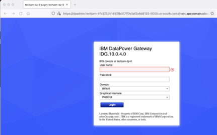

### 2. Configure Crytpo Identification Credentials

1.  In the Search entry field, type Crypto Identification Credentials and click on Crypto Identification Credentials
   
    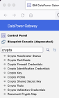

2.  In the Configure Crypto Identification Credentials window, press the Add button
   
    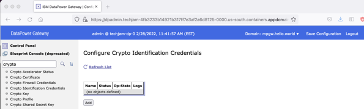

3.  In the Configure Crypto Identification Credentials window, 
    -  In the Name field, type SecureBackupCreds
    -  In the Crypto Key field, select “+”

    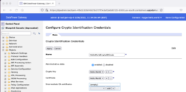

4.  In the Configure Crypto Key window,
    -  In the Name field type SecureBackupKey
    -  In the File name field, press the Upload button

    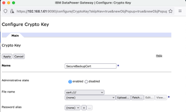

5.  In the Upload File window, 
    -  Press the Browse button to select the key that you want to use
    -  Select the checkbox Overwrite Existing File
    -  Press the Upload key

    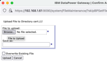

6.  In the Configure Crypto Key window, press the Apply button

    

7.  In the Configure Crypto Identification Credentials window, 
    -  In the Certificate field, select “+”
    
    

8.  In the Configure Crypto Certificate window,
    -  In the Name field type SecureBackupCert
    -  In the File name field, press the Upload button

    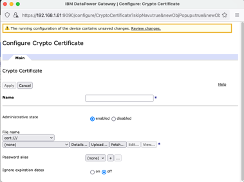

9.  In the Upload File window, 
    -  Press the Browse button to select the certificate that you want to use
    -  Select the checkbox Overwrite Existing File
    -  Press the Upload key

    

10. In the Configure Crypto Key window, press the Apply button

    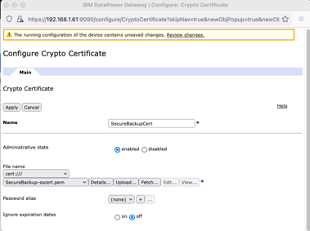

### 3. Run A Secure Backup

1.  In the Configure Crypto Identification Credentials window, 
    -  Press the Apply button
    -  Press the Save Configuration button
    
    

2.  In the Search field, 
    -  type System Control
    -  Press System Control button

    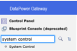

3.  In the System Control window and Secure Backup area, 
    -  In the Crypto certificate field, select SecureBackupCert
    -  In the Destination field, type local:///SecureBackup Your Initials
    -  Toggle the Include Raid button to off
    -  Press the button Secure Backup

    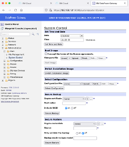

4.  In the Execute Action window, press Confirm

    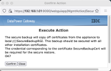

5.  In the Execute Action window, press the Close button

    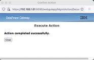

6.  In the Search field, 
    -  type File Management

    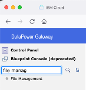

7.  In the File Management window,
    -  Press “+” next to the Local folder
    -  Press “+” next to the SecureBackup your initials
    -  Verify that there are files like the ones in the screen capture to the right

    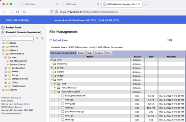

