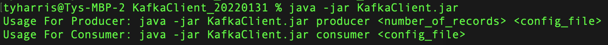

##	Setting up the sample Kafka Client to be used for the lab.

This section provides the instructions for setting up the Kafka Client that will be used throughout the labs.

1.	Check java install
    `C:\Users\rajan>java -version`

    

    At least version 1.8 should be available.
    If it’s not installed, download and install the Java Runtime. https://www.java.com/en/download/manual.jsp

2.	Download the sample Kafka Client from here:  

    https://ibm.box.com/shared/static/ogvj2jwgh7c505oj58w2kjgh4ypo3x09.zip 
     
3.	Unzip the downloaded Kafka Client (KafkaClient_YYYYMMDD.zip) into a folder called 
    `C:\TechJam\EventStreams_Lab\`
4.	Test the client
    Open a Command Prompt.
    `cd C:\TechJam\EventStreams_Lab\KafkaClient_YYYYMMDD\java -jar KafkaClient.jar`

    

