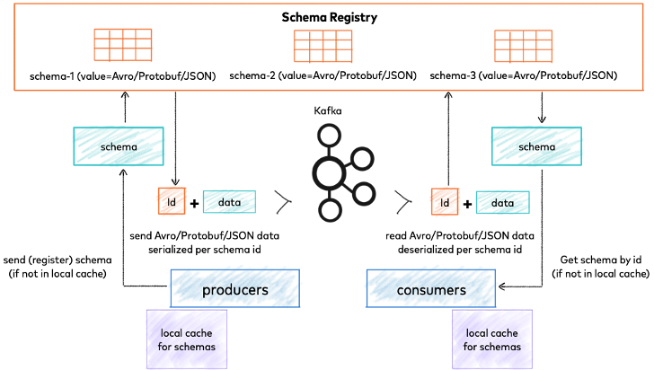
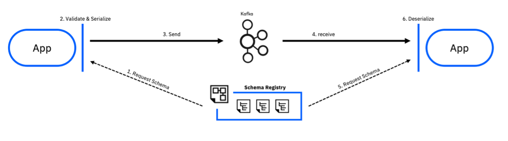
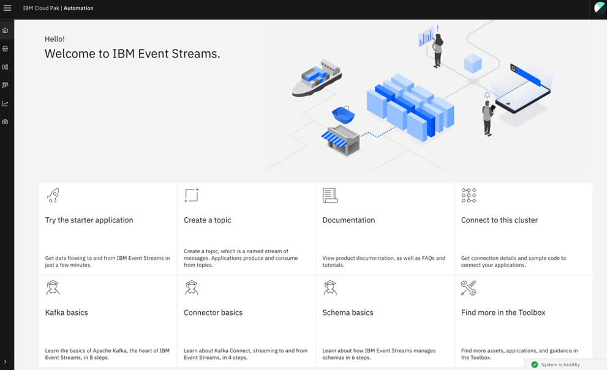
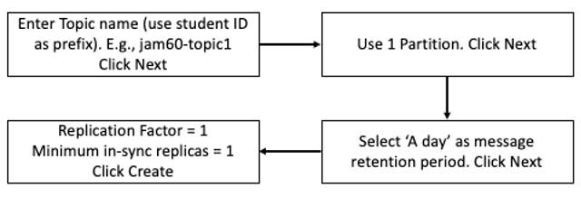

# Introduction
Version control can be a nightmare for organizations. With Kafka, it’s no different. With stream processing pipelines, there are no files to act as containers for messages with a single format. Let take a look at how Event Streams handles Schema Management with the Schema Registry.

# Lab Objective
In this lab, we’ll do the following: 
-	Create a topic and attach a schema to it
-	Create a Kafka user with appropriate rights to produce and consume data
-	Gather information needed to connect to the Kafka / Schema clusters.
-	Test producing / consuming data.
-	Make changes to the Schema and see the impact to producer/consumer.

# Pre-Requisites
-  Have setup the client machine properly. 
-  Able to access the Event Streams web interface. 

# Understanding Schema Registry
## What is a Schema Registry?

Schema Registry provides a serving layer for your metadata. It provides a RESTful interface for storing and retrieving your Avro®, JSON Schema, and Protobuf schemas. 
•	It stores a versioned history of all schemas based on a specified subject name strategy, provides multiple compatibility settings.
•	Allows evolution of schemas according to the configured compatibility settings and expanded support for these schema types. 
•	Provides serializers that plug into Apache Kafka® clients that handle schema storage and retrieval for Kafka messages that are sent in any of the supported formats.

In Event Streams, Schemas are stored in internal Kafka topics by the Apicurio Registry, an open-source schema registry. In addition to storing a versioned history of schemas, Apicurio Registry provides an interface for retrieving them. Each Event Streams cluster has its own instance of Apicurio Registry providing schema registry functionality.

## How the Schema Registry Works?

Now, let’s take a look at how the Schema Registry works.

1.	Sending applications request schema from the Schema Registry.
2.	The scheme is used to automatically validates and serializes be for the data is sent.
3.	Data is sent, serializing makes transmission more efficient. 
4.	The receiving application receives the serialized data.
5.	Receiving application request the schema from the Schema Registry. 
6.	Receiving application deserializes the same data automatically as it receives the message.

# Lab Procedures

## 5.1	Creating a topic and attaching a schema to it

1. Open this URL from a browser.
   [EventStreams Console](https://cpd-cp4i.techjam-4fb3233b14921b317ff7e3af2a6d8125-0000.us-south.containers.appdomain.cloud/integration/kafka-clusters/cp4i-es/techjam-es/) 

   - Click on “Enterprise LDAP”
   - Login with your studentID and password. That should bring you to the Event Streams Console home page. 
    

     

2. **Create Topic**
   
   -  Click on “Create a topic”. Use only lower cases for the topic.
      

   -  Refer to screenshots below as an example. 
      
      
      
      