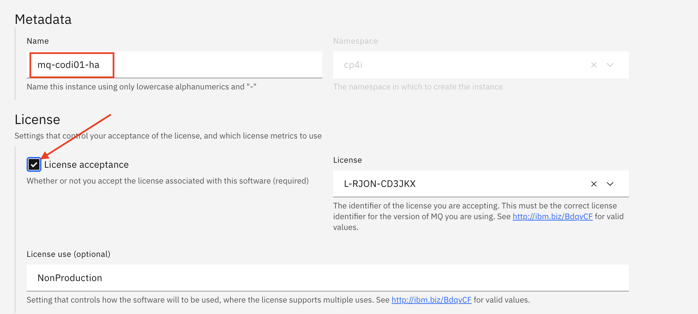
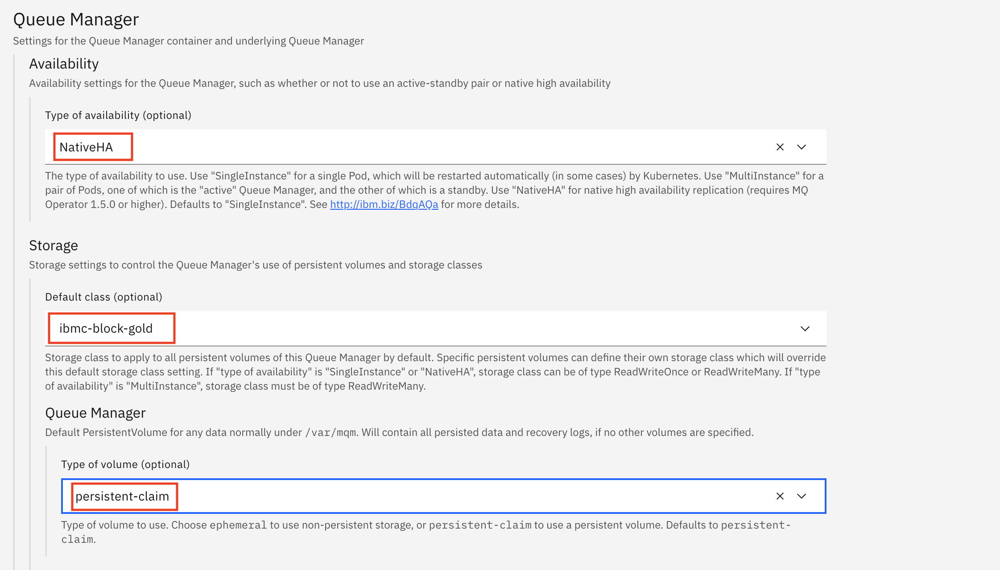
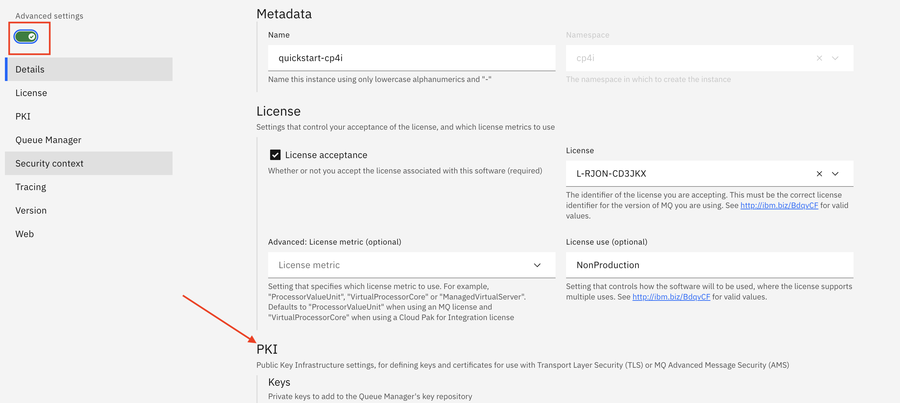
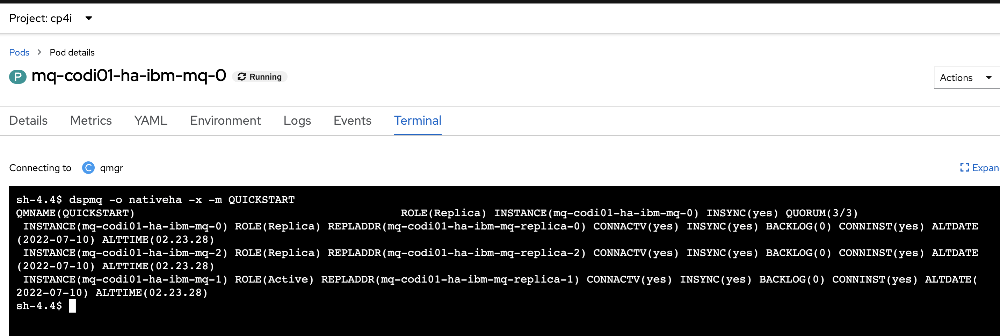

[Return to main lab page](../../MQ-Labs/Overview/)

These instructions will document the process to deploy a NativeHA highly available (HA) persistent IBM MQ on the Cloud Pak for Integration (CP4I) 2022.2.1.

## MQ Native HA Overview

A Native HA configuration provides a highly available queue manager where the recoverable MQ data (for example, the messages)  are replicated across multiple sets of storage, preventing loss from storage failures. The queue manager consists of multiple running instances, one is the leader, the others are ready to quickly take over in the event of a failure, maximizing access to the queue manager and its messages.

A Native HA configuration consists of three Kubernetes pods, each with an instance of the queue manager. One instance is the active queue manager, processing messages and writing to its recovery log. Whenever the recovery log is written, the active queue manager sends the data to the other two instances, known as replicas. Each replica writes to its own recovery log, acknowledges the data, and then updates its own queue data from the replicated recovery log. If the pod running the active queue manager fails, one of the replica instances of the queue manager takes over the active role and has current data to operate with.

A Kubernetes Service is used to route TCP/IP client connections to the current active instance, which is identified as being the only pod which is ready for network traffic. This happens without the need for the client application to be aware of the different instances.

Three pods are used to greatly reduce the possibility of a split-brain situation arising. In a two-pod high availability system split-brain could occur when the connectivity between the two pods breaks. With no connectivity, both pods could run the queue manager at the same time, accumulating different data. When connection is restored, there would be two different versions of the data (a 'split-brain'), and manual intervention is required to decide which data set to keep, and which to discard.

Native HA uses a three pod system with quorum to avoid the split-brain situation. Pods that can communicate with at least one of the other pods form a quorum. A queue manager can only become the active instance on a pod that has quorum. The queue manager cannot become active on a pod that is not connected to at least one other pod, so there can never be two active instances at the same time:

- If a single pod fails, the queue manager on one of the other two pods can take over. If two pods fail, the queue manager cannot become the active instance on the remaining pod because the pod does not have quorum (the remaining pod cannot tell whether the other two pods have failed, or they are still running and it has lost connectivity).
- If a single pod loses connectivity, the queue manager cannot become active on this pod because the pod does not have quorum. The queue manager on one of the remaining two pods can take over, which do have quorum. If all pods lose connectivity, the queue manager is unable to become active on any of the pods, because none of the pods have quorum.
- If an active pod fails, and subsequently recovers, it can rejoin the group in a replica role.

The following figure shows a typical deployment with three instances of a queue manager deployed in three containers.

* #NOTE: FILES REQUIRED FOR THIS LAB
All files required for this lab can be downloaded from:
https://github.com/IBMIntegration/techjam/tree/master/src/pages/mq/2023_Lab1/_labfiles

## Deploy the MQ Queue Manager with associated resources

We will provide a configmap that will be used by the MQ operator to create/configure all those objects on pod startup.

The hyperlink to the OpenShift Console for the cluster should be included in your email. Navigate to the OCP console now.

1. Click on the (+) icon at the top right of the Openshift console and paste the contents of the nativehamqsc.yaml file included in this lab. Edit the configmap name prepending your your userid. Also prepend your username in front of both of the occurences of the EXTERNALCHL channel name. In this example we are prepending*cody01*. Use you own user name. After all 3 edits are made click Create at the bottom of the screen.

The hyperlink to the Platform Navigator Console for the cluster should be included in your email. Navigate to the Platorm Navigator now.

2. When presented with the "Log in to IBM Automation", click *Enterprise LDAP*. Enter the userid and password that you received in your email and click *Login*. Remember to use your credentials, not the ones in the screen shot.

   
3. Click on *Integration Instances*.

   
4. Click *Create an Instance*.

   
5. Select *Messaging* and click *Next*.

   
6. Click select *Quick start* and then click *Next*.

   
7. Type mq-<<`<your user id>`user user id>>-ha as Name. For example *mq-cody01-ha* and click on the License acceptance checkbox.

   
8. Scroll down and select NativeHA as type of availability, one of the compatible block storage classes for Default storage class (for example *ibmc-block-gold* in IBM Cloud or *ocs-storagecluster-ceph* for self-managed clsuters) and persistent-clain as Type of volume.

9. Click on the*Advanced settings* toggle to show additional properties. Then scroll down to PKI.

10. Type*keystore* as name. Then type*tls.key* in the Items text box and press Enter. Type*tls.crt* and press enter again. Finally select*mq-tls-secret* from the Secret name combo box.

Note: The mq-tls-secret was previously created for your you. It holds the tls private key (tls.key) and public key (tls.crt) needed for TLS channel encryption.

11. Scroll down to the MQSC section. This allows you to provide a mq command script file so that MQ objects are created/configured automatically on pod startup.
12. Type nativehamqsc.mqsc and press enter in the Items text box and then select the name of the configmap you created at the step 1 of this lab in the Name drop down combo, then click*Create*.

The new Queue Manager instance will be created.

14. Click in the  Workloads->Pods menu item in the OCP console and then filter the pods by typing your username.

As expected you will see three pods for the nativeha queue manager. One of the pods has 1 of 1 containers running. Two of the pods have 0 of 1 containers running. This is the nature of nativeHA, one pod running the queue manager and data being replicated to the other two pods which are in standby mode.

### Viewing the status of Native HA queue managers

You can view the status of the Native HA instances by running the dspmq command inside one of the running Pods.

You can use the dspmq command in one of the running Pods to view the operational status of a queue manager instance. The information returned depends on whether the instance is active or a replica. The information supplied by the active instance is definitive, information from replica nodes might be out of date.
You can perform the following actions:

* View whether the queue manager instance on the current node is active or a replica.
* View the Native HA operational status of the instance on the current node.
* View the operational status of all three instances in a Native HA configuration.

The following status fields are used to report Native HA configuration status:

* ROLE
  Specifies the current role of the instance and is one of Active, Replica, or Unknown.
* INSTANCE
  The name provided for this instance of the queue manager when it was created using the -lr option of the crtmqm command.
* INSYNC
  Indicates whether the instance is able to take over as the active instance if required.
* QUORUM
  Reports the quorum status in the form number_of_instances_in-sync/number_of_instances_configured.
* REPLADDR
  The replication address of the queue manager instance.
* CONNACTV
  Indicates whether the node is connected to the active instance.
* BACKLOG
  Indicates the number of KB that the instance is behind.
* CONNINST
  Indicates whether the named instance is connected to this instance.
* ALTDATE
  Indicates the date on which this information was last updated (blank if it has never been updated).
* ALTTIME
  Indicates the time at which this information was last updated (blank if it has never been updated).

1. Click on any of the 3 pods and and then go to the Terminal tab.

2. Type*dspmq* and hit Enter to check the status of the local queue manager . You will see that in its status it'll say either Running or Replica depending on if it is the active queue manager or one of the two replicas of the Native HA cluster.

3. Type* dspmq -o nativeha -m QUICKSTART* to display the complete hativeha status of the local queue manager. It'll show the role of the queue manager, nativeha instance name, if it is in sync with the other two replicas and the number of queue managers in quorum.

4. Type*dspmq -o nativeha -x -m QUICKSTART* to display the complete hativeha status of all 3 queue managers in the nativeha cluster.

We will not test every possibility, but the following are possible displays to expect. Review the possibilities.

* An active instance of the queue manager named **mq00ha** would report the following status:

  QMNAME(mq05ha)                 STATUS(Running)

  * A replica instance of the queue manager would report the following status:

    QMNAME(mq05ha)                 STATUS(Replica)

    * An inactive instance would report the following status:

      QMNAME(mq05ha)                 STATUS(Ended Immediately)
      To determine Native HA operational status of the instance in the specified pod:

    We will not test every possibility, but the following are possible displays to expect. Review the possibilities.* The active instance of the queue manager named **mq05ha** might report the following status:

    QMNAME(mq05ha)               ROLE(Active) INSTANCE(inst1) INSYNC(Yes) QUORUM(3/3)

    * A replica instance of the queue manager might report the following status:

      QMNAME(mq05ha)               ROLE(Replica) INSTANCE(inst2) INSYNC(Yes) QUORUM(2/3)

      * An inactive instance of the queue manager might report the following status:

        QMNAME(mq05ha)               ROLE(Unknown) INSTANCE(inst3) INSYNC(no) QUORUM(0/3)

    To determine the Native HA operational status of all the instances in the Native HA configuration:

    We will not test every possibility, but the following are possible displays to expect. Review the possibilities.* If you issue this command on the node running the active instance of queue manager **mq05ha**, you might receive the following status:

    QMNAME(mq05ha)			ROLE(Active) INSTANCE(inst1) INSYNC(Yes) QUORUM(3/3)
    INSTANCE(mq05ha-ibm-mq-0) ROLE(Active)  REPLADDR(mq05ha-ibm-mq-0) 					CONNACTV(Yes) INSYNC(Yes) 					BACKLOG(0) CONNINST(Yes) ALTDATE(2021-01-12) ALTTIME(12.03.44)
    INSTANCE(mq05ha-ibm-mq-1) ROLE(Replica) REPLADDR(mq05ha-ibm-mq-1) 					CONNACTV(Yes) INSYNC(Yes) 					BACKLOG(0) CONNINST(Yes) ALTDATE(2021-01-12) ALTTIME(12.03.44)
    INSTANCE(mq05ha-ibm-mq-2) ROLE(Replica) REPLADDR(mq05ha-ibm-mq-2) 					CONNACTV(Yes) INSYNC(Yes) 					BACKLOG(0) CONNINST(Yes) ALTDATE(2021-01-12) ALTTIME(12.03.44)

    * If you issue this command on a node running a replica instance of queue manager **mq05ha**, you might receive the following status, which indicates that one of the replicas is lagging behind:

      QMNAME(mq05ha)			ROLE(Replica) INSTANCE(inst2) INSYNC(Yes) QUORUM(2/3)
      INSTANCE(mq05ha-ibm-mq-2) ROLE(Replica) REPLADDR(mq05ha-ibm-mq-2) 					CONNACTV(Yes) INSYNC(Yes) 					BACKLOG(0) CONNINST(Yes) ALTDATE(2021-01-12) ALTTIME(12.03.44)
      INSTANCE(mq05ha-ibm-mq-0) ROLE(Active)  REPLADDR(mq05ha-ibm-mq-0) 					CONNACTV(Yes) INSYNC(Yes) 					BACKLOG(0) CONNINST(Yes) ALTDATE(2021-01-12) ALTTIME(12.03.44)
      INSTANCE(mq05ha-ibm-mq-1) ROLE(Replica) REPLADDR(mq05ha-ibm-mq-1) 					CONNACTV(Yes) INSYNC(No)  					BACKLOG(435) CONNINST(Yes) ALTDATE(2021-01-12) ALTTIME(12.03.44)

      * If you issue this command on a node running an inactive instance of queue manager **mq05ha**, you might receive the following status:

        QMNAME(mq05ha)			ROLE(Unknown) INSTANCE(inst3) INSYNC(no) QUORUM(0/3)
        INSTANCE(mq05ha-ibm-mq-0) ROLE(Unknown) REPLADDR(mq05ha-ibm-mq-0) 					CONNACTV(Unknown) 							INSYNC(Unknown) BACKLOG(Unknown) CONNINST(No) ALTDATE() ALTTIME()
        INSTANCE(mq05ha-ibm-mq-1) ROLE(Unknown) REPLADDR(mq05ha-ibm-mq-1) 					CONNACTV(Unknown) 							INSYNC(Unknown) BACKLOG(Unknown) CONNINST(No) ALTDATE() ALTTIME()
        INSTANCE(mq05ha-ibm-mq-2) ROLE(Unknown) REPLADDR(mq05ha-ibm-mq-2) 					CONNACTV(No) 								INSYNC(Unknown) BACKLOG(Unknown) CONNINST(No) ALTDATE() ALTTIME()

        * If you issue the command when the instances are still negotiating which is active and which are replicas, you would receive the following status:

          QMNAME(mq05ha)              STATUS(Negotiating)

      If necessary, use these commands while testing the deployment.

  ## Congratulations

  You have completed this lab nativeHA for MQ on CP4I.
