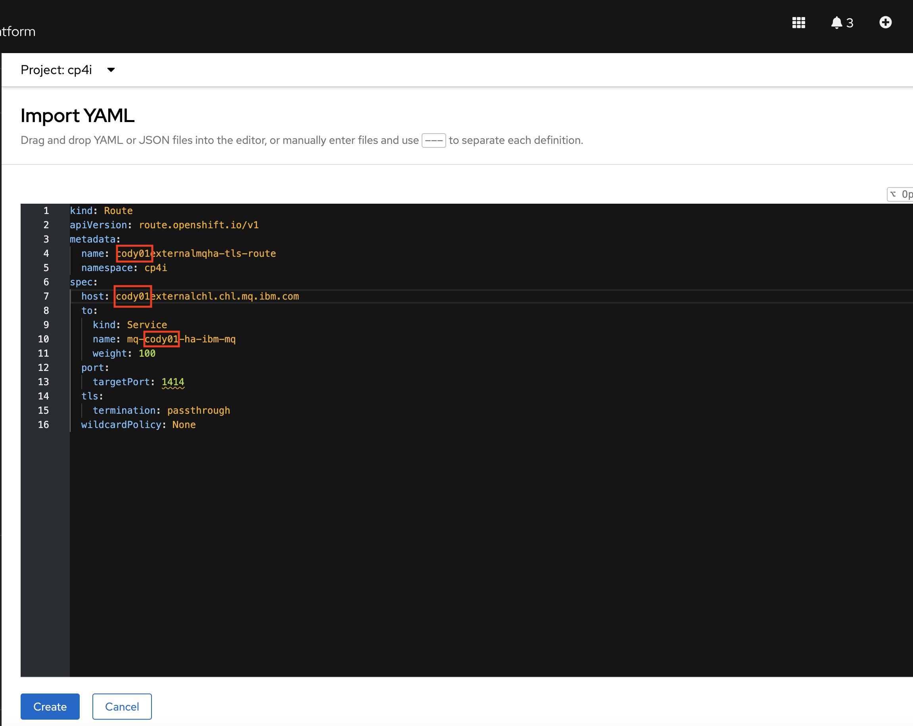
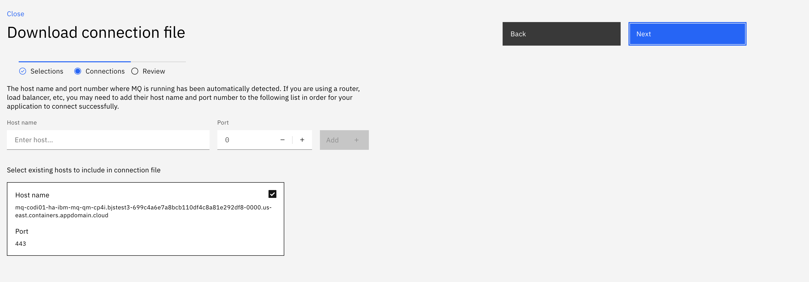
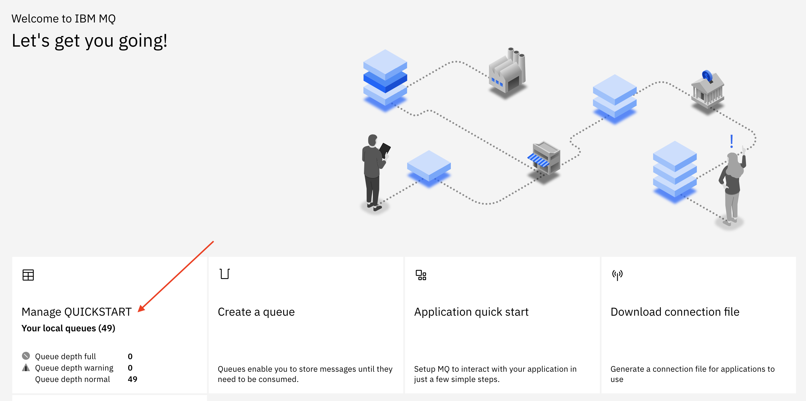

[Return to main lab page](../../MQ-Labs/Overview/)

## Connect an external client to MQ running on OCP

Connecting an MQ client running outside of the kubernetes cluster to a queue manager runnin on Openshift requires additional configuration.

In this lab you will connect an MQ client running on your laptop to the Native MQ queue managers you configured on Lab 1.

* #NOTE: PRE-REQUISITE
  Make sure that you have an MQ Client installed in your local machine.
  They can be downloaded from:

  - Windows:
    https://www.ibm.com/support/fixcentral/swg/doSelectFixes?options.selectedFixes=9.3.0.0-IBM-MQC-Win64&continue=1
  - Linux:
    https://www.ibm.com/support/fixcentral/swg/doSelectFixes?options.selectedFixes=9.3.0.0-IBM-MQC-LinuxX64&continue=1
  - MacOS
    https://developer.ibm.com/tutorials/mq-macos-dev/

    Follow any configuration instructions of the mq client after installation.

  ## Set up the OCP Routes

We need to create an openshift route to allow external application to connect in the cluster using TLS.

1. Click on the (+) icon at the top right of the Openshift console and paste the contents of the mqroute.yaml file included in this lab. Edit the route prepending your your userid to the name and hostname and then click Create.

Note: The first part of the host URL must match the name of the channel name in the queue manager (which was creted using the configmap) but all lower case. The "*.chl.mq.ibm.com*" is always fixed. It does not need to match any real domain name of the cluster. This setting is needed so that by using SNI over TLS the incomming requests can be routed not only to the correct port but also to the correct channel within the MQ pod.



2. The 4 clientkey files corresponding to the certificates configured on the MQ Channel will be provided to you. Download them to a folder in your local machine.
3. Return the Platform Navigator home page and click on on your queue manager name in the Messaging box

   
4. Click on *Download Connection File*

   
5. Select *QUICKSTART* as channel name and your channel name and *ANY_TLS12_OR_HIGHER* as cipher spec.

   
6. Click Next twice reviewing the settings without making any further changes.

   
7. Click Create. Save the file to a folder in your local machine

   
8. Open a new terminal window and run the following commands replacing "*path-to-ccdt*" and *"path-to-keyfile"* with the folders where you downloaded the keyfile and connection file:

   ```
   export MQCCDTURL='/path-to-ccdt/ibm-mqha-ccdt.json'
   ```

   ```
   export MQSSLKEYR='/path-to-keyfile/clientkey'
   ```
9. Run the follwing command in the terminal window:

   ```
   amqsputc APPQ1 QUICKSTART
   ```

   The sample program amsputc will put the messages to queue **APPQ1** which has a default persistence defined as persistent. These messages should still be available after a failover.
10. Type any message and press Enter. Type another message and press Enter twice to disconnect from the queue manager. Remember the text of the messages you typed.
11. In the terminal window enter the following commands replacing "*path-to-ccdt*" and *"path-to-keyfile"* with the folders where you downloaded the keyfile and connection file:

    ```
    export MQCCDTURL='/path-to-ccdt/ibm-mqha-ccdt.json'
    ```

    ```
    export MQSSLKEYR='/path-to-keyfile/clientkey'
    ```

    ```
    amqsghac APPQ QUICKSTART
    ```

    

    The sample program amqsghac starts running and will wait for messages to arrive on queue **APPQ**.
12. Open another terminal window and type the following command:

    ```
    amqsphac APPQ QUICKSTART
    ```
13. The sample program amqsphac will connect to MQ and start sending messages incessantly.
14. Return to the window where *amqsghac* is running. You should get a list of all the messages that have been previously sent before running the command and the ones that are being sent after.

    
15. Go back to the OCP console and check the status of the pods:
    
16. Delete the running pod

    

Once the active pod is deleted, the running programs will then reconnect to the other pod for it to take over.


16. Return to the browser tab where OCP is open. In your project, click the drop-down for *Workloads* and select *Pods*. Enter your queue manager name in the *Name* field to filter out the rest. You will see the now a different pod is in 1/1 Ready state.

    
17. Return the Platform Navigator home page and click on on your queue manager name in the Messaging box

    
18. Click on Manage.

    
19. Verify that queue **APPQ1** still has the number of messages you put to the queue earlier.

    
20. Click the hyperlink for the queue to verify that those are the messages you created.

    

## Congratulations

You have completed this lab for MQ on CP4I
