[Return to main lab page](../../MQ-Labs/Overview/)

## Requirements

* Openshift 4.6
* IBM Cloud Pak for Integration V2020.4.1
* IBM MQ V 9.2.2.0-r1 and mq.ibm.com/v1beta1 Operator ibm-mq.v1.5
* A namespace called cp4i-mq where the MQ Operator is installed
* An entitlement key called ibm-entitlement-key. IBM Employees can get from [here](https://myibm.ibm.com/products-services/containerlibrary). 
* A Github account and token 

	[Go here to create a github account](https://github.com/join?ref_cta=Sign+up&ref_loc=header+logged+out&ref_page=%2F&source=header-home)	
	
	[To create your github token](https://docs.github.com/en/free-pro-team@latest/github/authenticating-to-github/creating-a-personal-access-token)

## Steps

Once you have your gitHub account ready, you can continue with the lab.

## Step 1: Fork this repository

1. Open a web browser by double-clicking on the icon on the desktop.

	
	
1. Navigate to the git account **ibm-cloudintegration** with the following URL:

	```
	https://github.com/ibm-cloudintegration/
	```
	
	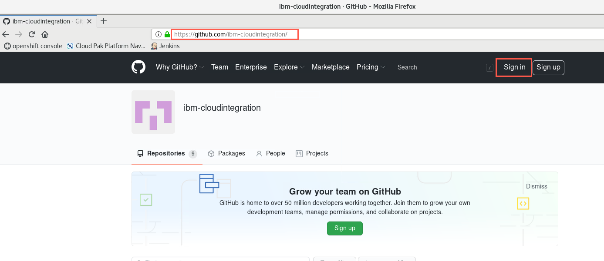
		
	If not signed-in, click *Sign in* and login with your personal gitHub ID and password.

	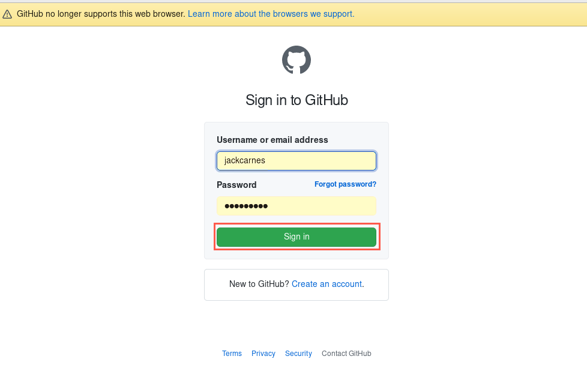
	
	If you receive a message about unsupported browser, ignore the message. It still works for this lab.
	
1. You need to fork the **cp4i-mq-ace-tekton** repository. Make sure you are in the *Repositories* section then click the *cp4i-mq-ace-tekton* hyperlink.

	
	
	Normally you could just download the code. But each student will be creating a pipeline and making changes to the code, so you will need your own repository.
	
1. In the top right corner of the screen (under your profile) click *Fork*.

	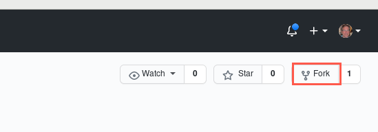

1. You will receive a pop-up with a list of one or more accounts to choose. Click your personal account.

	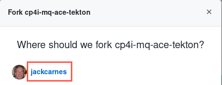	
1. The repository is copied to your account and you are taken to your account with the new repo. 

	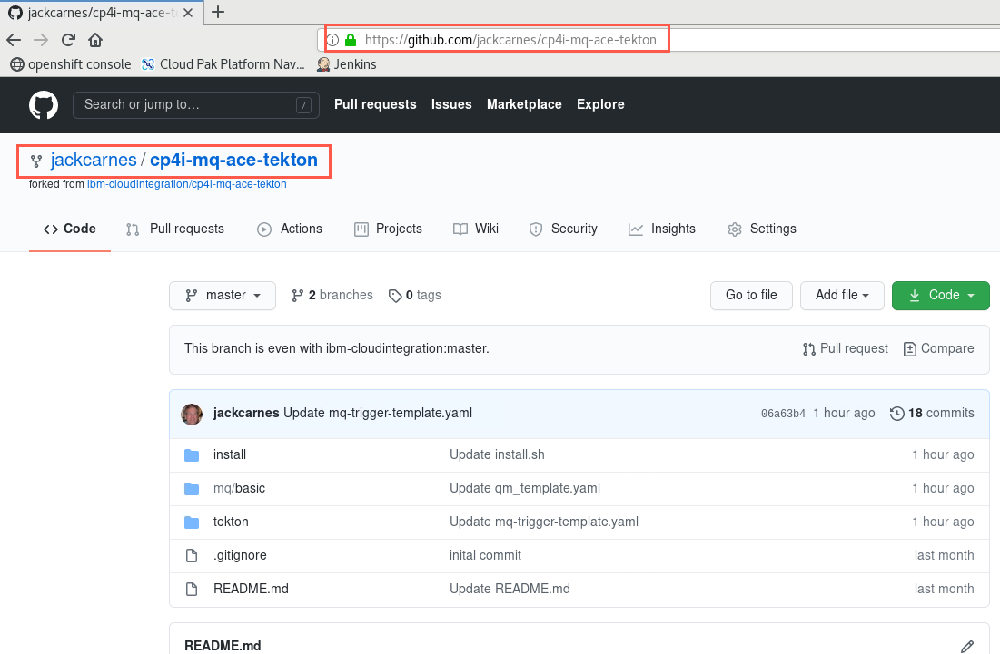	

## Step 2: Clone the forked repository onto your machine 

Now you can download the code to your desktop. 

1. Click the *Code* button and select *Download ZIP*.

	
	
1. Click the *Save file* radio button then click *OK*.

	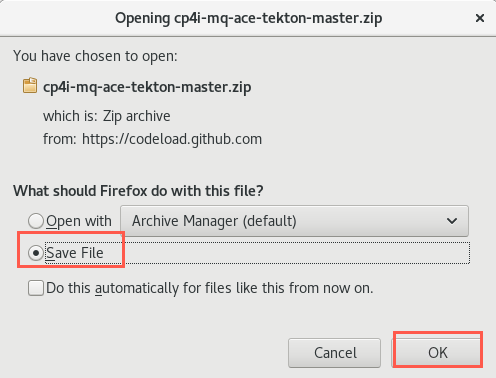
	
	The file is downloaded to */home/ibmuser/Downloads/cp4i-mq-ace-tekton.zip*.
	
1. Open a terminal window by double-clicking the icon on the desktop.

	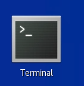
	
1. Make a new directory in your home directory with the following command. Then change to that directory.

	```
	mkdir ~/icp4ipl
	cd ~/icp4ipl
	```
	
	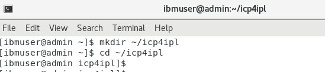
	
1. Unzip the downloaded code with the following command:

	```
	unzip ~/Downloads/cp4i-mq-ace-tekton-master.zip	```
			
	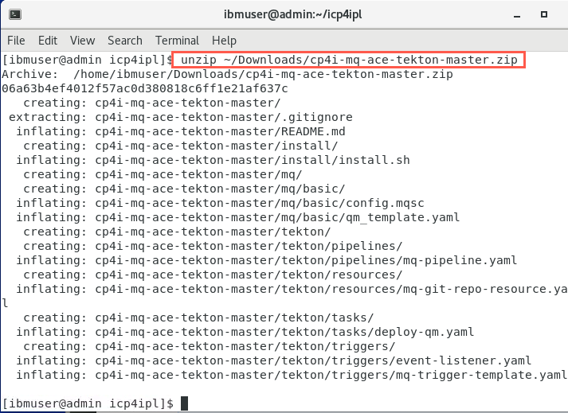
	
## Step 3: Modify and run the install script

1. Change to the *cp4i-mq-ace-tekton-master* directory.

	```
	cd cp4i-mq-ace-tekton-master
	```	
	
1. Open an edit session using *gedit* for the file *install.sh*. It is in the subdirectory *install*.

	```
	gedit install/install.sh
	```
	
	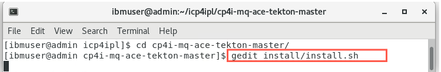
	
	The editor opens in a new window.
	
1.	Review the file observing the commands and objects being created. There are a few  changes needed. 

	Click the hamburger menu in the top right corner and select *Find and Replace...*.

	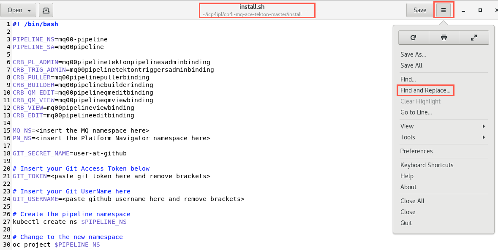
	
1. Enter **00** in *Find* field and your student ID in the *Replace with*. Click *Replace All*.

	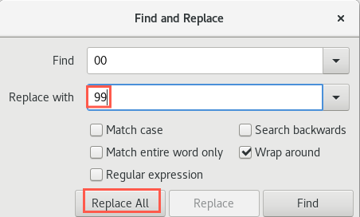
	
1. Insert your *git token* and *git usernname*. Insert the namespaces for *MQ_NS* and *PN_NS* (cp4i for this lab). Click *Save*.

	```
	GIT_TOKEN=paste git token here and remove brackets
	GIT_USERNAME=paste github username here and remove brackets
	MQ_NS=<insert the MQ namespace here>
	PN_NS=<insert the Platform Navigator namespace here>
	```
	
	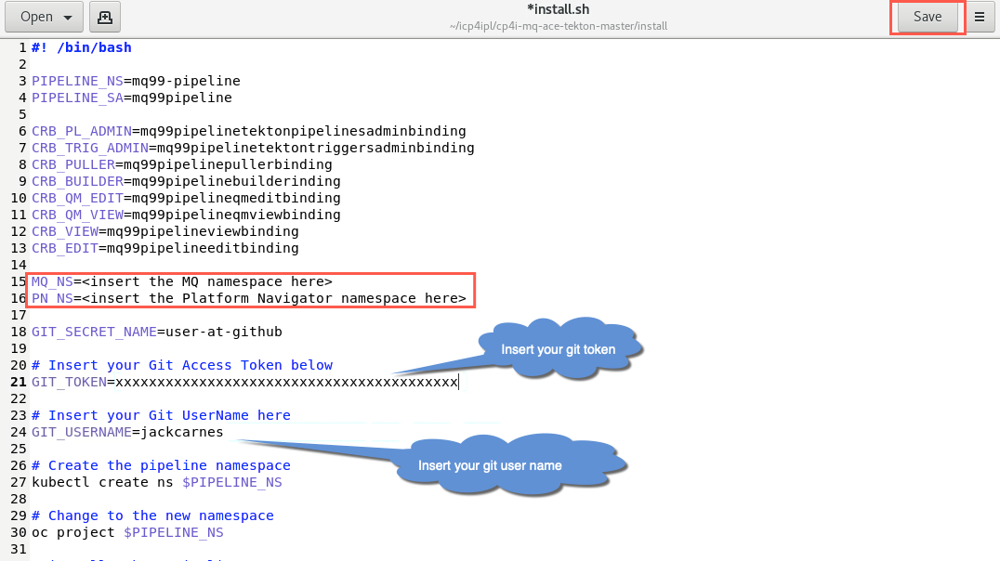
	
	**Note**: You should have gotten your gitHub token at the beginning of the lab. If you didn't, you will need to get it now.		
1. In gedit click *Open* > *Other documents* and navigate to */home/ibmuser/icp4ipl/cp4i-mq-ace-tekton-master/tekton/resources/mq-git-repo-resource.yaml*. Click *Open*. 

	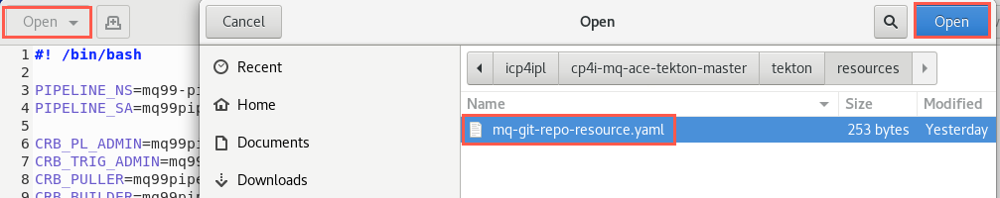
	
1. Update the *PipelineResource* by pointing to the url of your forked repository on line 8 - replace "xxxxxxxxxxx" with your github. Click *Save*.	
	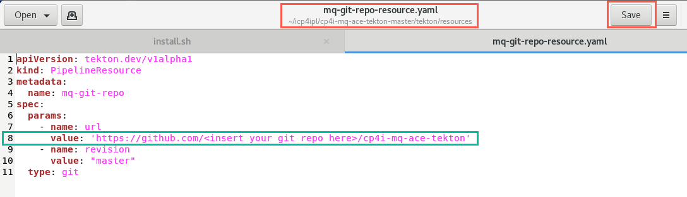 

1. Open another terminal window and navigate to */home/ibmuser/icp4ipl/cp4i-mq-ace-tekton-master/*. Make the install script executable with the following command: 

	```
	cd icp4ipl/cp4i-mq-ace-tekton-master
	chmod +x /install/install.sh
	```
	
	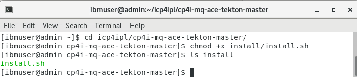
	
1. Run the install script with the following command:

	```
	./install/install.sh
	```
	
	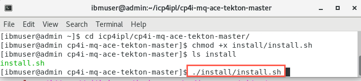	
1. Once the *install.sh* is complete return to the Open Shift Console to verify that the pipeline was created. Make sure you are in your mqxx-pipeline project. Click the drop-down for Pipelines and select *Pipelines*.

	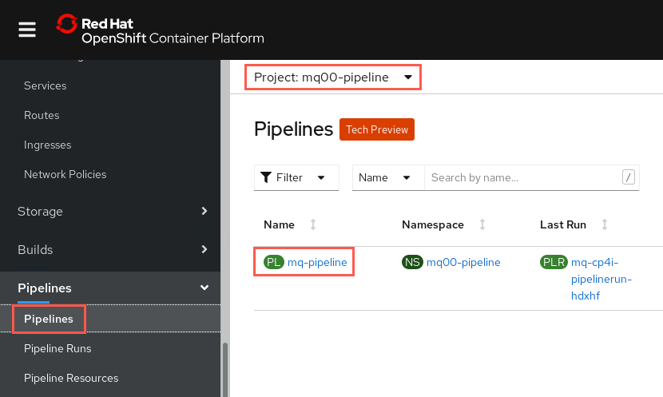
	
1. Click the hyperlink for *mq-pipeline*. Explore the various tabs. Pay particular attention to *Parameters* and *Resources*.

	You have not defined a *WebHook* yet, so you will receive failed status for *Pipeline Runs*.

## Step 4: Add the route to Github WebHook

Follow steps here to add a webhook.

1. Open a Firefox web browser session by double-clicking its icon on the desktop. 

	
	
1. Navigate to your fork of the this repository in GitHub and sign-in.

1. Click *Settings* then click *Webhooks*. 

	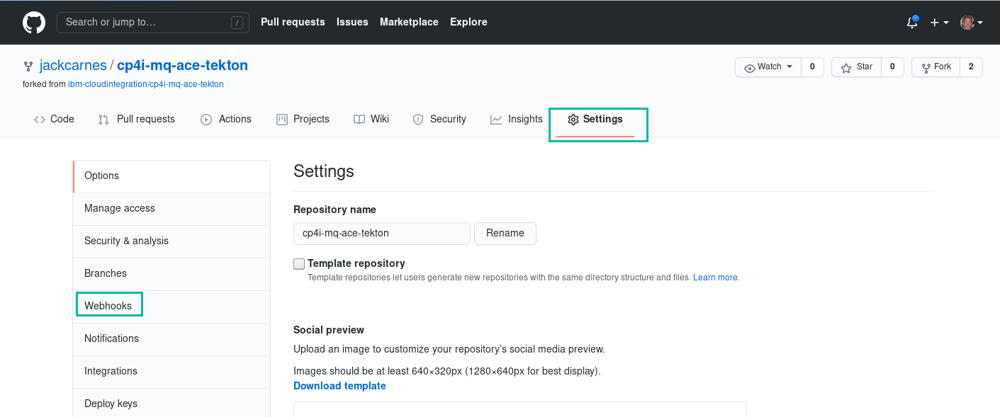

1. Click the *Add webhook* button.

	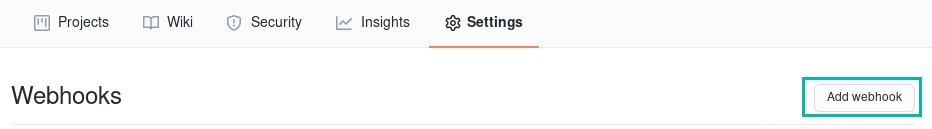
	
1. If you receive a pop-up to confirm password, enter password and click the *Confirm password* button.

	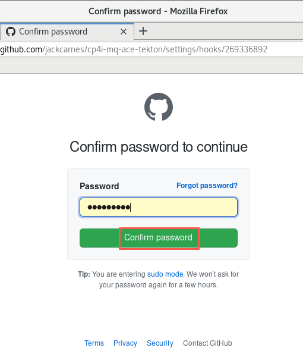	
1. You need to set the Payload URL to the EventListener Route. In order to find the URL enter the following command in your terminal window: 

	```
	oc get route el-el-cicd-mq-hook-route --template='http://{{.spec.host}}'
	```
	
	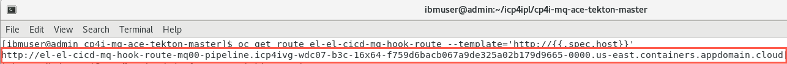

	Copy the returned value and paste into the *Payload URL* field. Set the *Content type* to **application/json**. You aren’t using the Secret in this lab, so you can leave it blank.  Select *Just the Push Event* radio button. Click *Add webhook*.		
	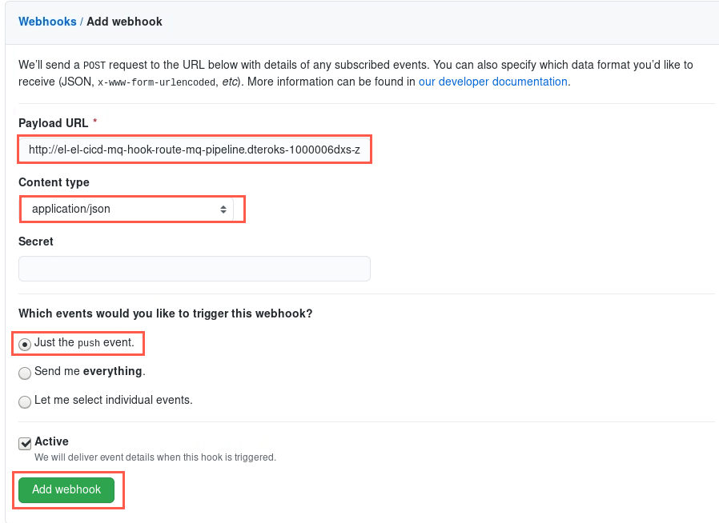

## Step 5: Test it out by committing a change

1. Click *Code* to return to the repo.

	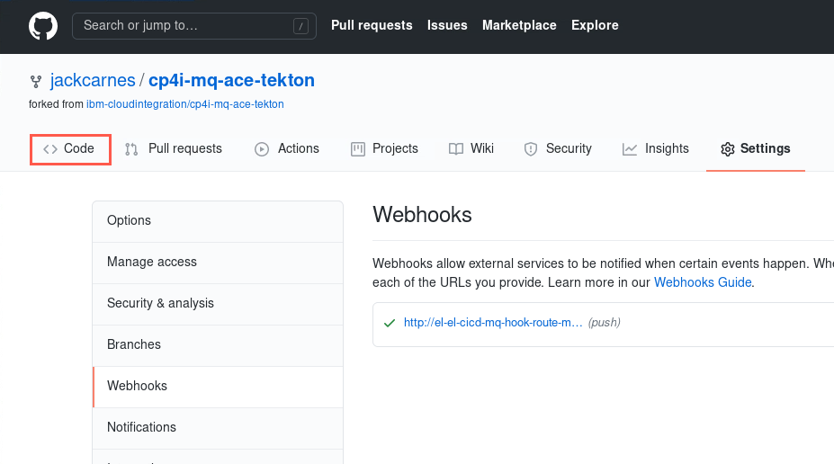
	
1. Click *mq/basic*.

	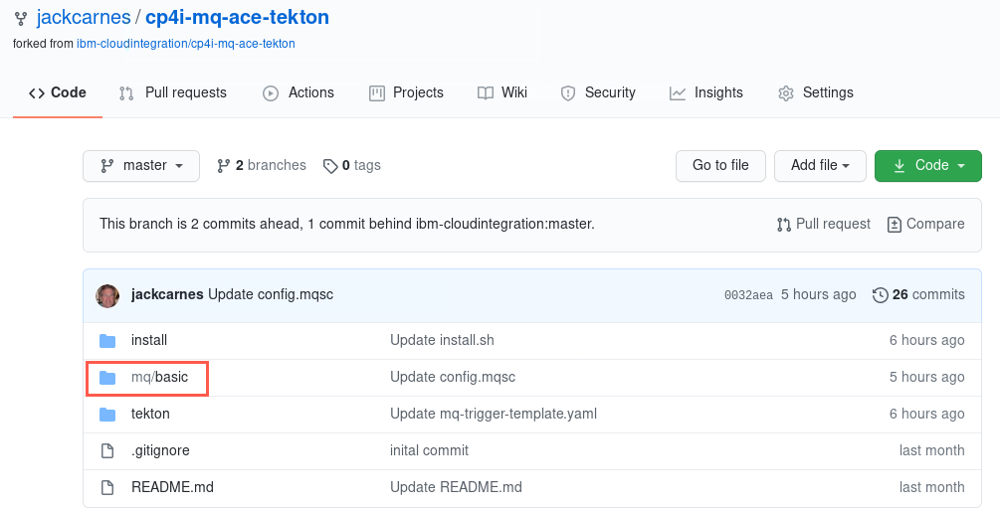
	
1. Click the file *config.mqsc* to open the file.

	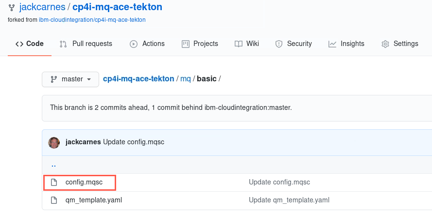
	
1. Click the pencil icon to edit the file.

	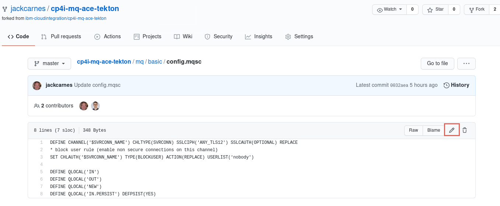
		
1. Make a simple change like adding a local queue called **TEST**.

	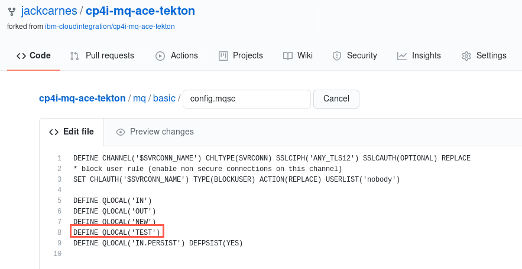	
1. Scroll down and click *Commit changes*. 

	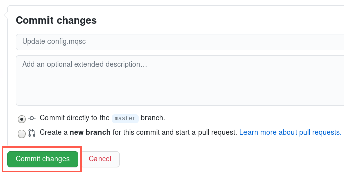	
1. Return to the OpenShift console. Scroll down to *Pipelines*. Make sure you are in your workspace. Click the drop-down and select *Pipeline Runs*. Click the hyperlink for one of the runs. 

	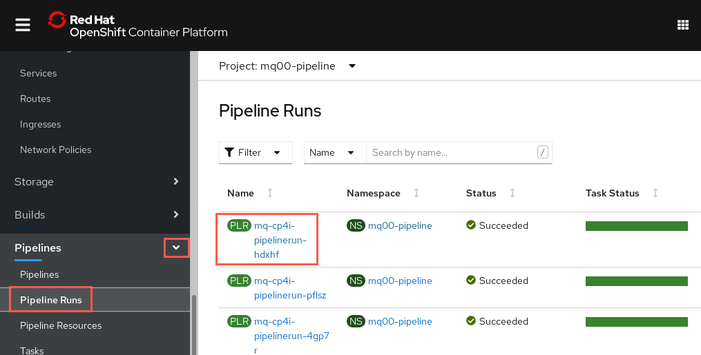	
1. You can see that task *deploy-qm* was successful. It will be high-lighted with a green check mark. If it fails it will be highlighted red. Click *Logs*.
	
	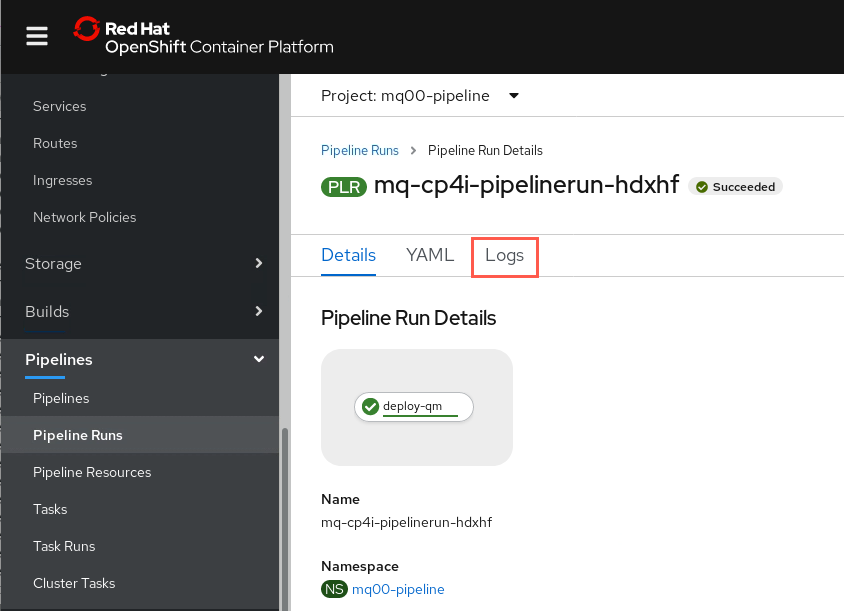

1. The display will be at the end of the log where you can see the deployment of the queue manager. You can also click *Expand* to make the log display full screen.

	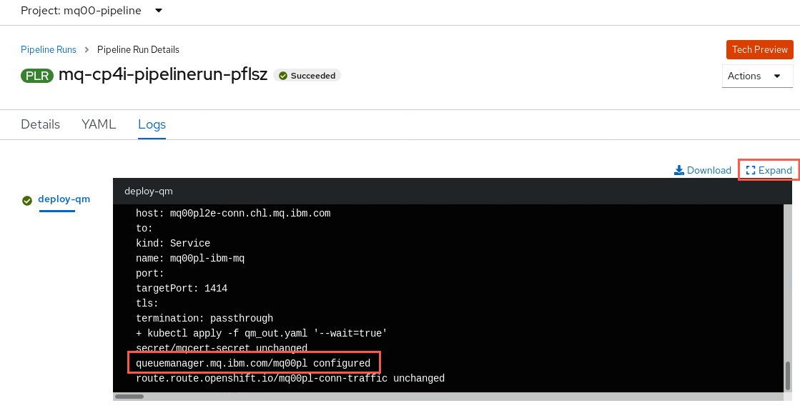
	
1. Open another web browser tab and click the bookmark for *Cloud Pak Platform Nav...*

	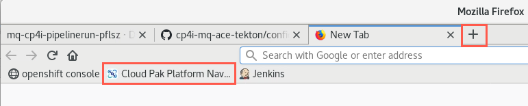
	
1. The *Platform Navigator* opens with *Capabilities*. Click *Show less* hyperlink to conserve screen space. Click *Runtimes*.

	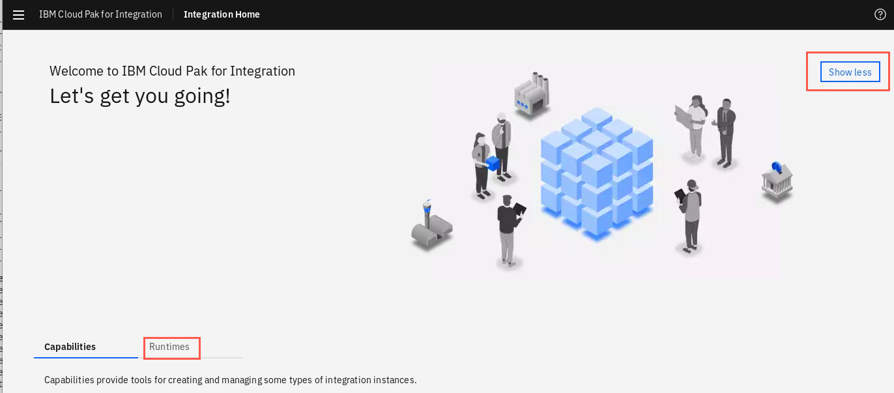
	
1. You will find your queue manager among others. If status shows *Pending* wait until it shows *Ready*. When it show *Ready* click the hyperlink for your queue manager to access the MQ Console.

	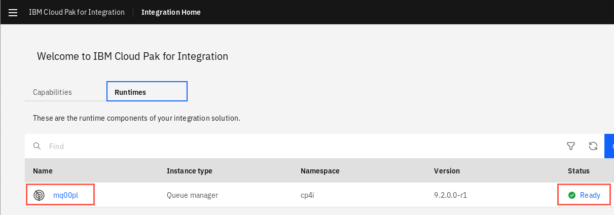
	
1. Once you are in the console you can verify your changes are there. Check that your changes are included. For example, if you added the local queue **TEST** make sure it now appears in the local queues display.

	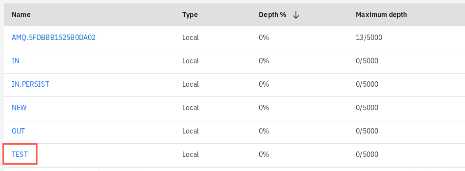
		
## Congratulations

You have completed this lab MQ Tekton Pipelines.

## Cleanup

1. Return to the Platform Navigator. Under *Runtimes* find your instance, click the elipsis on the right and select **Delete**. 

	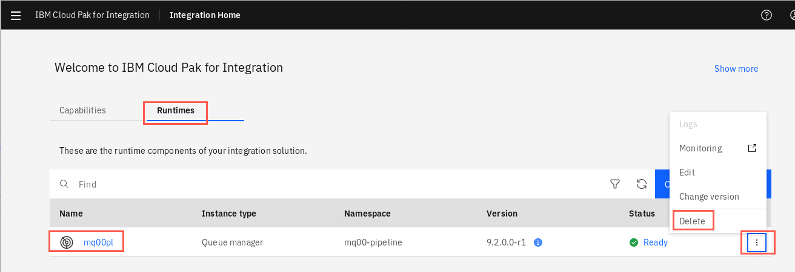 
	
1. Type the queue manager name and click *Delete* to confirm deletion.

	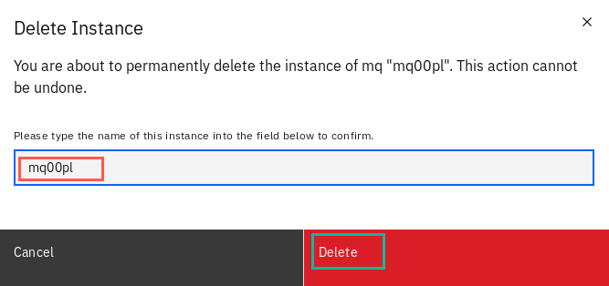 
	
	This will delete the queue manager pods and all related artifacts. This will help reduce load on the cluster as you continue the rest the labs. This queue manager will not be needed again.

	1. In a terminal window, navigate to */home/ibmuser/icp4ipl/cp4i-mq-ace-tekton-master/install*. Enter the following command to delete all resources in the mqxx-pipeline.  

	```
	./cleanup.sh
	```
	
	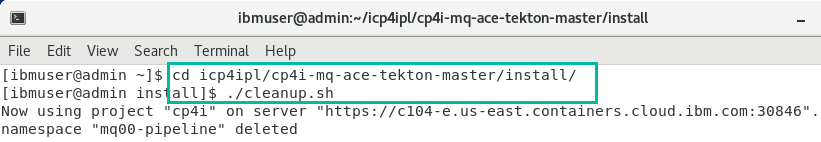	

## Troubleshoot pipeline issue		
1. Notice that pipeline run failed again. Time for a little OpenShift troubleshooting. Click the hyperlink for the pipeline run, then click *Logs* to review any messages. 

	
	
1. The end of the log is displayed and you see the error. Scroll to the right and you will see more details - *storage class does not exist*. What storage class does it need? 

	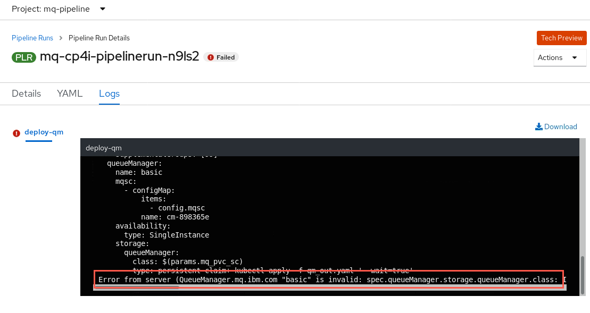
	
1. The list of available storage classes is displayed. But which storage class is required?

    Find the storage classes available by clicking the drop-down for *Storage* in the menu on left and select *Storage Classes*.

	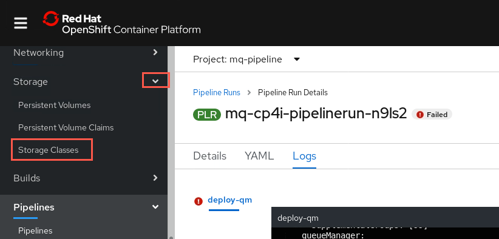